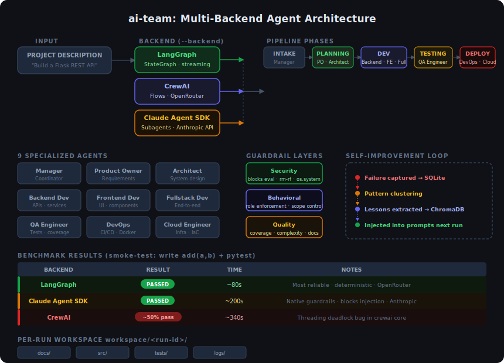
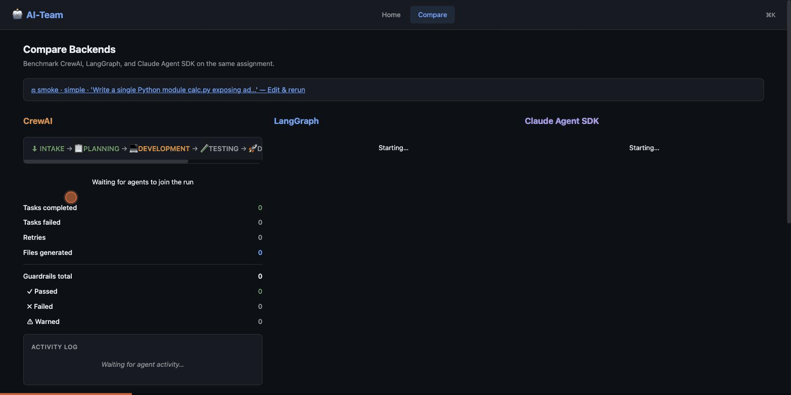
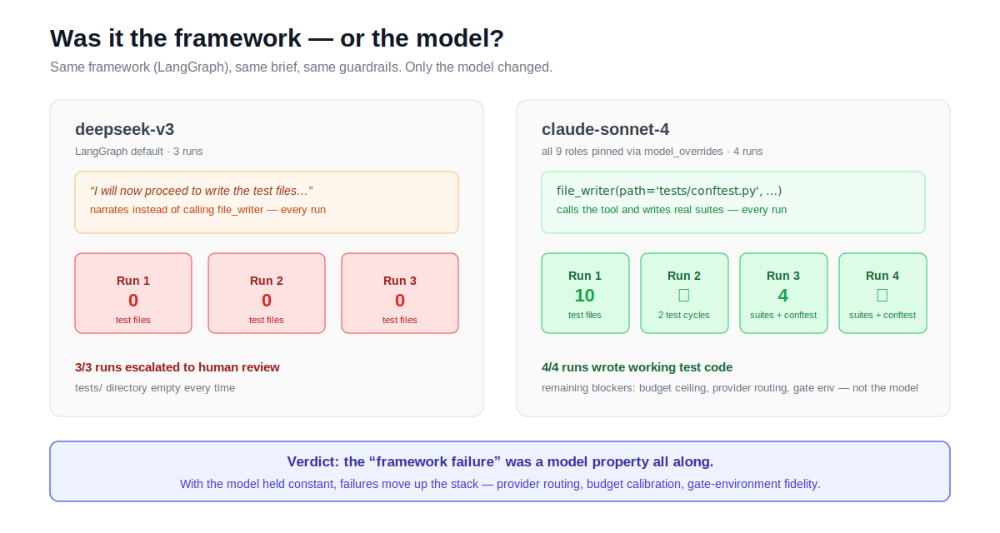
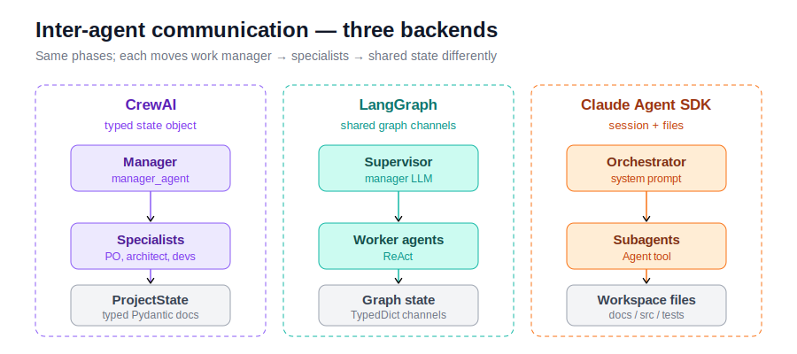

# AI-Team: Multi-Backend Agent Comparison Platform

[](https://github.com/RickZee/ai-team/actions/workflows/ci.yml)
[](https://www.python.org/downloads/)
[](LICENSE)

A nine-agent software team (Manager, Product Owner, Architect, Backend/Frontend/
Fullstack Developers, DevOps, Cloud Engineer, QA) implemented over three
orchestration frameworks — CrewAI, LangGraph, and the Claude Agent SDK — behind one
`Backend` protocol, so the same brief can be run through each and compared on
correctness, wall-clock time, and cost. The shared harness adds a runtime smoke gate
(boots the generated app and probes real HTTP), a per-run spend guard, subprocess
isolation with a hard kill, and behavioral/security/quality guardrails. Findings are
recorded with commit references in the [engineering journal](docs/journal/README.md).



## Quick start

```bash
git clone https://github.com/RickZee/ai-team.git && cd ai-team
cp .env.example .env        # add OPENROUTER_API_KEY (+ ANTHROPIC_API_KEY for the SDK backend)
uv sync                     # install deps (uv: https://astral.sh/uv)
bash scripts/quickstart.sh  # smoke-test every available backend, print a results table
```

Or drive the web dashboard directly:

```bash
uv run ai-team-web &                              # FastAPI on :8421
cd src/ai_team/ui/web/frontend && npm run dev      # React on :5173 (proxies API)
```

Open `http://localhost:5173/compare`, describe a project, click **Run All Backends** —
three orchestrators race the same brief, live:



For step-by-step setup and troubleshooting, see
[docs/GETTING_STARTED.md](docs/GETTING_STARTED.md).

## Orchestration backends

All three implement the same `Backend` protocol over the same tools, guardrails, and
workspace layout — swap at runtime with `--backend`.

| Backend | Observed at n=5 (mixed-model, not a verdict — see [Results](#results)) | Orchestration model |
|---|---|---|
| **[Claude Agent SDK](https://docs.anthropic.com/en/docs/agents-and-tools/claude-agent-sdk)** | 5/5 green on Claude, tightest spread, highest cost | Nested subagents, native tool-calling |
| **[CrewAI](https://crewai.com)** | 5/5 green on deepseek, slowest, widest spread | Crews + Flows (`@start`, `@listen`, `@router`) |
| **[LangGraph](https://langchain-ai.github.io/langgraph/)** | 1/5 on deepseek pre-fix, fastest when green | `StateGraph`, conditional edges, checkpointing |

```bash
uv run ai-team run "Build a REST API" --backend langgraph
uv run ai-team run "Build a REST API" --backend claude-agent-sdk
uv run ai-team run "Build a REST API" --backend crewai
```

CrewAI earned its way back to a full peer in the matrix. It was demoted early after a
runtime hang on the trivial smoke brief, but the n=5 batch traced that to two harness
bugs of mine (a workspace-scoping fallback and an environment-variable leak), not the
framework — and once fixed, it ran green across a multi-run streak on the exact
scenario it was demoted over. That whole arc, including the correction, is in
[docs/posts/failure-taxonomy.md](docs/posts/failure-taxonomy.md) #2/#3.

## Results

Whether a comparison-tab failure is a framework or a model property was tested
directly: same framework (LangGraph), same brief, same guardrails, only the model
changed.



deepseek wrote no test files in 3/3 runs; Claude wrote test suites in 4/4 — a model
property, not a framework one. Full data:
[COMPARISON_RESULTS.md](docs/COMPARISON_RESULTS.md). Failure analysis:
[failure-taxonomy.md](docs/posts/failure-taxonomy.md) — ten failure classes across
the model, framework, harness, and provider layers, each with a trace and a fix.

Single runs vary widely (same backend and config ranged 6m50s → 10m41s within one
hour), so numbers are taken from batches of n=5 per backend on the smoke brief. Two
caveats you must read before trusting the table below.

> **⚠️ This table is confounded and underpowered — it does not support framework verdicts.**
>
> 1. **Mixed models.** CrewAI and LangGraph run deepseek here; the Claude SDK runs
>    Claude. So a difference between rows is a *framework+model bundle* difference, not
>    a framework difference. The model-controlled comparison uses the `smoke-claude`
>    profile (every role pinned to one Claude model) — run it with
>    `uv run python scripts/run_smoke_batch.py --team smoke-claude`.
> 2. **n=5 is too small to rank.** A 1/5 green rate has a 95% Wilson interval of
>    **4–62%**, which overlaps 5/5's interval of **57–100%**. So even "5/5 vs 1/5"
>    is *not* a statistically supported difference at this sample size. The batch
>    runner now prints "no significant difference at this n" instead of a ranking.

| Backend (model) | Green | Green 95% CI | Wall min / median / max | Spend per run |
|---|---|---|---|---|
| Claude Agent SDK (Claude) | 5/5 | 100% [57–100] | 2m20s / 3m17s / 3m47s | $0.48–$0.95 |
| CrewAI (deepseek) | 5/5 | 100% [57–100] | 6m50s / 9m07s / 11m57s | pennies |
| LangGraph (deepseek) | 1/5 | 20% [4–62] | 1m25s / 3m55s / 5m08s | pennies |

Read these as **observations, not rankings**: at n=5 no pairwise verdict survives its
own confidence interval. LangGraph's 1/5 traces to two harness bugs (the dev/QA
file-layout contract and the lint-gate policy), root-caused with fixes in progress:
[langgraph-reliability-investigation.md](docs/troubleshooting/langgraph-reliability-investigation.md).
The honest headline is not "backend X wins" — it's "the harness and the model choice
dominate, and I don't yet have the runs to separate the frameworks."

## Team profiles

Not every project needs all nine agents. Select a profile with `--team`:

| Profile | Agents | Use case |
|---|---|---|
| `full` (default) | All 9 agents, all phases | Full software project |
| `full-claude` | All 9, pinned to `claude-sonnet-4.6` via OpenRouter | Same-model comparison runs |
| `backend-api` | Manager, PO, Architect, Backend Dev, QA, DevOps | REST API / microservice |
| `frontend-app` | Manager, PO, Architect, Frontend Dev, QA, DevOps | SPA / static site |
| `data-pipeline` | Manager, PO, Architect, Backend Dev, QA | ETL / data engineering |
| `prototype` | Architect, Fullstack Dev, QA | Minimal design → build → test |
| `smoke` | Architect, Backend Dev, QA | CI smoke checks (plan → code → test) |
| `infra-only` | Architect, DevOps, Cloud | IaC / CI-CD only |

Source: [`src/ai_team/config/team_profiles.yaml`](src/ai_team/config/team_profiles.yaml).

## Harness components

Each component below was added in response to a specific bug encountered during real
runs; the journal reference links to the incident:

| Guardrail | Catches | Journal reference |
|---|---|---|
| **Runtime smoke gate** | "70/70 pytest green, app 500s on every request" — boots the real app, probes real HTTP, drives a create→read→update→delete round-trip | [tests-pass-app-broken.md](docs/troubleshooting/tests-pass-app-broken.md) |
| **Per-run spend guard** | Runaway retry loops that are also billing loops; scoped per-run (`contextvars`) so concurrent Compare runs don't share a budget | [COMPARISON_RESULTS.md](docs/COMPARISON_RESULTS.md) |
| **Subprocess isolation + hard kill** | A hung backend thread starving the GIL for every other backend in the same process (traced live: a 78-minute false report) | [gil-starvation-hitl-delay.md](docs/troubleshooting/gil-starvation-hitl-delay.md) |
| **Auditable human overrides** | A human approving a run past a *failing* quality gate silently reading as success — now a distinct `complete_approved` terminal status, rendered differently everywhere | [COMPARISON_RESULTS.md](docs/COMPARISON_RESULTS.md) |
| **Calibrated behavioral guardrails** | Lexical scope checks that flagged correct QA output for using test vocabulary — fixed from measured false-positive/true-negative distributions, not guessed thresholds | [failure-taxonomy.md](docs/posts/failure-taxonomy.md) #5 |
| **Flow-wiring regression test** | A CrewAI event-bus self-trigger bug that produced 93,284 runaway iterations in 15 minutes — a meta-test now fails the build if any flow method ever listens to its own name again | [failure-taxonomy.md](docs/posts/failure-taxonomy.md) #2 |
| **Atomic run-id allocation** | Concurrent Compare launches colliding on the same run id and workspace (a classic TOCTOU race) | [failure-taxonomy.md](docs/posts/failure-taxonomy.md) #4 |

Full behavioral/security/quality guardrail catalog: [docs/GUARDRAILS.md](docs/GUARDRAILS.md).

## Architecture

```text
┌──────────────────────────────────────────────────────────────────────────────┐
│                            Web Dashboard (FastAPI + React)                   │
│           /run · /compare · /artifacts   --backend <name>  --team <profile>  │
└──────────────────────────────┬───────────────────────────────────────────────┘
                               ▼
┌──────────────────────────────────────────────────────────────────────────────┐
│                         Backend Protocol (core/)                             │
│           run(description, team, env) → ProjectResult                       │
│           stream(description, team, env) → AsyncIterator[StreamEvent]        │
└──────┬───────────────────────┬───────────────────────┬───────────────────────┘
       ▼                       ▼                       ▼
┌──────────────┐   ┌───────────────────┐   ┌─────────────────────┐
│   CrewAI     │   │    LangGraph      │   │  Claude Agent SDK   │
│  subprocess- │   │  StateGraph+nodes │   │ Nested subagents    │
│  isolated,   │   │  conditional      │   │ session persistence │
│  hard-killed │   │  edges, subgraphs │   │ native tool calling │
│  on timeout  │   │  checkpointing    │   │                      │
└──────┬───────┘   └─────────┬─────────┘   └──────────┬──────────┘
       └─────────────────────┼────────────────────────┘
                             ▼
┌──────────────────────────────────────────────────────────────────────────────┐
│  SHARED LAYERS                                                               │
│  Tools: file · code · git · test  │  Runtime smoke gate (real HTTP probes)   │
│  Guardrails: behavioral · security · quality  │  Per-run spend guard         │
│  Long-term memory + lessons (SQLite)  │  Team profiles                      │
└──────────────────────────────────────────────────────────────────────────────┘
```

How each backend moves work between agents (manager → specialists → shared state):



See [docs/ARCHITECTURE.md](docs/ARCHITECTURE.md) for full design, including [inter-agent communication](docs/ARCHITECTURE.md#213-inter-agent-communication) per backend.

## Demo projects

```bash
uv run python scripts/run_demo.py demos/00_smoke_test
uv run python scripts/run_demo.py demos/02_todo_app --skip-estimate
```

| Demo | Description |
|---|---|
| `00_smoke_test` | Trivial calculator + pytest — cheapest possible end-to-end pipeline check |
| `02_todo_app` | Full-stack TODO app — Flask + SQLite backend, HTML/JS frontend, Docker, pytest — the brief used in every comparison run above |

Each demo directory has `input.json` (the project spec) and `expected_output.json` (an
acceptance contract). See [docs/DEMOS.md](docs/DEMOS.md) for the full schema.

## Testing

```bash
uv run pytest                 # everything
uv run pytest tests/unit      # fast, no live API calls
uv run pytest tests/integration
```

The flow-wiring regression test — the one that guards against another 93,284-iteration
self-trigger loop — is worth running on its own after any change to `main_flow.py`:

```bash
uv run pytest tests/unit/flows/test_flow_wiring.py -q
```

To run against real OpenRouter (crew-level integration) instead of mocks:

```bash
AI_TEAM_USE_REAL_LLM=1 uv run pytest tests/integration -m real_llm -v
```

See [CONTRIBUTING.md](CONTRIBUTING.md) for code style and PR requirements.

## Configuration reference

`.env.example` is a minimal template (keys + common overrides). Defaults live in
`src/ai_team/config/settings.py` and `models.py` — unset vars use those.

| Variable | Description | Default |
|---|---|---|
| `OPENROUTER_API_KEY` | OpenRouter API key (CrewAI / LangGraph backends) | — |
| `ANTHROPIC_API_KEY` | Anthropic API key (Claude Agent SDK backend) | — |
| `AI_TEAM_ENV` | Model tier: `dev`, `test`, `prod` | `dev` |
| `AI_TEAM_MAX_COST_PER_RUN` | Pre-run estimate ceiling; abort if the estimate exceeds it | `5.0` |
| `AI_TEAM_RUN_BUDGET_USD` | Runtime spend guard; non-retryable abort once actual spend crosses it | `5.0` |
| `PROJECT_PLANNING_SEQUENTIAL` | Sequential planning crew (disable PO tools / planning) | `false` |
| `CREWAI_HARD_TIMEOUT_SECONDS` | Wall-clock kill deadline for the CrewAI subprocess | `900` |
| `AI_TEAM_LANGGRAPH_GRAPH_MODE` | LangGraph nodes: `placeholder` (stubs) or `full` (subgraphs) | `placeholder` |
| `AI_TEAM_LANGGRAPH_POSTGRES_URI` | Postgres URI for LangGraph checkpointing (optional) | SQLite |
| `AI_TEAM_USE_REAL_LLM` | Run live-LLM integration/evals when set to `1` | unset |
| `AI_TEAM_TEST_MEMORY` | Run live memory/embedder integration tests when set to `1` | unset |

The backend is selected per run with `--backend` (default `crewai`), not an env
var. Copy `.env.example` to `.env` and set the key for your chosen backend.
More knobs (`MEMORY_*`, `GUARDRAIL_*`, `ANTHROPIC_SMOKE_*`, OpenRouter attribution)
exist in Settings with code defaults — see [docs/GUARDRAILS.md](docs/GUARDRAILS.md)
and [docs/MODELS.md](docs/MODELS.md). Agent→model mapping:
[`agents.yaml`](src/ai_team/config/agents.yaml) and
[`models.py`](src/ai_team/config/models.py).

## Project structure

```
ai-team/
├── src/ai_team/
│   ├── core/                # Backend protocol, ProjectResult, TeamProfile loader, spend guard
│   ├── config/               # Settings, agents.yaml, team_profiles.yaml, models.py
│   ├── backends/
│   │   ├── registry.py       # Backend discovery and instantiation
│   │   ├── crewai_backend/   # CrewAI: subprocess-isolated, hard-killed on timeout
│   │   ├── langgraph_backend/  # LangGraph: graphs, nodes, routing, subgraphs
│   │   └── claude_agent_sdk_backend/  # Claude Agent SDK: orchestrator, subagents, MCP
│   ├── tools/                 # File, code, git, test tools, runtime smoke gate
│   ├── guardrails/            # Behavioral, security, quality
│   ├── memory/                 # Long-term memory (SQLite) + lessons loop
│   ├── monitor.py              # TeamMonitor — thread-safe event collector
│   └── ui/web/                 # FastAPI server + React/TypeScript/Vite dashboard
├── tests/
├── evals/                      # JSON scenario specs, LLM judge, backend eval suites
├── demos/                      # 00_smoke_test, 02_todo_app
├── docs/
│   ├── journal/                 # Session-by-session engineering record
│   ├── posts/                    # Failure taxonomy + individual write-ups
│   └── *.md                      # ARCHITECTURE, GUARDRAILS, DEMOS, EVALS, GETTING_STARTED
└── scripts/                      # quickstart, run_demo, compare_backends, pre_push_check
```

## Documentation

| Document | Description |
|---|---|
| [Engineering journal](docs/journal/README.md) | Session-by-session debugging record, including corrections |
| [Comparison results](docs/COMPARISON_RESULTS.md) | Live 3-way comparison data and the same-model matrix |
| [Failure taxonomy](docs/posts/failure-taxonomy.md) | Ten failure classes with receipts |
| [Troubleshooting](docs/troubleshooting/README.md) | Deep-dive post-mortems of non-obvious bugs |
| [ARCHITECTURE.md](docs/ARCHITECTURE.md) | System design |
| [GUARDRAILS.md](docs/GUARDRAILS.md) | Behavioral, security, quality guardrails |
| [DEMOS.md](docs/DEMOS.md) | Demo projects, schema |
| [EVALS.md](docs/EVALS.md) | Eval methodology |
| [AGENTS.md](docs/AGENTS.md) | Persona registry (goal, backstory, delegation per role) |
| [MODELS.md](docs/MODELS.md) | dev/test/prod model matrix, provider comparison, failure modes |
| [TEAM_PROFILES.md](docs/TEAM_PROFILES.md) | Profile catalog (`full`, `full-claude`, `smoke`, …) |
| [GETTING_STARTED.md](docs/GETTING_STARTED.md) | Setup, configuration, troubleshooting |
| [SELF_IMPROVEMENT.md](docs/SELF_IMPROVEMENT.md) | Runtime smoke gate and lessons loop |

## License and acknowledgments

- **License:** [MIT](LICENSE).
- **[CrewAI](https://crewai.com)** — agent and crew framework.
- **[LangGraph](https://langchain-ai.github.io/langgraph/)** — graph-based agent orchestration.
- **[Claude Agent SDK](https://docs.anthropic.com/en/docs/agents-and-tools/claude-agent-sdk)** — Anthropic's agent framework.
- **[OpenRouter](https://openrouter.ai)** — LLM API.
