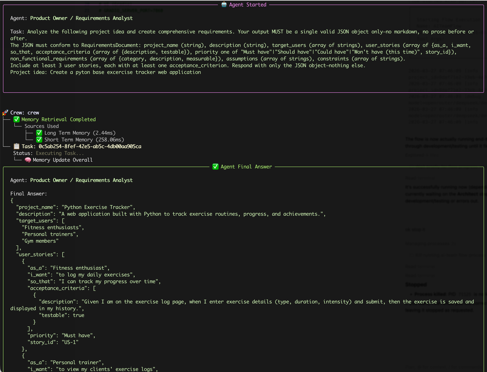
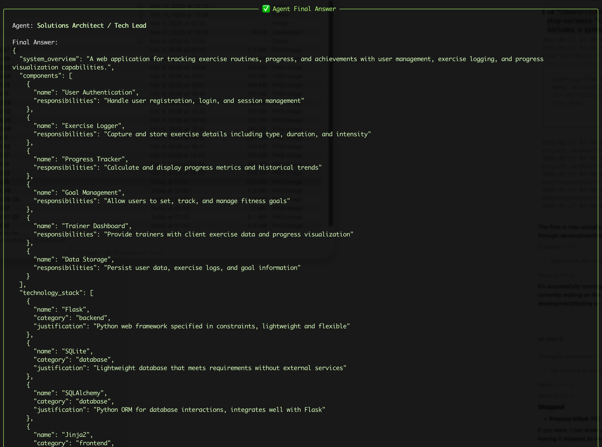

# AI-Team: Autonomous Multi-Agent Software Development

[](https://github.com/RickZee/ai-team/actions/workflows/ci.yml)
[](https://github.com/RickZee/ai-team)
[](https://www.python.org/downloads/)
[](LICENSE)

> A multi-agent software development system that transforms natural language into production-ready code — and a **framework comparison platform** for evaluating orchestration approaches side by side.

You describe a project in plain language; AI-Team routes it through a **shared agent pipeline** — Manager, Product Owner, Architect, developers, QA, and DevOps — backed by the same tools, guardrails, and workspace layout regardless of orchestration engine. Swap **CrewAI**, **LangGraph**, or the **Claude Agent SDK** at runtime (`--backend`) and compare how each framework handles planning, development, testing, and deployment. Every run produces a structured workspace (`docs/`, `src/`, `tests/`, deployment artifacts) with audit logs, cost tracking, and optional self-improvement feedback.


## Project goals

1. **Build** an autonomous AI team that accepts a project description and delivers requirements, architecture, code, tests, and deployment artifacts end-to-end.
2. **Compare** multiple orchestration frameworks running the same agents, tools, guardrails, and demos — measuring output quality, cost, latency, and developer experience.
3. **Evaluate** which framework best suits which use case, from quick prototypes to enterprise pipelines.

### Why compare?

The multi-agent framework landscape is moving fast. CrewAI, LangGraph, Claude Agent SDK, AutoGen, AWS Bedrock Agents — each makes different trade-offs around orchestration control, state management, human-in-the-loop, persistence, streaming, and cost. Rather than pick one and hope, this project runs the **same team through multiple backends** and lets the data decide.

## Orchestration backends

All backends share the same `Backend` protocol, tools, guardrails, Pydantic models, and team profiles. Swap at runtime with `--backend`:

| Backend | Status | Orchestration model | LLM provider | Key strengths |
|---------|--------|-------------------|--------------|---------------|
| **[CrewAI](https://crewai.com)** | Production | Crews + Flows (`@start`, `@listen`, `@router`) | OpenRouter | Simple setup, hierarchical process, built-in delegation |
| **[LangGraph](https://langchain-ai.github.io/langgraph/)** | Production | StateGraph with nodes + conditional edges | OpenRouter | Explicit routing, checkpointing, time-travel, state inspection |
| **[Claude Agent SDK](https://docs.anthropic.com/en/docs/agents-and-tools/claude-agent-sdk)** | Available | Nested subagents + session persistence | Anthropic API | Extended thinking, prompt caching, file rollback, native MCP, streaming |

```bash
ai-team run --backend crewai            "Build a REST API"   # CrewAI (default)
ai-team run --backend langgraph         "Build a REST API"   # LangGraph
ai-team run --backend claude-agent-sdk  "Build a REST API"   # Claude Agent SDK (ANTHROPIC_API_KEY + Claude Code)
```

### Backend comparison

Run the same demo through multiple backends and compare:

```bash
uv run python scripts/compare_backends.py demos/01_hello_world --env dev
uv run python scripts/compare_backends.py demos/01_hello_world --env dev --with-claude
```

Produces a side-by-side report: output quality, cost, latency, token usage, error rate. Use `--with-claude` to include the Claude Agent SDK (requires `ANTHROPIC_API_KEY`).

### Future backends

The multi-backend architecture supports adding new frameworks by implementing the `Backend` protocol:

- **AutoGen** — Microsoft's multi-agent framework
- **AWS Bedrock Agents** — managed agent service
- **Strands** — AWS open-source agent SDK
- **Custom** — bare LLM calls with manual orchestration

## Team profiles

Not every project needs all 9 agents. Select a profile with `--team`:

| Profile | Agents | Use case |
|---------|--------|----------|
| `full` (default) | All 9 agents, all phases | Full software project |
| `backend-api` | Manager, PO, Architect, Backend Dev, QA, DevOps | REST API / microservice |
| `frontend-app` | Manager, PO, Architect, Frontend Dev, QA, DevOps | SPA / static site |
| `data-pipeline` | Manager, PO, Architect, Backend Dev, QA | ETL / data engineering |
| `prototype` | Architect, Fullstack Dev, QA | Minimal design → build → test |
| `infra-only` | Architect, DevOps, Cloud | IaC / CI-CD only |
| `research-optimizer` | Optimizer | Karpathy AutoOptimizer Loop (see below) |

Canonical reference (agents, phases, backend parity, demos): **[docs/TEAM_PROFILES.md](docs/TEAM_PROFILES.md)**.  
Source: [`src/ai_team/config/team_profiles.yaml`](src/ai_team/config/team_profiles.yaml).

## Key features

| Feature | Description |
|---------|-------------|
| **9 specialized agents** | Manager, Product Owner, Architect, Backend/Frontend/Fullstack Developers, DevOps, Cloud, QA |
| **End-to-end workflow** | Intake → Planning → Development → Testing → Deployment |
| **Multi-backend** | Same team, same demos, different orchestration — compare results |
| **Team profiles** | Right-size the team for the use case (`--team backend-api`, `--team prototype`, ...) |
| **Enterprise guardrails** | Behavioral (role, scope), security (code safety, PII, secrets), quality (syntax, completeness) |
| **Operational guardrails** | Per-run wall-clock timeout, spend ceiling (`AI_TEAM_RUN_BUDGET_USD`), and recursion/retry caps that abort hung or runaway loops — see [docs/GUARDRAILS.md](docs/GUARDRAILS.md) |
| **MCP servers** | Per-team, per-agent MCP tool providers (GitHub, filesystem, Docker, Postgres) |
| **RAG knowledge** | Static best practices + dynamic project knowledge, scoped per agent role |
| **Self-improvement reports** | Each run produces a manager report that summarizes failures, references prior lessons, and proposes corrective actions |
| **AutoOptimizer Loop** | Karpathy-style autonomous edit→run→measure→keep/revert loop for iterative code optimization |
| **Observable** | Web dashboard (FastAPI + React), Textual TUI, Rich CLI monitor, structured logging, cost tracking |

## Self-improvement (failure → lessons → injection)

AI-Team automatically turns run outcomes into actionable feedback:

- **Report**: after each run, the Manager writes a `manager_self_improvement_report.md` (and `.json`) under `output/runs/<run_id>/reports/`.
- **Learn**: failures are recorded in long-term memory and can be promoted into role-scoped “lessons”.
- **Inject**: promoted lessons are injected into the next run’s agent prompts (by role) to reduce repeat failures.

See a full example report in [`docs/manager_self_improvement_report.md`](docs/manager_self_improvement_report.md).

## AutoOptimizer Loop (Karpathy-style)

Inspired by Andrej Karpathy's overnight experiment runs, the AutoOptimizer Loop is a tight autonomous cycle that iteratively improves a target metric (e.g. test pass rate, requests/sec, latency) on any workspace:

1. **Snapshot** — records current workspace state
2. **Edit** — agent proposes and applies ONE focused change
3. **Measure** — runs the evaluation command and reads the metric
4. **Keep or revert** — commits winning changes to a dedicated branch; restores snapshot on regression
5. **Learn** — ingests an experiment lesson into RAG so the next iteration builds on what worked

```bash
# Run 20 optimization experiments, budget $2
ai-team optimize ./workspace/todo-api \
  --metric demos/06_karpathy_optimization/metric.yaml \
  --budget 2.00 \
  --max-experiments 20

# Full options
ai-team optimize ./workspace/my-app \
  --metric metric.yaml \
  --strategy strategy.md \
  --backend claude-agent-sdk \
  --team research-optimizer \
  --budget 5.00 \
  --max-experiments 50 \
  --branch optimize/my-run \
  --editable src/ lib/
```

| Flag | Description | Default |
|------|-------------|---------|
| `--metric` | Path to `metric.yaml` (name, evaluation_command, direction) | required |
| `--strategy` | Path to a Markdown hints file for the optimizer agent | — |
| `--backend` | Backend to use | `claude-agent-sdk` |
| `--team` | Team profile | `research-optimizer` |
| `--budget` | Total USD budget across all experiments | `10.0` |
| `--max-experiments` | Max iterations | `50` |
| `--branch` | Git branch for winning commits | `optimize/karpathy-loop` |
| `--editable` | Paths the agent may edit (informational; enforced via prompt) | `src/` |

Results land in `logs/experiments.jsonl` inside the workspace. See [`demos/06_karpathy_optimization/`](demos/06_karpathy_optimization/) for a ready-to-run example and [`docs/EVALS.md`](docs/EVALS.md) for eval methodology.

Example excerpt:

```md
## This run: problems observed

1. **GuardrailError** (phase: `testing`): QA Engineer should only write test code, not modify production source.

## Proposed self-improvement actions

- Calibrate behavioral guardrails for QA/testing: reduce false positives when outputs are verbose but still test-scoped; consider role-specific relevance thresholds.
```

#### Sample screenshots

Planning output (requirements):



Planning output (architecture):



## Journey

Detailed log of this project: [docs/journey.md](docs/journey.md).

## Architecture

The [diagram above](#ai-team-autonomous-multi-agent-software-development) shows the **runtime flow**; the view below shows the **software layers** — how a single `Backend` protocol lets the UI drive any orchestration engine over the same shared tools, guardrails, and memory.

```text
┌──────────────────────────────────────────────────────────────────────────────┐
│                         UI Layer (3 interfaces)                              │
│  Web Dashboard (FastAPI+React) │ Textual TUI │ Rich CLI Monitor              │
│       --backend crewai | langgraph | claude-agent-sdk  --team <profile>      │
└──────────────────────────────┬───────────────────────────────────────────────┘
                               ▼
┌──────────────────────────────────────────────────────────────────────────────┐
│                         Backend Protocol (core/)                             │
│           run(description, team, env) → ProjectResult                        │
│           stream(description, team, env) → AsyncIterator[StreamEvent]        │
└──────┬───────────────────────┬───────────────────────┬───────────────────────┘
       ▼                       ▼                       ▼
┌──────────────┐   ┌───────────────────┐   ┌─────────────────────┐
│   CrewAI     │   │    LangGraph      │   │  Claude Agent SDK   │
│  Crews+Flows │   │  StateGraph+nodes │   │ Nested subagents    │
│  @start,     │   │  conditional      │   │ session persistence │
│  @listen,    │   │  edges, subgraphs │   │ hooks, skills,      │
│  @router     │   │  checkpointing    │   │ extended thinking   │
└──────┬───────┘   └─────────┬─────────┘   └──────────┬──────────┘
       └─────────────────────┼────────────────────────┘
                             ▼
┌──────────────────────────────────────────────────────────────────────────────┐
│  SHARED LAYERS                                                               │
│  Tools: file · code · git · test │ MCP servers (per-team, per-agent)         │
│  Guardrails: behavioral · security · quality                                 │
│  RAG: static knowledge · project indexing · session knowledge                │
│  Memory: session + long-term   │ Team profiles (config/team_profiles.yaml)   │
└──────────────────────────────────────────────────────────────────────────────┘
```

See [docs/ARCHITECTURE.md](docs/ARCHITECTURE.md) for full design.

## Quick start

```bash
git clone https://github.com/RickZee/ai-team.git && cd ai-team
cp .env.example .env        # add OPENROUTER_API_KEY (+ ANTHROPIC_API_KEY for SDK backend)
uv sync                     # install deps (uv: https://astral.sh/uv)
bash scripts/quickstart.sh  # smoke-test all available backends, print results table
```

Or run a specific backend directly:

```bash
# CrewAI
uv run python -m evals.run_evals --backend crewai --scenario smoke-test --no-judge

# LangGraph
uv run python -m evals.run_evals --backend langgraph --scenario smoke-test --no-judge

# Claude Agent SDK (requires ANTHROPIC_API_KEY)
uv run python -m evals.run_evals --backend claude-agent-sdk --scenario smoke-test --no-judge

# All three in parallel, side-by-side results table
uv run python -m evals.run_evals --compare --scenario smoke-test --no-judge
```

For step-by-step setup and troubleshooting, see [docs/GETTING_STARTED.md](docs/GETTING_STARTED.md).

## Configuration reference

| Variable | Description | Default |
|----------|-------------|---------|
| `OPENROUTER_API_KEY` | OpenRouter API key (CrewAI / LangGraph backends) | — |
| `ANTHROPIC_API_KEY` | Anthropic API key (Claude Agent SDK backend) | — |
| `AI_TEAM_ENV` | Tier: `dev`, `test`, `prod` | `dev` |
| `AI_TEAM_BACKEND` | Default backend: `crewai`, `langgraph`, `claude-agent-sdk` | `crewai` |
| `AI_TEAM_LANGGRAPH_POSTGRES_URI` | Postgres URI for LangGraph checkpointing (optional) | SQLite |
| `OPENROUTER_API_BASE` | OpenRouter endpoint | `https://openrouter.ai/api/v1` |
| `OPENROUTER_EMBEDDING_MODEL` | Embedding model for crew memory | `openai/text-embedding-3-small` |
| `GUARDRAIL_MAX_RETRIES` | Max guardrail retries | `3` |
| `CODE_QUALITY_MIN_SCORE` | Min quality score (0–1) | `0.7` |
| `TEST_COVERAGE_MIN` | Min test coverage (0–1) | `0.6` |
| `MAX_FILE_SIZE_KB` | Max file size for tools (KB) | `500` |
| `OPTIMIZER_MAX_EXPERIMENTS` | Default max iterations for AutoOptimizer | `50` |
| `OPTIMIZER_BUDGET_USD` | Default total budget (USD) | `10.0` |
| `OPTIMIZER_TIMEOUT_PER_EXPERIMENT` | Per-experiment timeout (seconds) | `300` |
| `OPTIMIZER_MIN_IMPROVEMENT_PCT` | Min improvement % to keep a commit | `0.5` |
| `OPTIMIZER_MAX_BUDGET_PER_EXPERIMENT_USD` | Per-experiment budget cap | `1.0` |
| `OPTIMIZER_MAX_TURNS_PER_EXPERIMENT` | Max agent turns per experiment | `40` |
| `OPTIMIZER_DEFAULT_BACKEND` | Default backend for optimizer | `claude-agent-sdk` |

Copy `.env.example` to `.env` and set the API key for your chosen backend. Before each run, a pre-flight check validates configured models. Agent→model mapping and guardrail behavior are documented in [docs/AGENTS.md](docs/AGENTS.md) and [docs/GUARDRAILS.md](docs/GUARDRAILS.md).

### Models by environment

Model IDs are in `openrouter/<provider>/<model>` form (see [src/ai_team/config/models.py](src/ai_team/config/models.py)). Set `AI_TEAM_ENV` to `dev`, `test`, or `prod` to choose a tier.

| Role | dev | test | prod |
|------|-----|------|------|
| Manager | `deepseek/deepseek-chat-v3-0324` | `google/gemini-3-flash-preview` | `anthropic/claude-sonnet-4` |
| Product Owner | `deepseek/deepseek-chat-v3-0324` | `google/gemini-3-flash-preview` | `openai/gpt-5.2` |
| Architect | `deepseek/deepseek-chat-v3-0324` | `deepseek/deepseek-r1-0528` | `anthropic/claude-sonnet-4` |
| Backend Developer | `mistralai/devstral-2512` | `minimax/minimax-m2` | `openai/gpt-5.3-codex` |
| Frontend Developer | `mistralai/devstral-2512` | `minimax/minimax-m2` | `anthropic/claude-sonnet-4` |
| Fullstack Developer | `mistralai/devstral-2512` | `minimax/minimax-m2` | `openai/gpt-5.3-codex` |
| Cloud Engineer | `deepseek/deepseek-chat-v3-0324` | `deepseek/deepseek-r1-0528` | `anthropic/claude-sonnet-4` |
| DevOps | `mistralai/devstral-2512` | `mistralai/devstral-2512` | `openai/gpt-5.3-codex` |
| QA Engineer | `deepseek/deepseek-chat-v3-0324` | `deepseek/deepseek-r1-0528` | `anthropic/claude-sonnet-4` |

Embeddings (crew memory) use `OPENROUTER_EMBEDDING_MODEL` (default: `openai/text-embedding-3-small`). Current IDs and pricing: [OpenRouter models](https://openrouter.ai/models).

## Demo projects

Six ready-to-run scenarios that exercise the full pipeline:

| # | Demo | Description |
|---|------|-------------|
| 1 | `01_hello_world` | Minimal Flask REST API — health, items CRUD, pytest, Dockerfile |
| 2 | `02_todo_app` | Full-stack TODO app — Flask + SQLite backend, HTML/JS frontend |
| 3 | `03_data_pipeline` | ETL pipeline — CSV ingest, validate/transform, SQLite load, CLI report |
| 4 | `04_ml_api` | FastAPI ML inference service — scikit-learn model, predict/health/metrics endpoints |
| 5 | `05_microservices` | Three-service system — API Gateway, User Service, Notification Service + docker-compose |
| 6 | `06_karpathy_optimization` | AutoOptimizer Loop — iterative metric-driven optimization with keep/revert and RAG lessons |

```bash
uv run python scripts/run_demo.py demos/01_hello_world
uv run python scripts/run_demo.py demos/02_todo_app --skip-estimate

# Demo 06: AutoOptimizer Loop
ai-team optimize demos/06_karpathy_optimization/workspace \
  --metric demos/06_karpathy_optimization/metric.yaml \
  --strategy demos/06_karpathy_optimization/strategy.md \
  --budget 2.00
```

Each demo directory contains `input.json` with the project spec and `expected_output.json` as an acceptance contract. After a run, `scripts/capture_demo.py` verifies the output and writes `RESULTS.md`.

For the full file layout, schema reference, capture/verification workflow, and instructions for adding new demos, see **[docs/DEMOS.md](docs/DEMOS.md)**.

### CLI options

The CLI has two top-level subcommands: `run` (build a project) and `optimize` (AutoOptimizer Loop).

```bash
# Build subcommand (default)
uv run python -m ai_team run "Build a minimal Flask API" \
  --backend langgraph --team backend-api --env dev --skip-estimate

# Optimize subcommand
ai-team optimize ./workspace/my-app \
  --metric metric.yaml --budget 2.00 --max-experiments 20
```

**`run` flags:**

| Flag | Description |
|------|-------------|
| `--backend` | `crewai` (default), `langgraph`, `claude-agent-sdk` |
| `--team` | Team profile from `config/team_profiles.yaml` |
| `--env` | `dev`, `test`, `prod` — selects model tier |
| `--skip-estimate` | Skip cost estimate confirmation |
| `--output` | `crewai` (default), `tui` — progress display mode |
| `--monitor` | Alias for `--output tui` |
| `--stream` | JSON lines streaming (LangGraph) |
| `--thread-id` | Resume thread (LangGraph checkpointing) |
| `--resume` | Resume after human-in-the-loop interrupt |

**`optimize` flags:**

| Flag | Description | Default |
|------|-------------|---------|
| `--metric` | Path to metric YAML (name, evaluation_command, direction) | required |
| `--strategy` | Path to Markdown strategy hints file | — |
| `--backend` | Backend for the optimizer agent | `claude-agent-sdk` |
| `--team` | Team profile | `research-optimizer` |
| `--budget` | Total USD budget | `10.0` |
| `--max-experiments` | Max iterations | `50` |
| `--branch` | Git branch for winning commits | `optimize/karpathy-loop` |
| `--editable` | Paths the agent may edit | `src/` |

Both `ai-team-web` and `ai-team-tui` support backend and team selection in their interfaces.

## Monitoring & UI

Three UI modes for different audiences — all share the same backend registry, monitor data models, and cost tracking.

### Web Dashboard (FastAPI + React)

A production-grade browser UI with real-time WebSocket streaming, GitHub-dark theme, and side-by-side backend comparison.

```bash
# Development (hot reload)
uv run ai-team-web &                          # FastAPI on :8421
cd src/ai_team/ui/web/frontend && npm run dev     # React on :5173 (proxies API)

# Production (single server)
cd src/ai_team/ui/web/frontend && npm run build
uv run ai-team-web                            # Serves React build + API on :8421
```

**Pages:**

| Page | Route | Features |
|------|-------|----------|
| Dashboard | `/`, `/runs/:id` | Run sidebar, live monitor, run summary on complete, artifact preview, HITL panel |
| Run | `/run` | Launch form, cost estimate, auto-handoff to Dashboard when run starts |
| Compare | `/compare` | Parallel backends, pre-flight cost consent, demo compare ($0), comparison summary |
| Artifacts | `/artifacts` | Unified run picker, file tree, tests, architecture, ZIP download |

See [docs/WEB_DASHBOARD.md](docs/WEB_DASHBOARD.md) for user journeys and UX notes.

**API endpoints:**

| Endpoint | Type | Purpose |
|----------|------|---------|
| `GET /api/health` | REST | Server health check |
| `GET /api/profiles` | REST | List team profiles |
| `GET /api/backends` | REST | List backends |
| `POST /api/estimate` | REST | Cost estimation |
| `GET /api/runs` | REST | List runs (in-memory session) |
| `GET /api/runs/{id}` | REST | Run detail + monitor snapshot |
| `POST /api/runs/{id}/resume` | REST | Resume LangGraph HITL (human feedback) |
| `POST /api/demo` | REST | Start demo simulation |
| `GET /api/registry/runs` | REST | List disk-backed runs (artifacts) |
| `GET /api/projects/{id}/tree` | REST | Artifact file tree (`root=workspace` or `bundle`) |
| `GET /api/projects/{id}/file` | REST | File content for preview |
| `GET /api/projects/{id}/tests` | REST | Test results JSON |
| `GET /api/projects/{id}/architecture` | REST | Architecture summary |
| `GET /api/projects/{id}/download.zip` | REST | Download workspace ZIP |
| `WS /ws/run` | WebSocket | Run backend with real-time event streaming |
| `WS /ws/monitor/{id}` | WebSocket | Monitor active run (500ms state snapshots) |

The React app uses same-origin `/api` and `/ws` (Vite proxies in dev; production serves UI and API from one port).

### Textual TUI (Terminal)

A Textual-based interactive terminal dashboard with keyboard navigation.

```bash
uv run ai-team-tui              # Launch TUI
uv run ai-team-tui --demo       # Launch with simulated demo
```

**Tabs:** Dashboard (`d`), Run (`r`), Compare (`c`), Quit (`q`)

Features: real-time phase pipeline, agent status table, metrics panel, activity log, guardrails panel, cost estimation, backend comparison — all in the terminal.

### Rich Monitor (inline)

The original Rich-based live display, embedded in CLI runs.

```bash
uv run ai-team run --monitor "Create a REST API for a todo list"
python -m ai_team.monitor   # Simulated demo
```

## Testing

```bash
# All tests
uv run pytest

# With coverage
uv run pytest --cov=src/ai_team --cov-report=term-missing

# By layer
uv run pytest tests/unit
uv run pytest tests/integration
uv run pytest tests/e2e
```

Integration full-flow tests use a manual flow driver (no `flow.kickoff()`), so they run with the rest of the suite and do not hang or spike memory.

When crews use memory (`memory=True`), they use an OpenRouter-backed embedder (see `get_embedder_config()`). In **integration tests** with `AI_TEAM_USE_REAL_LLM=1`, crew memory is forced off so tests do not depend on the embedding service.

To run **crew-level** integration tests (planning, development, testing) against **real OpenRouter** instead of mocks, set `AI_TEAM_USE_REAL_LLM=1` and `OPENROUTER_API_KEY`. Tests will skip if the key is missing. Full-flow tests remain mock-only by design.

```bash
AI_TEAM_USE_REAL_LLM=1 uv run pytest tests/integration -m real_llm -v
```

Optional **memory/embedder** tests: set `OPENROUTER_API_KEY`, then `AI_TEAM_USE_REAL_LLM=1 AI_TEAM_TEST_MEMORY=1 uv run pytest tests/integration -m test_memory -v`.

To run only the **OpenRouter connectivity** test (minimal cost; uses a free-tier model), set `OPENROUTER_API_KEY` in `.env` and run: `AI_TEAM_USE_REAL_LLM=1 uv run pytest tests/integration/test_openrouter.py::TestOpenRouterGated::test_openrouter_connectivity -v`.

See [CONTRIBUTING.md](CONTRIBUTING.md) for code style and PR requirements.

## Project structure

```
ai-team/
├── src/ai_team/
│   ├── core/                # Backend protocol, ProjectResult, TeamProfile loader
│   ├── config/              # Settings, agents.yaml, team_profiles.yaml, models.py
│   │   └── optimizer_settings.py  # OPTIMIZER_* env var config
│   ├── backends/
│   │   ├── registry.py      # Backend discovery and instantiation
│   │   ├── crewai_backend/  # CrewAI: crews, flows, agents, state
│   │   ├── langgraph_backend/  # LangGraph: graphs, nodes, routing, subgraphs
│   │   └── claude_agent_sdk_backend/  # Claude Agent SDK: orchestrator, subagents, hooks, MCP
│   ├── agents/              # Shared agent definitions
│   ├── tools/               # File, code, git, test tools
│   ├── mcp/                 # MCP server configs and adapters
│   ├── rag/                 # RAG pipeline (static + dynamic + session knowledge)
│   ├── guardrails/          # Behavioral, security, quality
│   ├── memory/              # Session and long-term memory
│   ├── optimizers/          # AutoOptimizer Loop
│   │   ├── loop.py          # KarpathyLoop — main state machine
│   │   ├── metric.py        # MetricConfig, extract_metric, load_metric_config
│   │   ├── experiment_log.py  # ExperimentRecord, append/load/summarise
│   │   └── git_reset.py     # git_reset_hard, git_stash helpers
│   ├── monitor.py           # TeamMonitor — shared data model for all UIs
│   ├── utils/               # Shared utilities
│   └── ui/
│       ├── web/             # FastAPI server + React/TypeScript/Vite dashboard
│       ├── tui/             # Textual TUI (terminal dashboard)
│       ├── __init__.py
├── tests/
│   ├── unit/
│   ├── integration/
│   └── e2e/
├── evals/
│   ├── scenarios/           # JSON scenario specs (hello-world, todo-api, devops, iac, qa, security, arch)
│   └── role_evals/          # Role-specific eval modules (optimizer, devops, iac, qa, security, arch)
├── demos/                   # 01_hello_world … 06_karpathy_optimization (see docs/DEMOS.md)
├── docs/
│   ├── langgraph/           # LangGraph backend plan
│   ├── claude-agent-sdk/    # Claude Agent SDK backend plan
│   └── *.md                 # ARCHITECTURE, AGENTS, FLOWS, GUARDRAILS, TOOLS, MEMORY, EVALS
└── scripts/                 # setup, run_demo, compare_backends
```

## Code stats

Count lines of code (requires [cloc](https://github.com/AlDanial/cloc)):

```bash
cloc \
  src tests docker scripts docs demos .github \
  --exclude-dir=__pycache__,node_modules,target,dist,build,cdk.out,.git,.venv,.pytest_cache,.archive,.ruff_cache,.mypy_cache,htmlcov,.tox,.eggs,.pdm-build,.pixi \
  --vcs=git
```

## Contributing

We welcome contributions. Please read [CONTRIBUTING.md](CONTRIBUTING.md) for:

- Development setup and dependencies
- Code style (black, ruff, mypy)
- PR process and commit message convention
- How to add new agents, tools, or guardrails

## Documentation

| Document | Description |
|----------|-------------|
| [ARCHITECTURE.md](docs/ARCHITECTURE.md) | System design — UI layer, flows, crews, agents, tools, guardrails, memory |
| [FLOWS.md](docs/FLOWS.md) | Orchestration flows (CrewAI and LangGraph) |
| [AGENTS.md](docs/AGENTS.md) | Agent roles, prompts, model mapping |
| [TEAM_PROFILES.md](docs/TEAM_PROFILES.md) | Team profiles — agents, phases, backend parity, demos |
| [GUARDRAILS.md](docs/GUARDRAILS.md) | Behavioral, security, quality guardrails |
| [TOOLS.md](docs/TOOLS.md) | Tool specifications |
| [MEMORY.md](docs/MEMORY.md) | Memory and knowledge management |
| [DEMOS.md](docs/DEMOS.md) | Demo projects, schema, capture/verification |
| [WEB_DASHBOARD.md](docs/WEB_DASHBOARD.md) | Web dashboard user journeys and UX notes |
| [EVALS.md](docs/EVALS.md) | Eval methodology, role-specific evals, LLM judges, April 2026 benchmark landscape |
| [GETTING_STARTED.md](docs/GETTING_STARTED.md) | Setup, configuration, troubleshooting |
| [HARDWARE.md](docs/HARDWARE.md) | Hardware requirements and recommendations |
| [RESULTS.md](docs/RESULTS.md) | Benchmark results and comparisons |
| [CREWAI_REFERENCE.md](docs/CREWAI_REFERENCE.md) | CrewAI framework reference |
| [LangGraph Plan](docs/langgraph/LANGGRAPH_MIGRATION_PLAN.md) | LangGraph backend architecture and tasks |
| [Claude SDK Plan](docs/claude-agent-sdk/CLAUDE_AGENT_SDK_PLAN.md) | Claude Agent SDK backend architecture and tasks |
| [Prompts](docs/prompts/PROMPTS.md) | Prompt templates and tracking |
| [Journey](docs/journey.md) | Project background and ongoing story |

## License and acknowledgments

- **License:** [MIT](LICENSE).
- **[CrewAI](https://crewai.com)** — agent and crew framework.
- **[LangGraph](https://langchain-ai.github.io/langgraph/)** — graph-based agent orchestration.
- **[Claude Agent SDK](https://docs.anthropic.com/en/docs/agents-and-tools/claude-agent-sdk)** — Anthropic's agent framework.
- **[OpenRouter](https://openrouter.ai)** — LLM and embeddings API.
