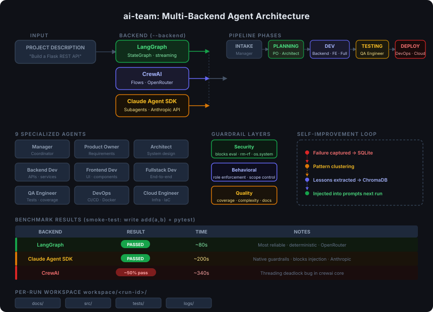
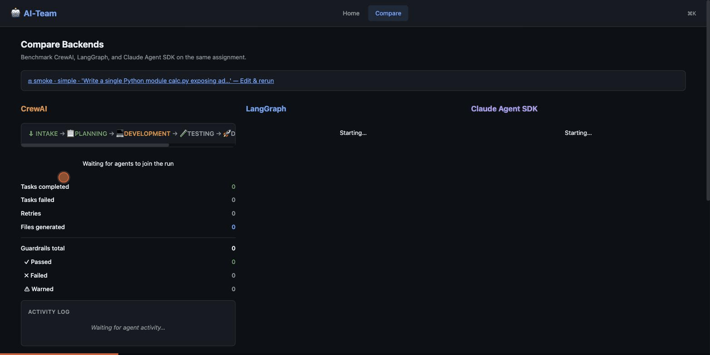
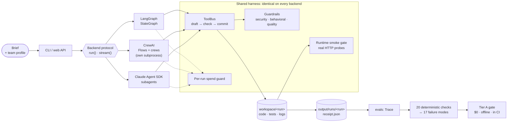
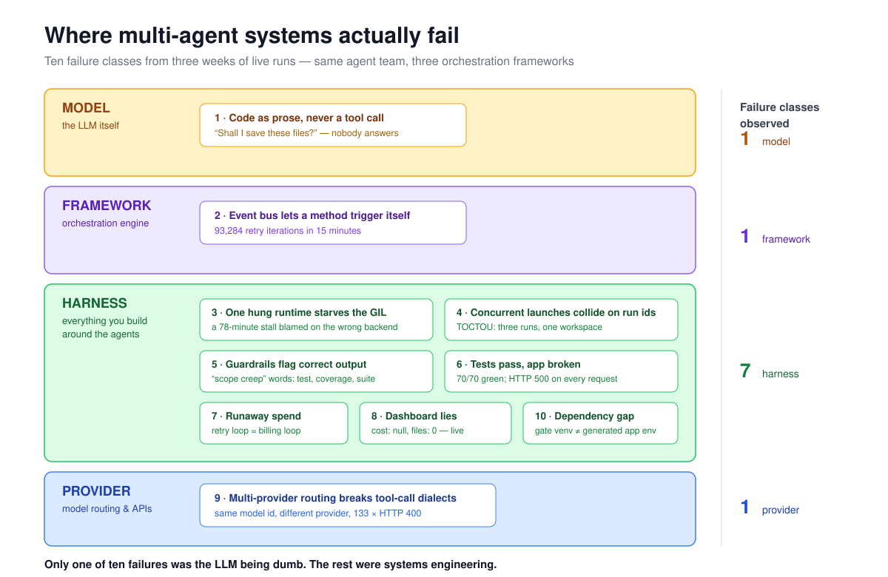
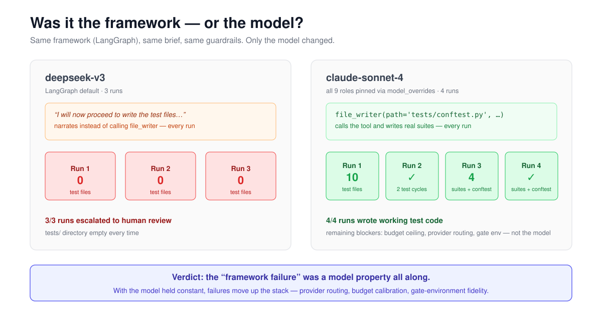
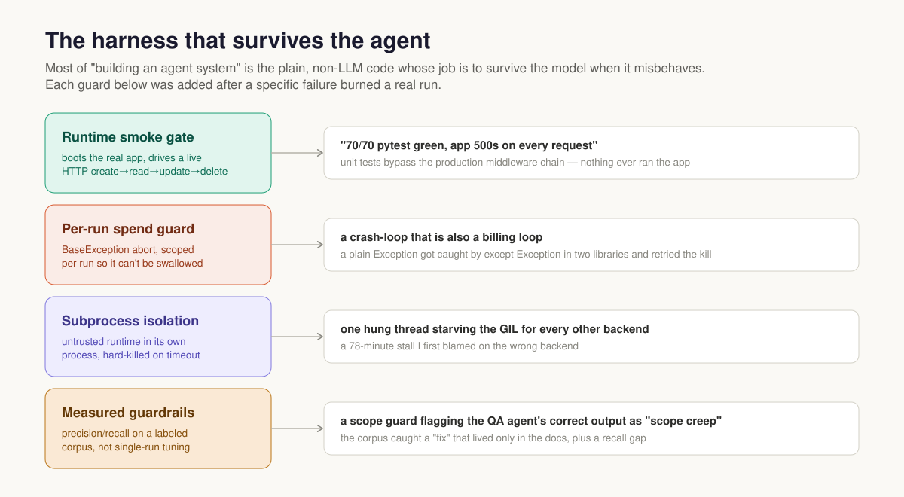

# ai-team

**One nine-agent software team, three orchestration frameworks, and the harness that makes their failures comparable.**

[](https://github.com/RickZee/ai-team/actions/workflows/ci.yml)
[](https://www.python.org/downloads/)
[](LICENSE)

A Manager, Product Owner, Architect, three developers, DevOps, a Cloud Engineer and QA take
a plain-language brief and build software. The same team, tools, guardrails and tasks run on
**[LangGraph](https://docs.langchain.com/oss/python/langgraph/overview)**,
**[CrewAI](https://docs.crewai.com/)** and the
**[Claude Agent SDK](https://code.claude.com/docs/en/agent-sdk/overview)** behind one `Backend`
protocol, and two cloud-native backends are being built against the same contract:
[Strands Agents](https://strandsagents.com/) on Amazon Bedrock AgentCore and
[Microsoft Agent Framework](https://learn.microsoft.com/en-us/agent-framework/overview/agent-framework-overview)
on Microsoft Foundry. Only the framework changes between runs, so every failure can be pinned to a layer:
model, framework, harness or provider. Most of them were the harness. That harness, and the
eval suite that measures it, are the real deliverable.



**Contents:** [Run it for $0](#run-it-in-60-seconds-for-0) ·
[How it fits together](#how-it-fits-together) · [Backends](#three-backends-one-protocol) ·
[What the runs show](#what-the-runs-show) · [The harness](#the-harness) · [Evals](#evals) ·
[Learn it](#learn-it) · [Develop](#develop) · [Layout](#repository-layout) ·
[Docs](#documentation) · [Acknowledgments](#license-and-acknowledgments)

## Run it in 60 seconds, for $0

The whole team runs with the model switched off, so nothing can spend:

```bash
git clone https://github.com/RickZee/ai-team.git && cd ai-team
uv sync                                   # https://docs.astral.sh/uv/
OPENROUTER_API_KEY= ANTHROPIC_API_KEY= \
  uv run python scripts/run_demo.py demos/00_smoke_test \
  --backend langgraph --graph-mode placeholder --skip-estimate --timeout 120
```

The run bundle lands in `output/runs/`. For real runs, copy `.env.example` to `.env`, add an
[OpenRouter](https://openrouter.ai/settings/keys) key (CrewAI, LangGraph) and/or an Anthropic
key (Claude Agent SDK), then:

```bash
uv run ai-team run "Build a REST API" --backend langgraph   # or crewai, claude-agent-sdk
bash scripts/quickstart.sh                                  # smoke every available backend
```

Or race all three in the web dashboard:

```bash
uv run ai-team-web &                                   # FastAPI on :8421 (loopback only)
cd src/ai_team/ui/web/frontend && npm ci && npm run dev  # React on :5173, proxies the API
```

Open `http://localhost:5173/compare`, describe a project, click **Run All Backends**:



Setup details and first-run errors: [docs/GETTING_STARTED.md](docs/GETTING_STARTED.md).

## How it fits together


```mermaid
flowchart LR
    brief(["Brief<br/>+ team profile"]) --> cli["CLI / web API"]
    cli --> proto{{"Backend protocol<br/>run() · stream()"}}
    proto --> lg["LangGraph<br/>StateGraph"]
    proto --> cr["CrewAI<br/>Flows + crews<br/>(own subprocess)"]
    proto --> sdk["Claude Agent SDK<br/>subagents"]
    subgraph harness["Shared harness: identical on every backend"]
        bus["ToolBus<br/>draft → check → commit"]
        guard["Guardrails<br/>security · behavioral · quality"]
        spend["Per-run spend guard"]
        smoke["Runtime smoke gate<br/>real HTTP probes"]
    end
    lg & cr & sdk --> bus
    bus --> guard
    lg & cr & sdk -.-> spend
    bus --> ws[("workspace/&lt;run&gt;<br/>code · tests · logs")]
    ws --> smoke
    ws --> bundle[("output/runs/&lt;run&gt;<br/>receipt.json")]
    bundle --> trace["evals: Trace"]
    trace --> checks["20 deterministic checks<br/>↔ 17 failure modes"]
    checks --> gate["Tier A gate<br/>$0 · offline · in CI"]
```

Agents hand work to each other through files in the run workspace, not shared memory. How
each framework moves that work between agents:


Full design: [docs/ARCHITECTURE.md](docs/ARCHITECTURE.md). Layer-by-layer status, with the
test that proves each claim: [docs/HARNESS.md](docs/HARNESS.md).

## Three backends, one protocol

| Backend | Orchestration model | Model access | Observed at n=5 ([not a verdict](#what-the-runs-show)) |
| --- | --- | --- | --- |
| **Claude Agent SDK** | Nested subagents, native tool calling, session persistence | Anthropic API | 5/5 green on Claude, tightest spread, highest cost |
| **CrewAI** | Flows (`@start`, `@listen`, `@router`) over crews; runs in a subprocess with a hard kill | OpenRouter via LiteLLM | 5/5 green on DeepSeek, slowest |
| **LangGraph** | `StateGraph`, conditional edges, SQLite/Postgres checkpointing | OpenRouter | 1/5 on DeepSeek before two harness fixes |

Swap per run with `--backend`. The protocol is
[`src/ai_team/core/backend.py`](src/ai_team/core/backend.py); the executable definition of
"an ai-team backend" is the conformance suite in [`tests/conformance/`](tests/conformance/).

**In progress:** Strands on Amazon Bedrock AgentCore and Microsoft Agent Framework on Microsoft
Foundry, local first, deployed with Terraform. Neither runs yet; the status of every backend on
every target is in [docs/CLOUD_NATIVE.md](docs/CLOUD_NATIVE.md) and the decision in
[ADR-001](docs/adr/ADR-001-cloud-native-backends.md).

<details>
<summary><b>Team profiles</b>: not every brief needs nine agents (<code>--team</code>)</summary>

| Profile | Agents | Use case |
| --- | --- | --- |
| `full` (default) | All 9, all phases | Full software project |
| `full-claude` | All 9, every role pinned to one Claude model via OpenRouter | Same-model comparisons |
| `backend-api` | Manager, PO, Architect, Backend Dev, QA, DevOps | REST API / microservice |
| `frontend-app` | Manager, PO, Architect, Frontend Dev, QA, DevOps | SPA / static site |
| `data-pipeline` | Manager, PO, Architect, Backend Dev, QA | ETL / data engineering |
| `prototype` | Architect, Fullstack Dev, QA | Design → build → test |
| `smoke` | Architect, Backend Dev, QA | CI smoke checks |
| `infra-only` | Architect, DevOps, Cloud | IaC / CI-CD only |

Source: [`team_profiles.yaml`](src/ai_team/config/team_profiles.yaml) ·
catalog: [docs/TEAM_PROFILES.md](docs/TEAM_PROFILES.md).
</details>

## What the runs show

Only one of the first ten failure classes was the model misbehaving. The other nine were the
framework, the provider, or code around the agents. The
[failure taxonomy essay](docs/posts/failure-taxonomy.md) walks through each with its trace
and fix; the machine-readable version has since grown to 17 classes
([`failure_modes.yaml`](evals/taxonomy/failure_modes.yaml), FM-001…017).



**Framework or model?** Tested directly: same framework (LangGraph), same brief, same
guardrails, only the model changed. DeepSeek wrote no test files in 3/3 runs; Claude wrote test
suites in 4/4. That is a model property, not a framework one.



**Across backends**, batches of n=5 on the smoke brief (single runs of one configuration
ranged 6m50s to 10m41s within an hour):

| Backend (model) | Green | 95% Wilson CI | Wall min / median / max | Spend per run |
| --- | --- | --- | --- | --- |
| Claude Agent SDK (Claude) | 5/5 | 57–100% | 2m20s / 3m17s / 3m47s | $0.48–$0.95 |
| CrewAI (DeepSeek) | 5/5 | 57–100% | 6m50s / 9m07s / 11m57s | cents |
| LangGraph (DeepSeek) | 1/5 | 4–62% | 1m25s / 3m55s / 5m08s | cents |

> [!WARNING]
> **This table does not rank frameworks.** Rows mix framework *and* model (Claude vs
> DeepSeek), and at n=5 every pair of
> [Wilson intervals](https://en.wikipedia.org/wiki/Binomial_proportion_confidence_interval#Wilson_score_interval)
> overlaps, so even 5/5 vs 1/5 is not a supported difference. LangGraph's 1/5 traced to two
> harness bugs ([investigation](docs/troubleshooting/langgraph-reliability-investigation.md)).
> The honest headline: the harness and the model choice dominate, and there are not yet enough
> runs to separate the frameworks. Full data: [docs/COMPARISON_RESULTS.md](docs/COMPARISON_RESULTS.md).

**Reproduce it, or prove it wrong.** The model-controlled run pins every role to one Claude
model, prints intervals, and says "no significant difference at this n" whenever they overlap:

```bash
uv run python scripts/run_smoke_batch.py --n 5 --team smoke-claude --demo demos/02_todo_app
```

Each batch writes a provenance bundle (`output/smoke_batch_<ts>.json`). If your numbers
disagree, open an issue with the bundle attached; disagreement backed by data is the point.

## The harness



Every component below exists because a real run failed without it:

| Guard | What it catches | Incident |
| --- | --- | --- |
| **Runtime smoke gate** | "70/70 pytest green, app 500s on every request": boots the app, drives a create→read→update→delete round-trip over HTTP | [tests-pass-app-broken](docs/troubleshooting/tests-pass-app-broken.md) |
| **Per-run spend guard** | Retry loops that are also billing loops; scoped per run with `contextvars` | [COMPARISON_RESULTS](docs/COMPARISON_RESULTS.md) |
| **Subprocess isolation + hard kill** | A hung backend thread starving the GIL for every other backend (a 78-minute false report) | [gil-starvation](docs/troubleshooting/gil-starvation-hitl-delay.md) |
| **Draft-then-commit ToolBus** | Agent writes landing before checks pass; every write goes through one bus | [HARNESS.md](docs/HARNESS.md), [`tools/draft.py`](src/ai_team/tools/draft.py) |
| **Auditable human overrides** | Approving past a failing gate reading as success; now a distinct `complete_approved` status | [COMPARISON_RESULTS](docs/COMPARISON_RESULTS.md) |
| **Calibrated guardrails** | A scope check flagging correct QA output; thresholds set from measured FP/TN rates | [taxonomy #5](docs/posts/failure-taxonomy.md) |
| **Flow-wiring regression test** | A CrewAI listener triggering itself: 93,284 iterations in 15 minutes | [taxonomy #2](docs/posts/failure-taxonomy.md) |
| **Atomic run-id allocation** | Concurrent launches colliding on one run id and workspace (TOCTOU) | [taxonomy #4](docs/posts/failure-taxonomy.md) |

Guardrail catalogue: [docs/GUARDRAILS.md](docs/GUARDRAILS.md). Threat model, including the web
control plane: [SECURITY.md](SECURITY.md).

## Evals

Error analysis first: every run becomes an immutable trace, failures are coded by hand into a
taxonomy, and each failure mode gets a deterministic check before anyone reaches for an LLM
judge ([method](docs/EVAL_METHODOLOGY.md)). The Tier A gate replays a committed, redacted
corpus through those checks, costs $0 and runs in CI:

```bash
uv run python -m evals.cli run --tier A --warn-only                       # the $0 gate
uv run python -m evals.cli trace backfill --workspace-root ./workspace    # your own runs → traces
uv run python -m evals.cli index rebuild
```

What the gate does and does not prove today, and what may be claimed from it:
[docs/EVAL_GATE_STATUS.md](docs/EVAL_GATE_STATUS.md). Entry point: [evals/README.md](evals/README.md).

## Learn it

> **[Agents That Actually Work](course/README.md)**: a free six-week course. Run the team with
> the model off, watch it fail for real, find out whether your monitoring saw anything, read
> thirty runs yourself, write a check, and prove a fix with a number that carries its *n*.
> Weeks 3–5 need no API key.

Shorter and code-free: [*Evals Without the Jargon*](docs/course/README.md), six sessions plus a
one-file harness you can point at your own logs.

## Develop

```bash
uv run pytest tests/unit                       # what CI runs on every push (no network, no keys)
uv run pytest tests/conformance                # the backend contract
uv run pytest tests/integration                # heavier, still mocked
AI_TEAM_USE_REAL_LLM=1 uv run pytest tests/integration -m real_llm   # live OpenRouter, costs money
./scripts/pre_push_check.sh                    # everything CI checks, locally
```

Ruff formats and lints, mypy type-checks, and `tests/unit/repo/` guards repository invariants
(reachability, dead links, type-debt and complexity ratchets). Conventions and PR process:
[CONTRIBUTING.md](CONTRIBUTING.md).

<details>
<summary><b>Configuration reference</b></summary>

`.env.example` holds the common keys; defaults live in
[`config/settings.py`](src/ai_team/config/settings.py) and
[`config/models.py`](src/ai_team/config/models.py).

| Variable | Description | Default |
| --- | --- | --- |
| `OPENROUTER_API_KEY` | OpenRouter key (CrewAI, LangGraph) | — |
| `ANTHROPIC_API_KEY` | Anthropic key (Claude Agent SDK) | — |
| `AI_TEAM_ENV` | Model tier: `dev`, `test`, `prod` | `dev` |
| `AI_TEAM_MAX_COST_PER_RUN` | Pre-run estimate ceiling (USD); abort above it | `5.0` |
| `AI_TEAM_RUN_BUDGET_USD` | Runtime spend guard (USD); non-retryable abort | `5.0` |
| `AI_TEAM_WEB_TOKEN` | Control-plane token; required to bind anything but loopback | unset |
| `CREWAI_HARD_TIMEOUT_SECONDS` | Wall-clock kill for the CrewAI subprocess | `900` |
| `AI_TEAM_LANGGRAPH_GRAPH_MODE` | `placeholder` (stub nodes) or `full` (subgraphs) | `placeholder` |
| `AI_TEAM_LANGGRAPH_POSTGRES_URI` | Postgres checkpointer (optional) | SQLite |
| `AI_TEAM_USE_REAL_LLM` | `1` enables live-LLM integration tests and evals | unset |
| `AI_TEAM_EVAL_BUDGET_USD` | Ceiling for live eval tiers B/C | `5.00` |

More knobs (`MEMORY_*`, `GUARDRAIL_*`, `ANTHROPIC_*`) are documented in
[GUARDRAILS.md](docs/GUARDRAILS.md) and [MODELS.md](docs/MODELS.md).
</details>

## Repository layout

```text
ai-team/
├── src/ai_team/
│   ├── core/            Backend protocol, results bundle, team profiles, spend guard
│   ├── backends/        crewai_backend/ · langgraph_backend/ · claude_agent_sdk_backend/
│   │                    + strands/agent_framework stubs and the shared conformance surface
│   ├── harness/         acceptance, context pinning, receipts, routing, lessons
│   ├── tools/           ToolBus, file/code/git/test tools, runtime smoke gate
│   ├── guardrails/      security · behavioral · quality
│   ├── config/          settings, agents.yaml, team_profiles.yaml, models.py
│   ├── memory/          long-term store and lessons (SQLite)
│   ├── models/          shared domain models (requirements, architecture, QA)
│   ├── reports/         manager self-improvement reports
│   ├── knowledge/       authored snippets injected into agent context
│   └── ui/web/          FastAPI control plane + React/Vite dashboard
├── evals/               traces, taxonomy, checks, judges, Tier A–C, fixtures
├── tests/               unit/ (CI) · conformance/ · integration/ · e2e/ · performance/
├── course/              Agents That Actually Work (six weeks)
├── demos/               00_smoke_test · 02_todo_app (input + acceptance contract)
├── docs/                reference, journal, posts, troubleshooting (map: docs/README.md)
├── infra/terraform/     AgentCore and Azure deployment for the cloud backends
├── docker/              app image, cloud-backend images, compose (+ optional OTel, Ollama)
├── scripts/             run_demo, quickstart, smoke batches, pre-push gates
└── .kiro/specs/         specs: requirements → design → tasks (the plan of record)
```

## Documentation

Start with the [documentation map](docs/README.md). The five most useful pages:

- [Engineering journal](docs/journal/README.md): what broke, when, and the commit that fixed it, corrections included
- [Failure taxonomy](docs/posts/failure-taxonomy.md): the classes of failure, each with a trace
- [HARNESS.md](docs/HARNESS.md): the seven harness layers and whether each is instrumented, enforced or closed-loop
- [ARCHITECTURE.md](docs/ARCHITECTURE.md): system design and inter-agent communication per backend
- [Spec index](.kiro/specs/README.md): what is planned and in what order

## License and acknowledgments

[MIT](LICENSE). Built on [CrewAI](https://docs.crewai.com/),
[LangGraph](https://docs.langchain.com/oss/python/langgraph/overview),
the [Claude Agent SDK](https://code.claude.com/docs/en/agent-sdk/overview),
[LiteLLM](https://docs.litellm.ai/) and [OpenRouter](https://openrouter.ai/), with
[uv](https://docs.astral.sh/uv/) and [Ruff](https://docs.astral.sh/ruff/).

The eval method follows Hamel Husain and Shreya Shankar's error-analysis-first practice
([AI Evals FAQ](https://hamel.dev/blog/posts/evals-faq/)). The harness framing draws on
Anthropic's [Harness design for long-running application development](https://www.anthropic.com/engineering/harness-design-long-running-apps).
Trace telemetry targets [OpenInference](https://github.com/Arize-ai/openinference) conventions so
external viewers can read it. Every other source, and what was taken from each, is in
[docs/resources.md](docs/resources.md).
