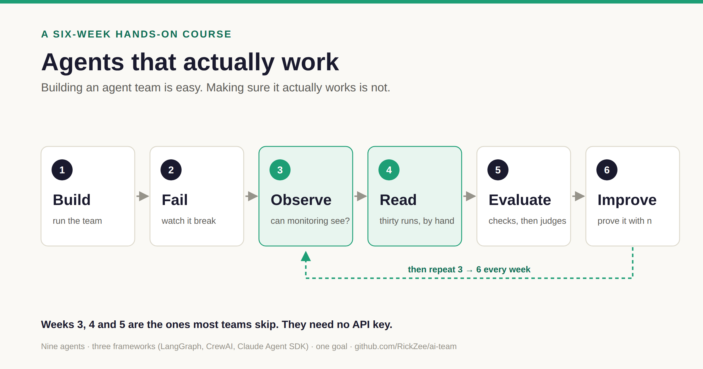

# Agents That Actually Work

**Building an agentic team is easy. Making sure it actually works is not.**



A free, six-week, hands-on course. You take a real multi-agent software team — nine agents,
three frameworks, one goal — run it fresh, and watch it fail. Then you learn to see *why*,
measure it, and make it better with evals.

Every step is a real command you type yourself, against a real system, with failures nobody
staged for you. There is no wrapper script on purpose: the commands *are* the lesson, and
they're the same ones you'll run on your own system afterwards.

## Start

```bash
git clone https://github.com/RickZee/ai-team.git && cd ai-team
uv sync                      # install (https://docs.astral.sh/uv/)
cp .env.example .env         # keys are optional — see below
```

Then open [Week 1](./week-1-build.md).

## The six weeks

| Week | You will… | Cost |
| --- | --- | --- |
| **[1 · Build](./week-1-build.md)** | Meet the team, run it with the model switched off, then for real | $0, then cents |
| **[2 · Fail](./week-2-fail.md)** | Give three frameworks the same brief; decide whose failure each one is | ≈ $1 live (optional), $0 with the recorded case |
| **[3 · Observe](./week-3-observe.md)** | Find out whether your monitoring saw anything at all | $0 |
| **[4 · Read](./week-4-read.md)** | Read thirty runs yourself — the step nobody does | $0, one afternoon |
| **[5 · Evaluate](./week-5-evals.md)** | Learn what a green run proves, then write your own check | $0 |
| **[6 · Improve](./week-6-improve.md)** | Fix one failure and prove it with a number that carries its `n` | $0 with the recorded batch; live batches optional |

About two hours a week. **Weeks 3–5 need no API key.**

## How every lab works

Each step has the same five beats:

1. **Predict** — write down what you expect *before* you run anything.
2. **Run** — the exact command.
3. **Observe** — what it printed on this repo (your numbers will differ).
4. **Explain** — why, and what it means beyond this repo.
5. **Change** — edit something, run again, compare.

The predictions matter. Most of what this course teaches is the gap between what you
expected and what the system recorded.

## What you need

- Mac or Linux, [uv](https://docs.astral.sh/uv/), Python 3.11+ (uv fetches it)
- **Optional:** an [OpenRouter](https://openrouter.ai/settings/keys) key (LangGraph, CrewAI)
  and/or an Anthropic key (Claude Agent SDK), in `.env`. Paid runs in this course cap spend
  with `AI_TEAM_RUN_BUDGET_USD=1`.
- Node.js only if you want the web dashboard.

Scratch files go in `course/.work/` (gitignored). Delete it any time to start over.

## Who it's for

| You are… | You'll get |
| --- | --- |
| **A developer shipping agents** | A loop you can run on your own system on Monday |
| **A QA or test lead** | Your job with new nouns — each lab has a *For testers* note |
| **A lead or founder** | The questions to ask before believing "our agents pass 94%" |

## The one idea

> **The instrument is the last thing anyone audits — and the only one whose failure hides
> every other.**

The case study is [*The Starved Harness*](../docs/posts/the-starved-harness.md): 13,000 lines of
eval code that had never measured the system it was built for. You'll reproduce that finding
in week 3, in five seconds, for free.

## Honest about the testbed

This is a live research project, and the course uses that on purpose. As of **2026-09-16**:

- The `$0` offline eval suite runs on every pull request — but it scores synthetic fixtures,
  so every rate it prints is **`FIXTURE-ONLY`**.
- Most runs carry no step-level spans, and a third never recorded which framework ran. The
  trace builder mislabelled every run until 2026-09-16. That's week 3.
- Nobody has published a failure-frequency table from real runs of this system yet. Week 4
  is how you'd make one.

## Where things are

| | |
| --- | --- |
| Run records | `output/runs/<run_id>/` · newest id in `output/latest` |
| Code the agents wrote | `workspace/<run_id>/` |
| Eval harness | [`evals/`](../evals/README.md) — `uv run python -m evals.cli --help` |
| Failure catalogue | [`docs/posts/failure-taxonomy.md`](../docs/posts/failure-taxonomy.md) |
| One-file harness for *your* logs | [`docs/course/minieval.py`](../docs/course/minieval.py) |
| Course illustrations | [`images/`](./images/) — SVG for GitHub, PNG for everywhere else |

## Credits

The method — traces before scores, open coding, checks before judges, judges measured
against human labels — is Hamel Husain's and Shreya Shankar's. Read Hamel's
[*A Field Guide to Rapidly Improving AI Products*](https://hamel.dev/blog/posts/field-guide/).

MIT licensed, like the repo.
