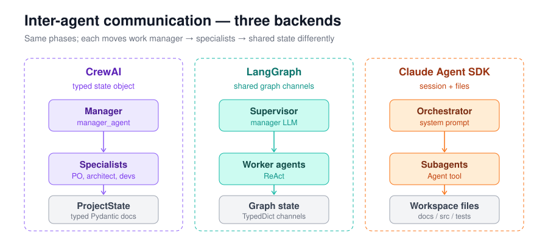
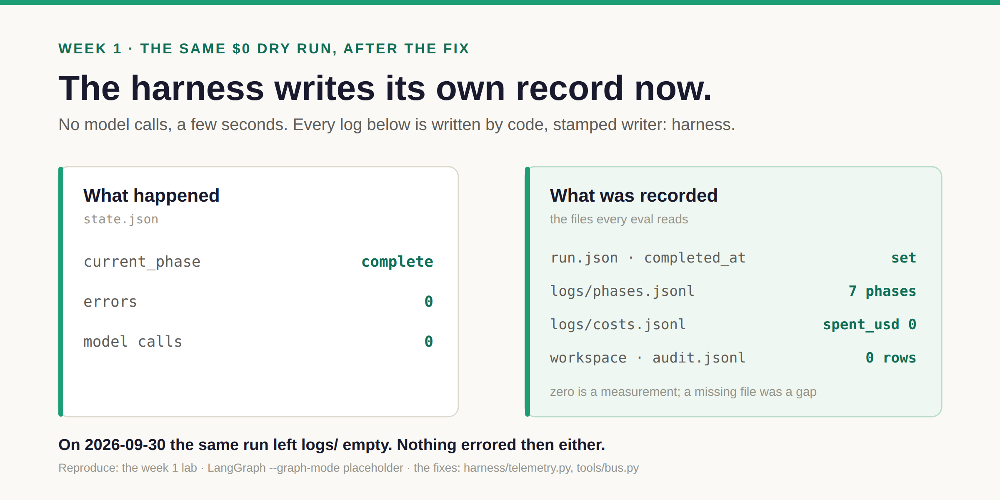
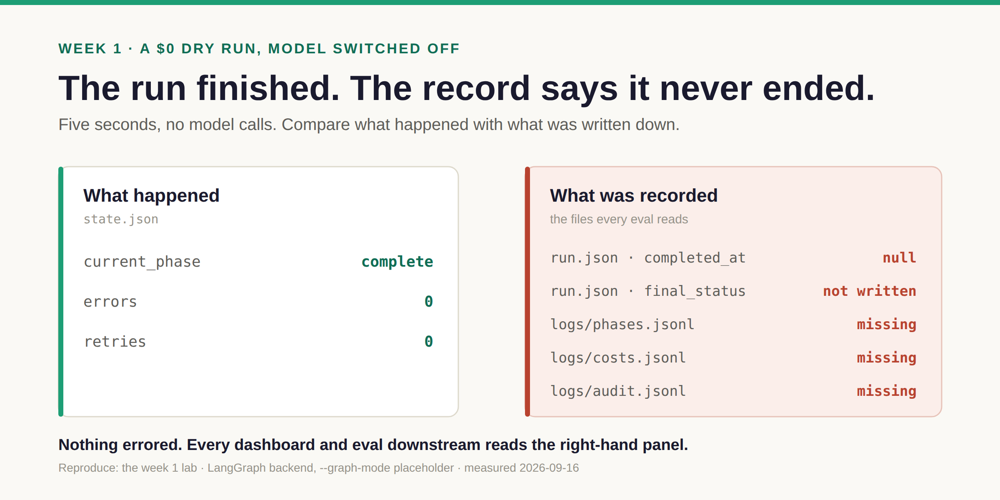

# Week 1 · Build — the easy part

**By the end:** you've run a nine-agent team twice — once with no model, once for real — and
you know where everything it did was written down.
**Time:** ~90 min · **Cost:** $0, then cents (Claude runs ≈ $0.50–$1) · [← Course home](./README.md)

---

## Step 1 — Meet the team (20 min)

One brief goes in. Agents plan it, write code, test it, and hand back a workspace. The same
team runs on **three frameworks** behind one interface:



**Read** `src/ai_team/core/backend.py`. It's about 30 lines: every framework implements
`run(description, profile)` and `stream(...)`. Same tools, same guardrails, same folders.
That's what makes the question behind this course answerable:

> **When it fails, whose failure is it — the model's, the framework's, or yours?**

Our brief lives in `demos/00_smoke_test/` — open `input.json`. It uses the small `prototype`
team: architect → developer → QA.

## Step 2 — Run it with the model switched off (15 min, $0)

**Predict.** The pipeline will "run" with every model call stubbed. When it finishes, which
of these will exist? An end time in the run record · a final status · a phase log · a cost log
· an audit log of tool calls. And what should a cost log say about a run that spent nothing?

**Run.** The empty key variables guarantee this can't spend, even if `.env` has keys — an
explicitly empty variable beats `.env` on purpose. Keep them on this one line: if you `export`
them instead, the paid run in step 3 refuses to start until you `unset` them.

```bash
OPENROUTER_API_KEY= ANTHROPIC_API_KEY= \
  uv run python scripts/run_demo.py demos/00_smoke_test \
  --backend langgraph --graph-mode placeholder --skip-estimate --timeout 120
```

**Observe.** Now look at what was written:

```bash
RUN=output/runs/$(cat output/latest); ID=$(cat output/latest)
ls $RUN $RUN/logs workspace/$ID/logs
python3 -m json.tool $RUN/run.json
grep -m1 '"current_phase"' $RUN/state.json
cat $RUN/logs/costs.jsonl
wc -l workspace/$ID/logs/audit.jsonl
```

Fill in this card from what you see:

| Field | Value |
| --- | --- |
| backend (`run.json`) | |
| current_phase (`state.json`) | |
| completed_at (`run.json`) | |
| final status (`run.json` → `extra`) | |
| files in `$RUN/logs/` | |
| `spent_usd` in `costs.jsonl` | |
| rows in `workspace/<id>/logs/audit.jsonl` | |

On this repo it looks like this now:



On 2026-09-30 the same command produced this card:



**Explain.** Same run, same zero model calls. On September 30 the record knew the run had
ended and nothing else: `logs/` was empty. No phase log, no cost log, no audit log. Nothing
errored.

Every dashboard, eval and report reads those logs. A run with no phase log gives every
path-based check nothing to look at; a run with no cost log drops out of every spend chart.
**Missing data doesn't fail loudly. It makes every number above it a bit fictional.**

Three things changed, all in the harness, none in a prompt. The cost log always gets a
`run_total` row, so a free run says `spent_usd: 0` instead of vanishing. The phase log is
written from the phases the graph actually recorded; before, it was a numbered line in an
agent's prompt (week 3 is about that). And a run that cannot call a tool leaves an empty
audit log, because zero rows is a measurement and a missing file is a gap. Every row says
`"writer": "harness"`.

**Change.** Find the writers, then check the oldest gap of all. Until 2026-09-16 command-line
runs didn't even record an end time — only the web server and the Claude SDK backend called
`finalize()`. Find who calls it now, then count how many *old* records are still open:

```bash
grep -n '"writer"' src/ai_team/harness/telemetry.py
grep -rn --include='*.py' "finalize(" src/ai_team scripts
python3 -c "import json,glob; r=[json.load(open(f)) for f in glob.glob('output/runs/*/run.json')]; print(sum(not x.get('completed_at') for x in r), 'of', len(r), 'records have no end time')"
```

On the maintainer's checkout that printed **220 of 318**. Fixing the writer didn't repair
history: every old record is still open, and anything that averages over them still
inherits the gap. Keep that in mind for week 3.

## Step 3 — Run it for real (30 min, cents)

Needs `OPENROUTER_API_KEY` in `.env` (or `ANTHROPIC_API_KEY` for `claude-agent-sdk`). If the
run stops immediately saying the variable is set but empty, that's step 2's safety catch still
in your shell: `unset OPENROUTER_API_KEY ANTHROPIC_API_KEY` and run it again.

**Predict.** The brief: *write `add(a, b)` and one pytest.* A single model call does this in
about two seconds. How long will the team take? Will it pass?

**Run.**

```bash
AI_TEAM_ENV=dev AI_TEAM_RUN_BUDGET_USD=1 \
  uv run python scripts/run_demo.py demos/00_smoke_test \
  --backend langgraph --skip-estimate --timeout 900
```

**Observe.** Fill in the same card for this run, plus: wall time, `retry_count`, and whether
`workspace/<run_id>/` contains a test file.

```bash
RUN=output/runs/$(cat output/latest); ID=$(cat output/latest)
ls $RUN                                   # is there a state.json at all?
grep -E '"(current_phase|retry_count)"' $RUN/state.json 2>/dev/null || echo "no state.json"
ls workspace/$ID
```

**Stop rule.** If it's still running at **minute 15**, press **Ctrl-C** and check nothing is
left behind: `ps aux | grep run_demo` (kill any leftovers — they keep spending). On
LangGraph, a run you stop (or the watchdog stops) keeps its last checkpoint in `state.json`,
with `stopped_by` and `stopped_in` naming what was running; on the other frameworks it may
have no `state.json` at all. Either way, write it on your card. Then use the
recorded case in [week 2, step 2](./week-2-fail.md#step-2--study-a-recorded-failure-45-min-0),
which is the same brief with every log kept.

**Explain.** It may succeed, hang, or end asking a human for review. **All three are useful.**
Don't re-run it yet — whatever happened is next week's material. (On 2026-09-16 a fresh-clone
LangGraph run had correct files within minutes and was still retrying a guardrail at 15. That
loop was fixed later the same day — week 2 shows how.)

## Where things went

| Path | Holds | Written by |
| --- | --- | --- |
| `output/runs/<id>/` | the **run record**: `run.json`, `state.json`, `logs/`, `reports/` | the harness |
| `workspace/<id>/` | the **code the agents wrote** | the agents |

Remember this table. In week 3 it's the whole story.

## ✅ Checkpoint

- [ ] Two filled-in cards: dry run and real run
- [ ] One sentence on why the September 30 dry-run card was suspicious, and what yours shows instead
- [ ] How many of your run records have no end time, and why fixing the code didn't change that

**For testers:** a dry run with the model mocked is a smoke test of your *test
infrastructure*. Before trusting a report, check the harness wrote one.

**Next:** [Week 2 · Fail →](./week-2-fail.md)
