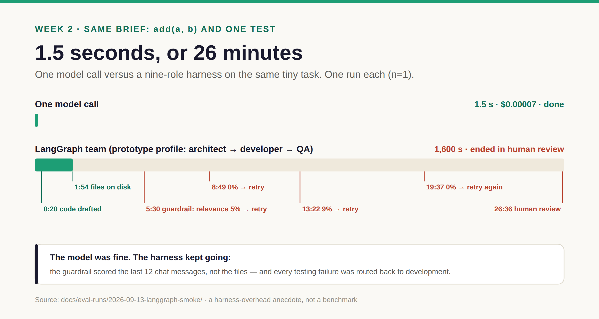

# Week 2 · Fail — run it fresh, see it break

**By the end:** you've watched the same brief break on different frameworks and put a layer —
model, framework, harness or provider — next to every failure.
**Time:** ~2 hours · **Cost:** ≈ $1 with keys, $0 with the recorded case · [← Course home](./README.md)

---

## Step 1 — The race (30 min)

**Predict.** Same brief, same tools, same guardrails. Which framework finishes fastest? Which
one fails? Write it down.

**Run** — one line per backend you have a key for:

```bash
for B in langgraph crewai claude-agent-sdk; do
  AI_TEAM_ENV=dev AI_TEAM_RUN_BUDGET_USD=1 \
    uv run python scripts/run_demo.py demos/00_smoke_test \
    --backend $B --skip-estimate --timeout 900
done
```

Prefer to watch? Start the dashboard and use the **Compare** tab, which races them live:

```bash
uv run ai-team-web &                                        # API on :8421
(cd src/ai_team/ui/web/frontend && npm install && npm run dev)  # open localhost:5173/compare
```

**Observe.** One row per run:

| | langgraph | crewai | claude-agent-sdk |
| --- | --- | --- | --- |
| Finished? how? | | | |
| Wall time | | | |
| `retry_count` | | | |
| Test file in `workspace/<id>/`? | | | |
| Files in `output/runs/<id>/logs/` | | | |

```bash
ls -t output/runs | head -3          # your three newest run ids
```

## Step 2 — Study a recorded failure (45 min, $0)

No key? This step is for you too. It's the same brief, run on 2026-09-13, with every log kept:
[`docs/eval-runs/2026-09-13-langgraph-smoke/`](../docs/eval-runs/2026-09-13-langgraph-smoke/README.md).

**Predict.** A bare model call writes this module in 1.5 seconds for $0.00007. How long did the
nine-role team take?

**Observe.**



Read the *Timeline* table in that README top to bottom, then open the evidence:

```bash
ls docs/eval-runs/2026-09-13-langgraph-smoke/evidence/
```

**Explain.** The files were correct by minute two. Everything after that was the harness:

- a relevance guardrail scored the QA agent against the **last 12 chat messages** — not the
  files it wrote — and got 0–9% against a 15% floor, so it retried;
- the router sent **every** testing-phase error back to development;
- the test run collected **0 tests**, with the test file sitting right there.

A better model would not have helped.

**Change.** Open the guardrail and the router and find the lines responsible:

```bash
grep -n "def _concat_recent_ai_content" -A20 src/ai_team/backends/langgraph_backend/graphs/guardrail_hooks.py
grep -n "def route_after_testing" -A25 src/ai_team/backends/langgraph_backend/graphs/routing.py
```

What one-line change would stop the loop? Don't make it yet — that's week 6.

## Step 3 — Whose failure is it? (30 min)

Put a layer next to every failure from steps 1 and 2:

| Layer | Means | Example from this repo |
| --- | --- | --- |
| **Model** | The LLM did something dumb | Wrote code as prose and asked permission instead of calling the tool |
| **Framework** | The orchestrator's rules bit you | An event listener that re-triggers itself forever |
| **Harness** | Your own glue code | The guardrail reading chat history instead of files |
| **Provider** | The API or router | The same model id behaving differently depending on who serves it |


Check yourself against the full catalogue:
[*Seventeen Ways Multi-Agent Systems Actually Fail*](../docs/posts/failure-taxonomy.md).
(The chart above was drawn when it had ten entries; the catalogue now has seventeen, and the
harness still dominates.)

## Step 4 — Don't rank anything yet (15 min)

**Predict.** Framework A went green 5 of 5, framework B 1 of 5. Is A better?

**Observe.** Two traps:

1. **The models differ.** By default CrewAI and LangGraph run a DeepSeek model and the Claude
   SDK runs Claude, so each row is a *framework + model* bundle. Holding the model constant
   changes the story:

   

2. **n=5 is too small.** 1/5 has a 95% interval of 4–62%; 5/5 has 57–100%. They overlap. We'll
   do this properly in week 6.

**Explain.** Write down *what* failed, not *who won*.

## ✅ Checkpoint

- [ ] A comparison table — your runs or the recorded case
- [ ] A layer next to every failure
- [ ] The minute the recorded task was actually done, and what kept it running

**For testers:** this is root-cause classification in a defect tracker, with four new
component names.

**Exercise:** find a failure where two layers are both plausible. What evidence would settle
it — and was that evidence recorded? That's next week.

**Next:** [Week 3 · Observe →](./week-3-observe.md)
