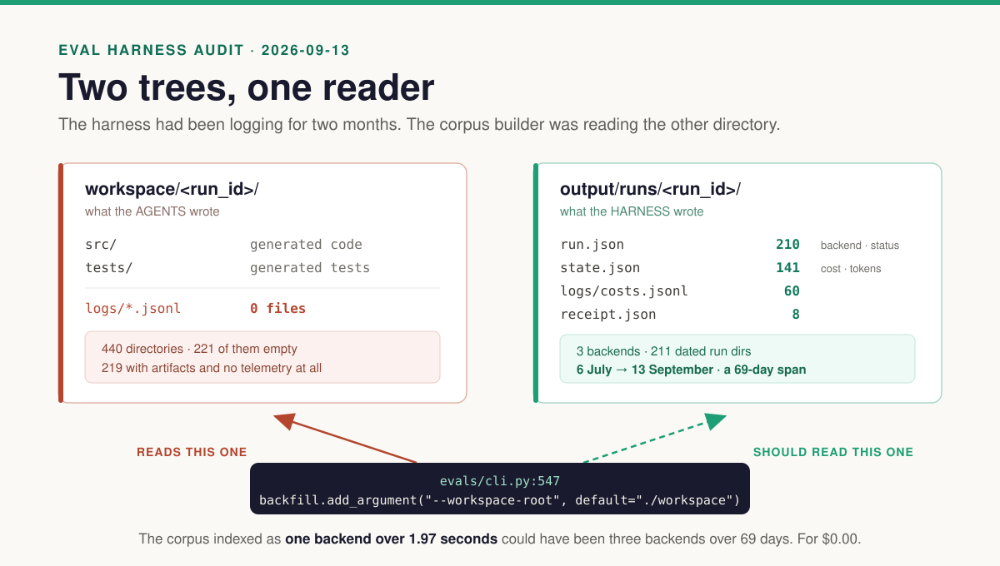
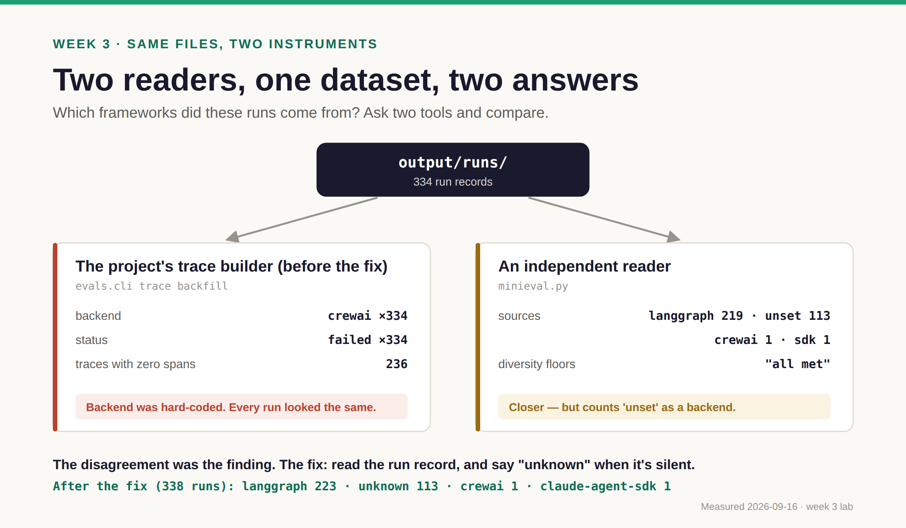
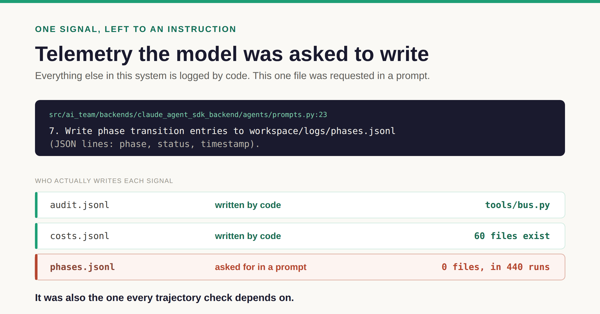

# Week 3 · Observe — can your monitoring see anything?

**By the end:** you've built a trace corpus, caught the instrument lying twice, and know which
of your signals are written by code and which were only *asked for*.
**Time:** ~90 min · **Cost:** $0, no key · [← Course home](./README.md)

---

Eval tools read **traces**: a recorded run, broken into **spans** (one step each, with a
timestamp). No spans, nothing to score. So before "is my agent good?", ask:

> **Does the thing that writes my traces agree with the thing that reads them?**

Read [*The Starved Harness*](../docs/posts/the-starved-harness.md) first (15 min). You're about to
reproduce it.

Every command this week writes to a scratch folder:

```bash
mkdir -p course/.work
```

> **Fresh clone?** Your numbers will be tiny — one trace per run you did in weeks 1–2. The
> *Observe* blocks below come from the maintainer's checkout with ~340 runs. Compare the
> **shape** (which backend, which status, spans or none), not the counts. A few more dry runs
> won't help: they're identical and carry no spans.

## Step 1 — Build a corpus the default way (10 min)

**Predict.** You've run the team at least once, and week 1 showed you where the run record
went. How many traces and spans will the eval harness find if you use its defaults?

**Run.**

```bash
uv run python -m evals.cli trace backfill --traces-root course/.work/t-default --limit 50
uv run python -m evals.cli index rebuild  --traces-root course/.work/t-default
uv run python -m evals.cli index stats    --traces-root course/.work/t-default
```

**Observe.** It depends on what you ran in weeks 1–2:

| You ran | What the default finds |
| --- | --- |
| only dry runs | one trace per run, `unknown · failed`, **zero spans** |
| real runs too | a few traces, *some* spans (the agents' own logs), still `unknown` backend |
| the maintainer's ~340 runs | `unknown · failed · 50` (with `--limit 50`), zero spans |

Now count spans:

```bash
grep -ho '"span_id"' course/.work/t-default/*.json | wc -l
```

Zero if you only did dry runs; a handful if you did real ones.

**Explain.** Either way, look at the backfill defaults: `grep -n "workspace-root" evals/cli.py`. It reads
`./workspace` — the **code the agents wrote** — not `output/runs/`, where the harness keeps
its records. You saw both folders in week 1.



One default argument. Two folders. No test between them. Nothing errors; the corpus comes
back empty (dry runs) or **mislabelled** (real runs) — and no row says which framework ran,
because the harness's run record isn't in that folder.

## Step 2 — Point it at the right folder (15 min)

**Predict.** With `--workspace-root output/runs`, what will the `backend` column show? You know
which frameworks you ran.

**Run.**

```bash
uv run python -m evals.cli trace backfill --workspace-root output/runs --traces-root course/.work/traces
uv run python -m evals.cli index rebuild --traces-root course/.work/traces
uv run python -m evals.cli index stats   --traces-root course/.work/traces
```

**Observe.** On this repo (2026-09-16, after the fix below):

```
backend            status     n
langgraph          complete   111
langgraph          failed     112
unknown            complete    97
unknown            failed      16
crewai             failed       1
claude-agent-sdk   complete     1
```

Spans: `grep -ho '"span_id"' course/.work/traces/*.json | wc -l` → about 160, in fewer than a
third of the traces. Now read one trace's `warnings`:

```bash
ls -t course/.work/traces/*.json | head -1 | xargs python3 -m json.tool | grep -A8 '"warnings"'
```

**Explain.** Until 2026-09-16 this step printed **`crewai · failed · 334`** — every run the same.
The command created its trace builder with `backend="crewai"` and never read the run record.
Read the fix — it's small:

```bash
FIX=$(git log --format=%h -1 --grep="read backend, status and clock" -- evals/trace/builder.py)
git show $FIX -- evals/trace/builder.py evals/cli.py
```

Two things changed, and both are worth copying into your own tools:

- **Read what the run recorded.** Backend, final status and timestamps now come from
  `run.json` (including the nested `extra.final_status`) and `state.json`.
- **Say "unknown" when the record is silent.** 113 runs never wrote which backend ran (the web
  dashboard didn't record it — also fixed now). Guessing a default is how 334 runs became
  `crewai`. The `failed` rows include runs that never recorded a status at all; each such trace
  carries the warning `no final status recorded`.

Fixing the folder exposed the label bug; fixing the label exposed a writer that never recorded
the backend. That's what instrument work looks like.

**Change.** Try the old behaviour on purpose and compare:

```bash
uv run python -m evals.cli trace backfill --workspace-root output/runs --backend crewai \
  --traces-root course/.work/t-forced --limit 20
uv run python -m evals.cli index rebuild --traces-root course/.work/t-forced
uv run python -m evals.cli index stats   --traces-root course/.work/t-forced
```

## Step 3 — Get a second opinion (15 min)

**Predict.** An independent reader over the same folder — will it agree?

**Run.** [`minieval.py`](../docs/course/minieval.py) is a ~500-line, standard-library reader.

```bash
uv run python docs/course/minieval.py ingest --logs output/runs --out course/.work/mini
uv run python docs/course/minieval.py stats  --traces course/.work/mini
```

**Observe.**

```
sources   {'langgraph': 219, 'unset': 113, 'crewai': 1, 'claude-agent-sdk': 1}
statuses  {'unknown': 236, 'complete': 98}
floors    all met
```



**Explain.** It agrees with the fixed builder on the counts — but it counts `unset` as a
framework and calls the diversity floors "met" when two of its four sources have one run each.
Before the fix, the two tools disagreed completely, and that disagreement is how the bug was
found. Neither tool is the truth; the files are.

- When a measurement indicts everything, suspect the measurement.
- When two measurements disagree, **the disagreement is the finding.**

## Step 4 — Which checks can see? (15 min)

**Predict.** The harness has 20 checks. Over your real corpus, how many will actually decide
something?

**Run.**

```bash
uv run python -m evals.cli coverage liveness --traces-root course/.work/traces --out course/.work/liveness.md
head -5 course/.work/liveness.md
```

**Observe.** `20 checks, 3 live, 16 blind, 1 unreachable … na 89%`. Scroll to
*Why checks abstained*: the most common reason is `no phase_start spans`.

**Explain.** A check can pass, fail, or **abstain**. Abstentions are quiet, so a suite can look
calm while deciding almost nothing. More on that in week 5.

## Step 5 — Who writes the telemetry? (15 min)

**Run.**

```bash
grep -rn --include='*.py' "phases.jsonl" src/ai_team
```

**Observe.** One line is in `agents/prompts.py`:
`7. Write phase transition entries to workspace/logs/phases.jsonl`.



**Explain.** That's **self-reported telemetry**: a signal you asked a model to produce instead of
writing it yourself. It doesn't fail loudly — it just isn't there, and every check that needs
it abstains.

**Change.** Fill in, using `grep` for each:

| Signal | Written by code or by a prompt? | Present on your runs? |
| --- | --- | --- |
| `logs/phases.jsonl` | | |
| `logs/costs.jsonl` | | |
| `logs/audit.jsonl` | | |
| `run.json` → `completed_at` | | |

## ✅ Checkpoint

- [ ] You reproduced the empty corpus, then fixed the folder
- [ ] You can explain why every trace used to say `crewai`, and what the fix changed
- [ ] You can name one way the second reader is also wrong
- [ ] Your writer table is filled in

**For testers:** validate the gauge before the part. Here, two gauges disagree, and both
are off.

**Exercise — the ten-minute audit, for your own system:** (0) do writer and reader agree on
where traces live? (1) how many real traces, how diverse? (2) how many has a human read?
(3) where did your failure categories come from? (4) what does a green run assert, in one
sentence? Question 2 is next week.

**Next:** [Week 4 · Read →](./week-4-read.md)
