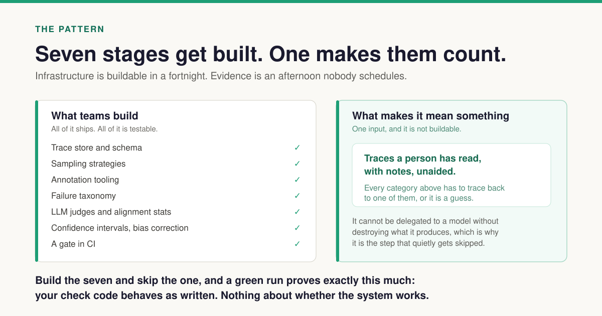
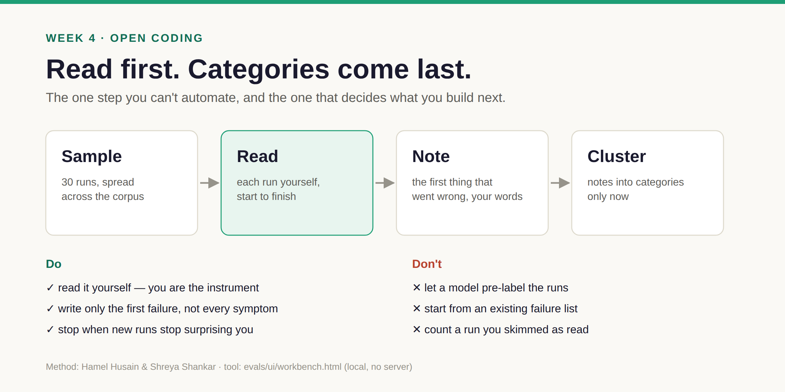

# Week 4 · Read — thirty runs, by hand

**By the end:** you've read thirty runs yourself, written down what went wrong in your own
words, and let categories *emerge* from your notes.
**Time:** one afternoon (~3 hours) · **Cost:** $0 · [← Course home](./README.md)

---

## Why this week matters most

Surveys ask teams whether they *have* observability — most say yes. None asks the number that
decides whether it means anything:

> **How many traces has a human on your team actually read?**



Installing observability is procurement. Reading traces is the work — and the one step you
can't build your way through. The project behind this course built 13,000 lines of eval code
and read zero traces. Don't copy that.



## The rules

1. **You read. Not a model.** If a model pre-labels the runs, you'll anchor on its guesses and
   lose the ground truth everything else rests on.
2. **No categories up front.** Don't open the failure catalogue yet. Write what you see:
   *"QA retried three times after the file already existed."*
3. **Note the first thing that went wrong,** not every symptom after it.
4. **Thirty is enough** to change what you build next.

This is **open coding** (Husain & Shankar). In testing terms: exploratory testing with notes,
before the test plan.

## Step 1 — Pick thirty (10 min)

Uses the corpus you built in week 3 (`course/.work/traces`).

> **You need at least 30 real runs.** A fresh clone doesn't have them, and dry runs are all
> identical. Either do real runs in weeks 1–2 (about $1 each, capped), read the recorded case
> in `docs/eval-runs/` instead, or use a checkout that already has a run history. A shipped
> teaching corpus is planned (`.kiro/specs/eval-testbed/`) but doesn't exist yet.

**Predict.** Thirty random runs from your corpus. How many do you expect to be informative?

**Run.**

```bash
uv run python -m evals.cli sample --strategy stratified -n 30 --seed 1 \
  --traces-root course/.work/traces --samples-root course/.work/samples
SAMPLE=$(ls -t course/.work/samples | head -1 | sed 's/\.json$//'); echo $SAMPLE

uv run python -m evals.cli annotate bundle --sample $SAMPLE --out course/.work/bundle.json \
  --traces-root course/.work/traces --samples-root course/.work/samples \
  --annotations-root course/.work/annotations
```

Open `evals/ui/workbench.html` in a browser (it's one local file — no server) and drop in
`course/.work/bundle.json`.

## Step 2 — Read (2–3 hours)

Most traces are thin (week 3), so keep the raw record open next to the workbench:

```bash
# the run folder for the trace you're reading (the workbench shows its workspace path)
ID=$(ls -t output/runs | head -1)   # newest run; replace with the one you're reading
python3 -m json.tool output/runs/$ID/run.json
grep -E '"(current_phase|retry_count|errors)"' output/runs/$ID/state.json
ls output/runs/$ID/logs workspace/$ID
```

Write one short note per run and a few tags in your own words. Export from the workbench when
you're done (it saves `annotations.jsonl`).

> A run that tells you nothing is still a note: *"no spans, no cost, can't tell what happened."*
> If a third of your notes say that, you've just measured your instrument.

**Observe.** Before moving on, count your own notes: informative vs. uninformative. Compare
with your prediction.

## Step 3 — Save and cluster (20 min)

**Run.**

```bash
NOTES=~/Downloads/annotations.jsonl       # wherever your browser saved the export
if [ -f "$NOTES" ]; then
  uv run python -m evals.cli annotate --sample $SAMPLE --batch-file "$NOTES" \
    --traces-root course/.work/traces --samples-root course/.work/samples \
    --annotations-root course/.work/annotations
else
  echo "No export at $NOTES — export your notes from the workbench first"
fi
uv run python -m evals.cli taxonomy propose --from-annotations \
  --annotations-root course/.work/annotations
```

**Observe.** A table of candidate categories built from *your* tags:

```
canonical              n  in_tax  variants
mislabeled_backend     2  no      mislabeled-backend
```

**Explain.** These are suggestions. For each: accept, rename, merge, or discard. Only now open
[the failure catalogue](../docs/posts/failure-taxonomy.md) and compare:

| | Count |
| --- | --- |
| Your categories that match a documented failure | |
| Documented failures you never saw in thirty runs | |
| Your categories with **no** documented failure | |

The last row is the valuable one: failures nobody found by reasoning from memory.

**Change.** Pick your most frequent category and write one sentence a *program* could check —
no model involved. That sentence is next week's code.

## ✅ Checkpoint

- [ ] 30 notes saved: `cat course/.work/annotations/*.jsonl | wc -l`
- [ ] A short list of categories, each pointing at specific run ids, with counts out of 30
- [ ] The comparison table above

When you report your categories, say what they are: **`CORPUS`, n = 30, a stratified sample of
one system.** They show you what *can* go wrong. They don't tell you how often it does
everywhere.

> Doing this on the real project? Use `--annotations-root evals/annotations` so your notes land
> in the project's own store.

**Next:** [Week 5 · Evaluate →](./week-5-evals.md)
