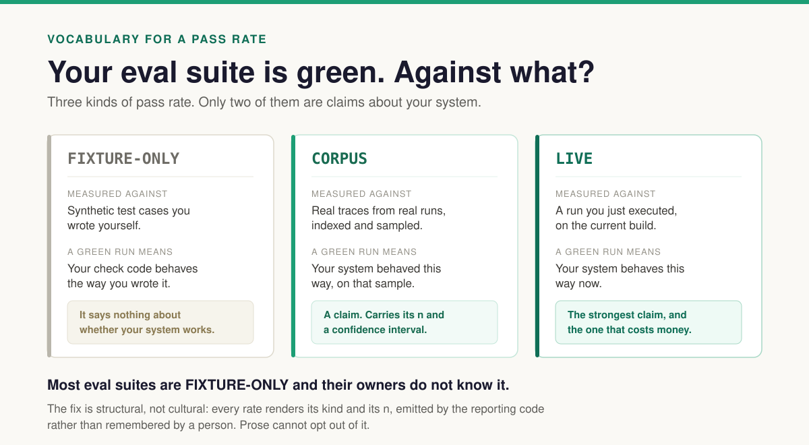
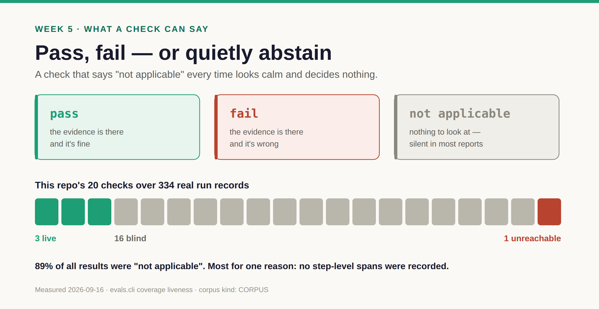
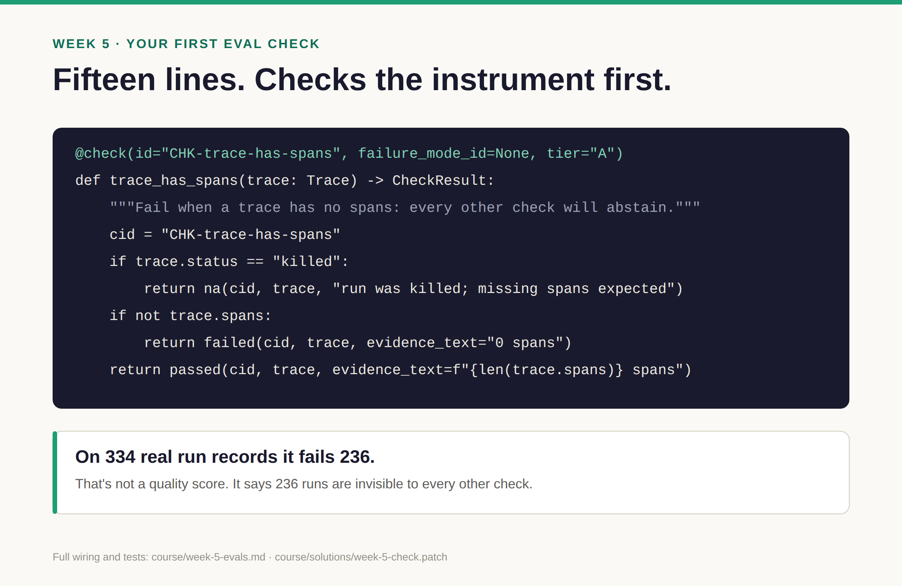

# Week 5 · Evaluate — checks first, judges later

**By the end:** you know exactly what a green (or red) eval run proves, and you've written and
wired your own check.
**Time:** ~2 hours · **Cost:** $0 · [← Course home](./README.md)

---

## Step 1 — Run the suite (15 min)

**Predict.** A free, offline eval suite runs on every pull request in this repo. Will it be
green? And what would green mean?

**Run.**

```bash
uv run python -m evals.cli run --tier A --warn-only --out course/.work/tier-a
head -3 course/.work/tier-a/summary.txt
```

**Observe.** Two seconds, zero dollars, no network. On 2026-09-16:

```
eval[A] fail: FAIL — 182 failed check(s) across suite
  layer[harness] fails=102 0.479 (n=213, 95% CI [0.413, 0.546])
```

Red. Does that mean the agents are broken? **No** — and green wouldn't mean they work.

## Step 2 — What did it pass against? (30 min)

**Run.**

```bash
ls evals/fixtures/traces | head
ls evals/fixtures/traces | wc -l
```

**Observe.** Tier A scores hand-written fixtures — a `__pass`, `__fail` and `__na` example per
check. That "47.9% of harness checks fail" is a statement about fixtures *designed to fail*.

**Explain.** Every rate is computed over something. Label it, every time:



A green CI badge on a `FIXTURE-ONLY` suite, quoted as proof the agents work, is the most
over-read signal in AI engineering. Read [*FIXTURE-ONLY*](../docs/posts/fixture-only.md) (10 min).

> **Every rate carries its corpus kind and its `n` — printed by the reporting code, not
> remembered by you.**

**Change.** Open `course/.work/tier-a/report.html`. Does every number carry both? Mark the ones
that don't.

## Step 3 — Checks before judges (20 min)

- **Check** — deterministic code. Cheap, repeatable. *"Was a test file written?"*
- **Judge** — an LLM grading output. Costly, nondeterministic, and it **needs its own accuracy
  measured** against your week 4 labels (100+ of them) before it's allowed to gate anything.
  And it must never share a vendor with the system it grades.

If code can decide it, code decides it. This repo has 20 checks and zero validated judges —
the right order.

**Run.** Read one real check:

```bash
sed -n 1,40p evals/checks/spend.py
```

**Observe.** Three outcomes: `passed`, `failed`, and `na` (with a reason).



**Explain.** `na` is what week 3's liveness report counted: 89% of results on real runs.

## Step 4 — Write your own check (60 min)

**Predict.** A check that fails any trace with no spans. Out of your ~330 real traces, how many
will fail it?

**Write** `evals/checks/mine.py` — the check that would have caught week 3 on day one:

```python
"""My first check: does this trace contain anything a check can read?"""

from __future__ import annotations

from evals.checks.base import CheckResult, failed, na, passed
from evals.checks.registry import check
from evals.trace.models import Trace


@check(id="CHK-trace-has-spans", failure_mode_id=None, tier="A")
def trace_has_spans(trace: Trace) -> CheckResult:
    """Fail when a trace has no spans: every other check will abstain on it."""
    cid = "CHK-trace-has-spans"
    if trace.status == "killed":
        return na(cid, trace, "run was killed externally; missing spans are expected")
    if not trace.spans:
        return failed(cid, trace, evidence_text="0 spans; nothing downstream can read this run")
    return passed(cid, trace, evidence_text=f"{len(trace.spans)} spans")
```

Every check needs all three outcomes — including a reason to abstain. Now wire it in. The
test suite enforces each of these, so if you skip one, `pytest` tells you which:

| # | File | Add |
| --- | --- | --- |
| 1 | `evals/checks/registry.py` | `import evals.checks.mine  # noqa: F401` inside `ensure_checks_loaded()` |
| 2 | `evals/coverage.py` | `"CHK-trace-has-spans": (),` in `_CHECK_SPAN_READS` (the span types it reads) |
| 3 | `tests/unit/evals/trace_fixtures.py` | a `_has_spans(outcome)` builder (pass: one span · fail: none · na: `status="killed"`), plus the id in `build_for_check` and `ALL_CHECK_IDS` |
| 4 | `tests/unit/evals/test_check_sensitivity.py` | a mutation in `_mutate` that should flip pass → fail: `trace.spans = []` |
| 5 | `evals/fixtures/traces/` | the committed fixtures Tier A replays (generate them, below) |
| 6 | `evals/baselines/tier_a.json` | your check in the gate's baseline (accept it, below — needs a clean git tree) |

**Run.**

```bash
# generate the fixtures from your builder, then copy them where Tier A reads them
uv run python -c "from tests.unit.evals.trace_fixtures import dump_all_fixtures; dump_all_fixtures()"
cp tests/fixtures/traces/CHK-trace-has-spans__*.json evals/fixtures/traces/

uv run pytest tests/unit/evals -q          # the wiring is correct

# record the check in the gate's baseline (refuses on a dirty tree, so commit first)
git checkout -b my-first-check && git add evals tests && git commit -m "Add CHK-trace-has-spans"
uv run python -m evals.cli run --tier A --warn-only --out course/.work/tier-a
uv run python -m evals.cli baseline accept --tier A --reason "add CHK-trace-has-spans" \
  --report course/.work/tier-a/report.json
git commit -am "Accept Tier A baseline with CHK-trace-has-spans"
uv run pytest tests/unit/repo -q           # the repo-wide guards agree
head -3 course/.work/tier-a/summary.txt                                        # FIXTURE-ONLY
uv run python -m evals.cli coverage liveness --traces-root course/.work/traces \
  --out course/.work/liveness.md && grep trace-has-spans course/.work/liveness.md   # CORPUS
```

Stuck? Edits 1–5 are in [`solutions/week-5-check.patch`](./solutions/week-5-check.patch)
(`git apply course/solutions/week-5-check.patch`), tested against 400+ unit tests. Edit 6 is
the `baseline accept` command above — it stamps your own commit, so it can't be a patch.

**Observe & explain.**

- In Tier A your check now **fails on other checks' fixtures**, because many of them have no
  spans. Tier A runs every check over every fixture — one more reason its total `fail`
  count tells you little.
- On this repo's 334 real traces it fails **236**. That's your first `CORPUS` number — and it
  measures the instrument, not the agents. That's fine. Instrument first.



**Change.** Turn your week 4 sentence into a second check, wired the same way.

## ✅ Checkpoint

- [ ] You can say what the Tier A result proves, in one sentence, with its corpus kind
- [ ] Your check is registered, has fixtures, and the unit tests pass
- [ ] You've seen your check's result on real traces, with its `n`

**For testers:** a check is an assertion. A judge is a test oracle — and you'd never trust an
oracle whose own accuracy you hadn't measured.

**Next:** [Week 6 · Improve →](./week-6-improve.md)
