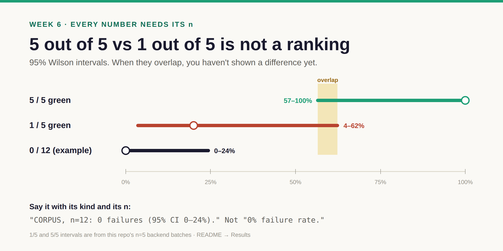
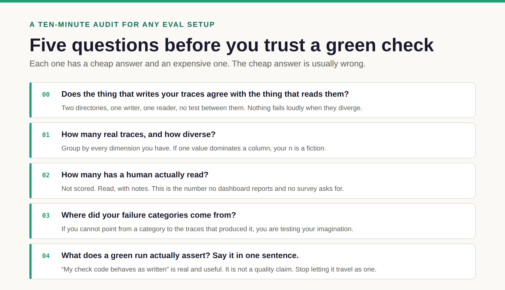

# Week 6 · Improve — fix it, prove it, keep watching

**By the end:** you've closed the loop once — one failure fixed, re-run, and reported as a
number that carries its corpus kind and its `n` — and you have a cadence to keep it honest.
**Time:** ~3 hours · **Cost:** ≈ $1–5 · [← Course home](./README.md)

---

You've done every arrow of the loop once. This week you go round on purpose.


## Step 1 — Pick one failure (20 min)

From your week 4 categories, choose one that is **frequent**, **detectable by code**, and
**fixable in an afternoon**. Candidates you've already met:

| Failure | Where you saw it | Kind of fix |
| --- | --- | --- |
| Run records never get an end time on command-line runs | week 1, `finalize()` | instrument |
| The trace builder labels every run `crewai` | week 3, `evals/cli.py` | instrument |
| The guardrail scores chat history, not files | week 2, `guardrail_hooks.py` | system |
| Every testing error routes back to development | week 2, `routing.py` | system |

**Instrument fixes** don't make the agents better; they make every later number true. If
unsure, start with one of those.

## Step 2 — Measure before you fix (30 min)

**Predict.** How often does your failure happen in the current corpus?

**Run.** Use your week 5 check (or write one for this failure), rebuild, and measure:

```bash
uv run python -m evals.cli trace backfill --workspace-root output/runs --traces-root course/.work/traces
uv run python -m evals.cli coverage liveness --traces-root course/.work/traces --out course/.work/before.md
grep "<your check id>" course/.work/before.md
```

**Observe.** Write the baseline as one line: **`CORPUS`, n = ___, failing = ___.**

## Step 3 — Fix and re-run (90 min)

Make the change, then run the tests:

```bash
uv run pytest tests/unit -q
```

Produce fresh evidence — more than one run:

```bash
uv run python scripts/run_smoke_batch.py --n 5                      # 5 runs per backend
uv run python scripts/run_smoke_batch.py --n 5 --team smoke-claude  # same model on every backend
```

The second command holds the model constant, which is what makes a *framework* comparison
fair (week 2).

Rebuild traces and measure again, writing to `after.md`.

## Step 4 — Say only what you can prove (30 min)

**Predict.** Before 8 of 12 failing, after 0 of 12. Can you say "fixed"?

**Observe.**



**Explain.** Three rules:

- **Intervals, not points.** `0/12` isn't "0%" — it's "somewhere between 0% and about 24%".
- **Overlap means no ranking.** If before and after overlap, run more before you claim it.
- **System change or instrument change?** If a number moved because a check went from blind to
  live, your eyesight improved, not your system. Report both; never blend them.

**Change.** Write your result as one sentence:

> *"CORPUS, n=12 runs after the fix: 0 failing (95% CI 0–24%), versus 8 of 12 before."*

Compute an interval with the repo's own helper:

```bash
uv run python -c "from evals.reliability import wilson_ci; print(wilson_ci(0, 12))"   # (0.0, 0.243)
```

## Step 5 — Keep watching (30 min)

A loop you run once is a project. On a cadence, it's monitoring.

| When | What | Command |
| --- | --- | --- |
| Every pull request | the `$0` offline suite (already in this repo's CI) | `uv run python -m evals.cli run --tier A --warn-only` |
| Weekly | rebuild traces, check liveness, watch abstentions | `trace backfill` · `coverage liveness` |
| Weekly | read ten new runs | `sample -n 10` · workbench · `annotate` |
| Monthly | audit the instrument: writer vs reader, two readers agreeing | week 3, steps 1–3 |

Watch it live any time: `uv run ai-team-web` and the dashboard's **Compare** tab.

Before you believe any agent claim — yours or anyone's — ask:



> **No pass rate without its corpus kind and its `n`.** "We run a $0 eval gate on every PR" is
> a true claim. "Our agents pass 94% of evals" isn't — until a `CORPUS` rate says so.

## 🎓 Capstone

1. Week 2: the comparison table, a layer on every failure
2. Week 3: the writer table, and how each reader was wrong
3. Week 4: your categories, with counts out of 30
4. Week 5: your check, with its `FIXTURE-ONLY` and `CORPUS` results
5. Week 6: your before/after sentence, with intervals

If you can produce those five, you can evaluate any agent system — including the one at work,
which almost certainly has a week 3 problem nobody has looked for.

## Take it home

Run the audit on **your own** logs without adopting this repo:

```bash
python3 docs/course/minieval.py ingest --logs /path/to/your/runs --out ./traces
python3 docs/course/minieval.py audit  --traces ./traces
```

One file, standard library, Python 3.11+. It answers what a tool can answer and says plainly
which questions it can't — the ones you have to do yourself. (Remember week 3: check it
against your files too.)

[← Course home](./README.md)
