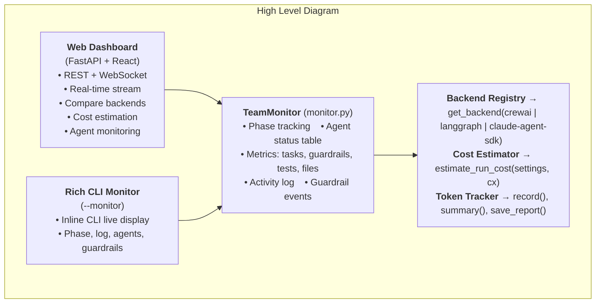
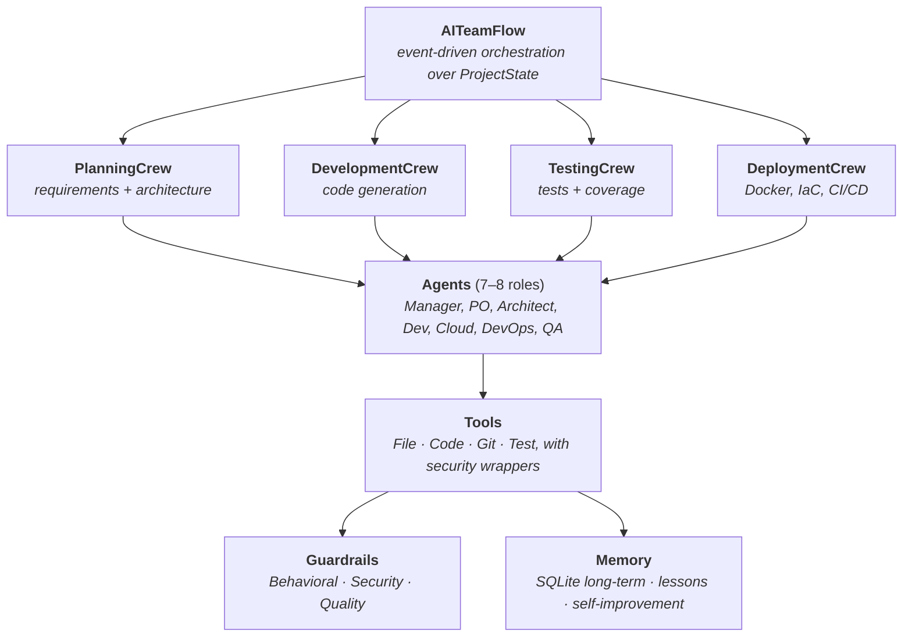
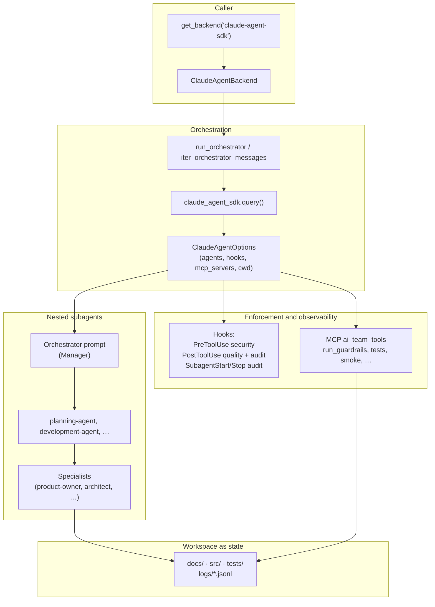
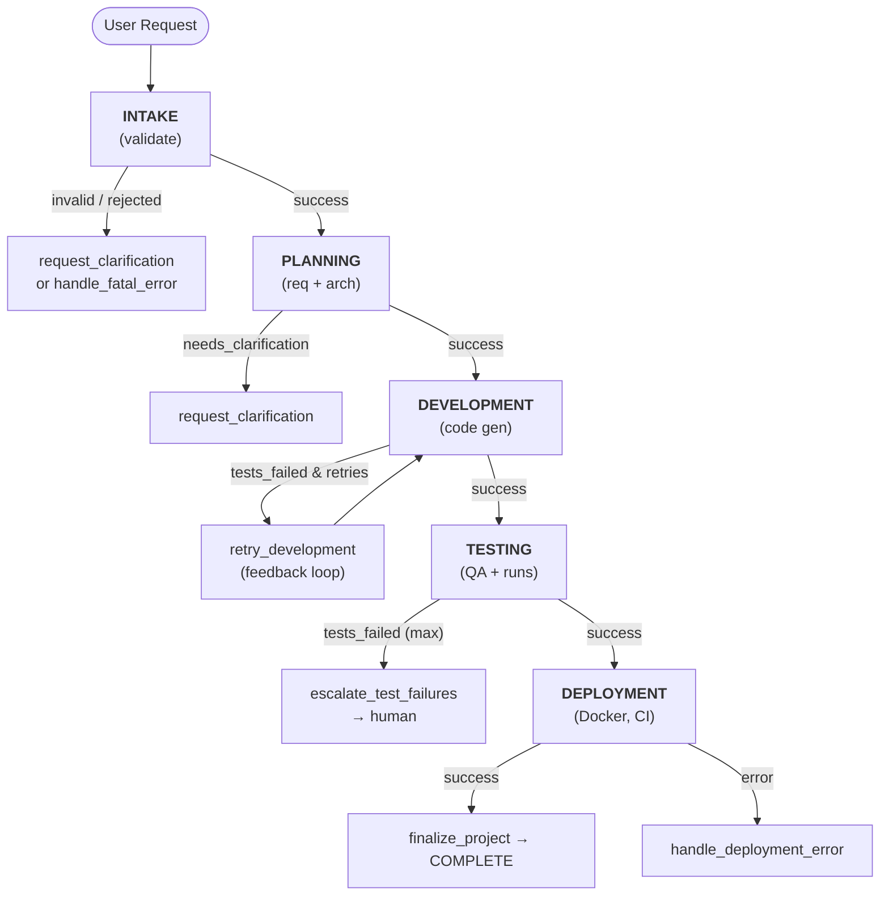
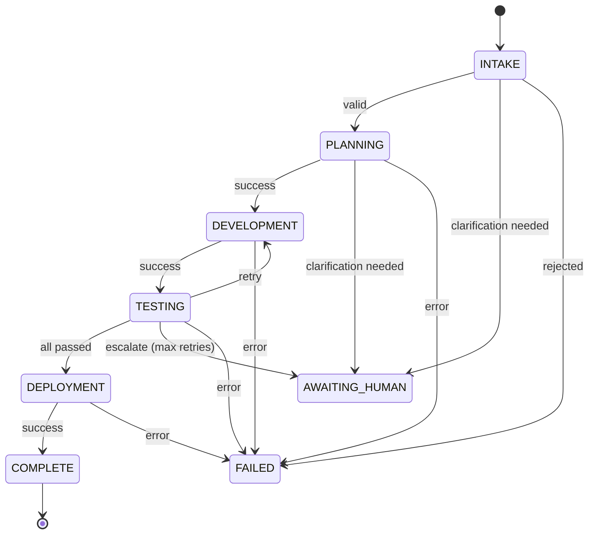

# Architecture

This document describes the AI Team system architecture: flows, crews, agents, tools, guardrails, memory, and UI layers. It aligns with the multi-backend design and the `Backend` protocol.

---

## 0. UI & Monitoring Layer

Two primary interfaces plus an optional CLI monitor — all integrate through `TeamMonitor`, the `Backend` protocol, and cost tracking APIs.



### Key files

| File | Purpose |
|------|---------|
| `src/ai_team/ui/web/server.py` | FastAPI server — REST + WebSocket endpoints |
| `src/ai_team/ui/web/frontend/` | React + TypeScript + Vite dashboard |
| `src/ai_team/monitor.py` | TeamMonitor — shared event collector for web + CLI |

---

## 1. System Overview Diagram



---

## 2. Component Descriptions

### 2.1 Flow Layer

| Component | Description |
|-----------|-------------|
| **AITeamFlow** | Main CrewAI `Flow[ProjectState]` orchestrator. Drives the lifecycle: intake → planning → development → testing → deployment → finalize. Uses `@start()`, `@listen()`, and `@router()` for event-driven routing. |
| **ProjectState** | Pydantic model holding all flow state: `project_id`, `user_request`, `current_phase`, `requirements`, `architecture`, `generated_files`, `test_results`, `deployment_config`, `errors`, `human_feedback`, `awaiting_human_input`, etc. |
| **Routing logic** | After each crew step, routers decide the next step (e.g. `run_development`, `request_clarification`, `handle_fatal_error`, `retry_development`, `escalate_test_failures`). Supports human-in-the-loop and error recovery. |

#### 2.1.1 Orchestration backends (CrewAI, LangGraph, Claude Agent SDK)

| Backend | Entry | Role |
|---------|--------|------|
| **CrewAI** | `CrewAIBackend` → `run_ai_team` / `AITeamFlow` | Comparison datapoint: hierarchical crews, subprocess-isolated, hard-killed on timeout. |
| **LangGraph** | `LangGraphBackend` → compiled `StateGraph` (`compile_main_graph`) | Recommended default: same phases (intake → planning → … → deployment), checkpointing, HITL via `interrupt()`. |
| **Claude Agent SDK** | `ClaudeAgentBackend` → `orchestrator.run_orchestrator` / `iter_orchestrator_messages` | Recommended for reliability: nested subagents, Anthropic API + Claude Code CLI (not OpenRouter). |

Both implement the shared `Backend` protocol and return `ProjectResult`. Team composition and phase lists come from the same `TeamProfile` (`config/team_profiles.yaml`). The CLI selects the backend with `--backend crewai|langgraph|claude-agent-sdk`. See ADR-004, ADR-005, ADR-006, and ADR-007 below.

**Comparison (orchestration shape).**

| | **CrewAI** | **LangGraph** | **Claude Agent SDK** |
|--|------------|---------------|----------------------|
| **Primary state** | `ProjectState` in Flow | Checkpointed graph state | Session transcript + files under workspace |
| **Resume** | Flow rerun / new run | Thread id + `Command(resume=...)` | `session_id` + optional fork |
| **HITL** | Flow flags / human_feedback | `interrupt()` | `AskUserQuestion` + optional `can_use_tool` default answer |
| **Tool guardrails** | CrewAI tasks + Python guardrails | Nodes + shared guardrail helpers | SDK **hooks** (Pre/Post tool) + MCP tools |

#### 2.1.2 Claude Agent SDK backend (diagram)

Implementation lives under `src/ai_team/backends/claude_agent_sdk_backend/` (`backend.py`, `orchestrator.py`, `agents/`, `hooks/`, `tools/mcp_server.py`). The orchestrator builds `ClaudeAgentOptions` (system prompt + repo `CLAUDE.md` + `docs/CLAUDE_PROFILE.md`), registers the in-process **ai_team_tools** MCP server (guardrails, pytest, smoke), and streams or runs until a `ResultMessage`.



For operator steps (env vars, budget, recovery), see [docs/claude-agent-sdk/RUNBOOK.md](claude-agent-sdk/RUNBOOK.md).

### 2.2 Crew Layer

| Crew | Purpose | Key agents |
|------|---------|------------|
| **PlanningCrew** | Turn user request into requirements and architecture. | Manager (coordinator), Product Owner, Architect. Hierarchical process. |
| **DevelopmentCrew** | Generate and write code per architecture. | Manager (coordinator), Backend/Frontend/Fullstack developers. Hierarchical process. |
| **TestingCrew** | Run tests, collect coverage, validate acceptance. | QA Engineer; uses test-runner and code tools. |
| **DeploymentCrew** | Produce deployment and CI/CD artifacts. | DevOps Engineer, Cloud Engineer; Docker, K8s, Terraform, CI configs. |

### 2.3 Agent Layer (7–8 specialized agents)

| Agent | Responsibility |
|-------|----------------|
| **Manager** | Coordinate crew, break down work, resolve blockers, escalate to human when needed. Uses task delegation and status reporting. |
| **Product Owner** | Requirements and user stories; acceptance criteria; MoSCoW prioritization. Output: `RequirementsDocument`. |
| **Architect** | System design, technology choices, interfaces, ADRs. Output: `ArchitectureDocument`. Can delegate to Cloud/DevOps. |
| **Backend Developer** | APIs, services, DB schemas, backend code (Python/Node/Go). |
| **Frontend Developer** | UI components, state, styling (React/Vue, etc.). |
| **Cloud Engineer** | IaC (Terraform/CloudFormation), cost/security/reliability. |
| **DevOps Engineer** | CI/CD, Docker, K8s, monitoring, observability. |
| **QA Engineer** | Test strategy, automation, coverage, quality checks. |

Agents are defined in [`config/agents.yaml`](../src/ai_team/config/agents.yaml) (role, goal, backstory) — see [AGENTS.md](AGENTS.md). Models per role and environment tier are in [`config/models.py`](../src/ai_team/config/models.py) — see [MODELS.md](MODELS.md).

### 2.4 Tool Layer

| Category | Examples | Security |
|----------|----------|----------|
| **File** | read_file, write_file, list_dir | Path validation (allowed dirs), no path traversal. |
| **Code** | code_generation, code_review, sandbox execution | Sandboxed execution; guardrails on generated code. |
| **Git** | status, commit, branch, diff | Scoped to workspace; no force-push to protected branches by policy. |
| **Test** | run_tests, coverage_report | Timeout and resource limits. |

Tools are wrapped with guardrail checks where applicable (e.g. SecurityGuardrails.validate_file_path, validate_code_safety).

### 2.5 Guardrail Layer

| Type | Purpose |
|------|---------|
| **Behavioral** | Role adherence (e.g. QA only writes tests), scope control (no unbounded expansion), require reasoning in long outputs. |
| **Security** | Code safety (no unsafe exec/subprocess/eval), no secrets in output, PII redaction, prompt-injection detection, file-path validation. |
| **Quality** | Word count bounds, JSON validity, Python syntax, no TODO/FIXME/NotImplementedError placeholders; optional LLM guardrails (hallucination, code review). |

Configured via `GuardrailConfig` in settings; full chain built by `create_full_guardrail_chain()`.

### 2.6 Memory Layer

| Type | Storage | Use |
|------|---------|-----|
| **Long-term** | SQLite (`LongTermStore`) | Cross-session recall; lessons and self-improvement metadata |
| **Lessons** | SQLite + optional injection at run start | Failure patterns distilled from prior runs (`memory/lessons.py`) |
| **Self-improvement** | Runtime smoke loop + manager reports | Post-run verification and structured improvement suggestions (`self_improvement_runtime.py`) |

ChromaDB short-term memory, entity memory, and the RAG subsystem were removed. CrewAI may still use its own internal Chroma storage when that backend runs.

See [SELF_IMPROVEMENT.md](SELF_IMPROVEMENT.md) and [GUARDRAILS.md](GUARDRAILS.md) (runtime smoke gate).

---

## 3. Data Flow Diagram



State is carried in **ProjectState** through the flow; each crew reads/writes the relevant fields (e.g. PlanningCrew → `requirements`, `architecture`; DevelopmentCrew → `generated_files`; TestingCrew → `test_results`).

---

## 4. State Machine (ProjectState Transitions)



- **INTAKE** → PLANNING (valid), AWAITING_HUMAN (clarification), FAILED (rejected).
- **PLANNING** → DEVELOPMENT (success), AWAITING_HUMAN (clarification), FAILED (error).
- **DEVELOPMENT** → TESTING (success), FAILED (error).
- **TESTING** → DEPLOYMENT (all passed), DEVELOPMENT (retry), AWAITING_HUMAN (escalate after max retries), FAILED (error).
- **DEPLOYMENT** → COMPLETE (success), FAILED (error).

`phase_history` on ProjectState records each transition with timestamp and reason.

---

## 5. Technology Stack

| Layer | Technology | Purpose |
|-------|------------|---------|
| Orchestration | **CrewAI Flows**, **LangGraph**, **Claude Agent SDK** | Three backends behind one `Backend` protocol. |
| LLM | **OpenRouter** (CrewAI/LangGraph), **Anthropic API** (SDK) | Models per agent via `AI_TEAM_ENV` and `team_profiles.yaml` overrides. |
| State & schemas | **Pydantic** | ProjectState, LangGraphProjectState, results bundles, guardrail models. |
| Memory | **SQLite** | Long-term store, lessons, self-improvement metadata. |
| UI | **FastAPI + React** (port 8421) | Web dashboard: run, compare, artifacts. Optional Rich `--monitor` on CLI. |
| Config | **pydantic-settings** | Settings, OpenRouter, guardrails, memory from env. |
| Logging | **structlog** | Structured logs for flow and agents. |

---

## 6. Directory Structure Mapping

```
ai-team/
├── src/ai_team/
│   ├── core/             # Backend protocol, results bundles, spend guard, team profiles
│   ├── config/           # settings.py, agents.yaml, team_profiles.yaml, models.py
│   ├── backends/
│   │   ├── crewai_backend/
│   │   ├── langgraph_backend/
│   │   └── claude_agent_sdk_backend/
│   ├── agents/           # Agent implementations (CrewAI path)
│   ├── crews/            # PlanningCrew, DevelopmentCrew, TestingCrew, DeploymentCrew
│   ├── flows/            # AITeamFlow, ProjectState, run_ai_team()
│   ├── tools/            # File, code, git, test, smoke tools
│   ├── guardrails/       # Behavioral, security, quality
│   ├── memory/           # LongTermStore, lessons, self-improvement runtime
│   ├── monitor.py        # TeamMonitor event collector
│   └── ui/web/           # FastAPI server + React dashboard
├── tests/                # unit/, integration/, e2e/
├── evals/                # run_evals.py, backends/, scenarios/
├── docs/                 # ARCHITECTURE, GUARDRAILS, DEMOS, EVALS, journal/, troubleshooting/
├── demos/                # 00_smoke_test, 02_todo_app
└── scripts/              # quickstart, run_demo, compare_backends, pre_push_check
```

---

## 7. Integration Points and Extension Guide

- **Adding an agent**  
  - Add entry in `config/agents.yaml` and (if needed) a model in `config/models.py` (OpenRouterSettings, ENV_MODELS).  
  - Implement the agent in `agents/` (extend BaseAgent), attach tools, then add to the appropriate crew in `crews/`.

- **Adding a crew**  
  - Create a new crew class in `crews/`, assign manager and member agents, define tasks.  
  - In `flows/main_flow.py`, add a `@listen("run_<crew>")` method and wire routing in the appropriate `@router(...)`.

- **Adding a tool**  
  - Implement in `tools/` (CrewAI `@tool` or BaseTool).  
  - Apply path/safety checks (reuse SecurityGuardrails where relevant).  
  - Attach the tool to the right agents in `agents/`.

- **Adding a guardrail**  
  - Add validation in `guardrails/` (Behavioral, Security, or Quality).  
  - Optionally add to `create_full_guardrail_chain()` or call from task/agent callbacks.

- **Adding a backend**  
  - Implement the `Backend` protocol (`core/backend.py`): `run()` and `stream()`, returning a normalized `ProjectResult`. Register it by name in `backends/registry.py`.  
  - **Deliverable contract (backend-agnostic):** generated files land in the per-run workspace (`settings.project.workspace_dir/<id>/`). When the active profile includes the `deployment` phase, the run **must** produce a non-empty root `README.md` (overview, setup, run instructions, API reference). The DevOps agent owns it — the shared `devops_engineer` goal in `config/agents.yaml` (CrewAI + LangGraph) and `devops_prompt()` in the Claude SDK backend both require it.  
  - **Enforcement is shared, not per-backend:** `deployment_artifacts_guardrail(workspace_dir, phases)` in `guardrails/quality.py` runs from the common post-run path in `main.py` for *every* backend, so a new backend is automatically checked. It is **warn-only** (logs `deployment_artifacts_check`; never fails the run) and a no-op for profiles without a `deployment` phase (e.g. `prototype`, `smoke`).  
  - Plan→dev→test deliverables (code, tests) are validated by the testing phase; only the README/deployment docs are gated by this extra check.

- **Changing state shape**  
  - Extend `ProjectState` or nested models in `flows/main_flow.py`.  
  - Update crew tasks and routers that read/write those fields.

- **Human-in-the-loop**  
  - Use `awaiting_human_input` and `human_feedback` on ProjectState; route to `request_clarification` or `escalate_*` and resume from `AWAITING_HUMAN` when feedback is provided (e.g. via web dashboard, TUI, or API).

---

## 8. Architecture Decision Records (ADRs)

### ADR-001: Why CrewAI Flows over LangGraph

**Status:** Accepted  

**Context:** We need an orchestrator that coordinates multiple crews (planning, development, testing, deployment) with shared state, conditional routing, and human-in-the-loop.

**Decision:** Use **CrewAI Flows** as the main orchestration layer.

**Rationale:**

- **Native crew integration:** Flows are designed to trigger and consume CrewAI crews; state can be passed via a single Pydantic model (ProjectState).
- **Declarative routing:** `@router()` and `@listen()` make phase transitions and branches explicit (e.g. retry development vs escalate).
- **Simpler mental model:** Event-driven flow with a single state object is easier to reason about and test than a generic graph.
- **Ecosystem fit:** Agents, tasks, tools, and memory are already CrewAI concepts; one stack reduces integration cost.

**Consequences:** We depend on CrewAI’s Flow API and lifecycle. If we need very custom graph semantics later, we can still wrap or replace the flow implementation while keeping the same state and crew contracts.

---

### ADR-002: Why OpenRouter for LLM and Embeddings

**Status:** Accepted  

**Context:** Agents need an LLM and embedding backend; we want a single API key, multiple models per role, and no local GPU requirement.

**Decision:** Use **OpenRouter** as the sole provider for inference and embeddings.

**Rationale:**

- **Single key:** One `OPENROUTER_API_KEY` for chat and embeddings.
- **Model choice:** Different models per role via `OpenRouterSettings` and `AI_TEAM_ENV` (dev/test/prod).
- **No local GPU:** No Ollama or local model setup; works in CI and on any host with network.

**Consequences:** Requires network and OpenRouter account. See `scripts/setup_openrouter.sh` and `.env.example`.

---

### ADR-003: Why Hierarchical Process for Planning and Development Crews

**Status:** Accepted  

**Context:** Planning and development involve multiple agents (e.g. Manager, Product Owner, Architect; Manager, Backend, Frontend). We need coordination and delegation without ad hoc handoffs.

**Decision:** Use a **hierarchical process** for PlanningCrew and DevelopmentCrew, with the **Manager** as `manager_agent`.

**Rationale:**

- **Single coordinator:** The Manager assigns tasks, resolves conflicts, and escalates to human when needed, which matches the “engineering manager” role in the design.
- **Structured delegation:** CrewAI’s hierarchical process provides a clear pattern: manager decides “who does what” and aggregates results, reducing duplicate or conflicting work.
- **Scalability:** Adding more specialists (e.g. another developer type) only requires adding an agent and tasks; the Manager’s role stays the same.
- **Traceability:** Manager’s decisions and status updates can be logged and reflected in ProjectState for observability.

**Consequences:** The Manager agent must be capable of task decomposition and routing; it should use tools like task_delegation and status_reporting. Testing and Deployment crews can remain simpler (e.g. single primary agent or small flat crew) since they have fewer concurrent roles.

---

### ADR-004: LangGraph as an alternative orchestration backend

**Status:** Accepted  

**Context:** CrewAI Flows cover the primary multi-crew pipeline. Some workflows benefit from explicit graph semantics, first-class checkpointing, and streamable node updates for CLI/TUI/web dashboard.

**Decision:** Add an optional **LangGraph** backend (`LangGraphBackend`) that compiles a main graph with phase-aligned nodes, conditional routing, guardrail nodes, and optional subgraphs for planning/development/testing/deployment.

**Rationale:** Same `ProjectResult` contract; enables `--resume` after interrupts; integrates with existing team profiles without duplicating agent definitions in graph code (subgraph runners consume profile-aware tools).

**Consequences:** Two code paths to maintain; LangGraph subgraphs that call LLMs must stay aligned with CrewAI tool/guardrail behavior. Comparison tooling (`scripts/compare_backends.py`) helps validate parity on demos.

---

### ADR-005: Multi-backend architecture and team profiles

**Status:** Accepted  

**Context:** Users need to swap orchestration engines and team composition without forking the repository.

**Decision:** Centralize backend selection in `get_backend(name)` and team composition in `load_team_profile(team)`. CLI flags: `--backend`, `--team`. CrewAI, LangGraph, and Claude Agent SDK backends receive the same `TeamProfile` and project description string.

**Rationale:** One configuration surface (`team_profiles.yaml`); demos and comparison scripts exercise both backends with identical inputs.

**Consequences:** New backend features should be reflected in both stacks when parity matters, or documented as backend-specific.

---

### ADR-006: Claude Agent SDK backend — session transcript vs typed graph state

**Status:** Accepted  

**Context:** CrewAI Flows and LangGraph keep **structured application state** (`ProjectState`, checkpoint tuples) that UIs and tests can inspect. The Claude Agent SDK instead runs a **long-lived agent session** with tool calls and optional nested subagents; Anthropic does not expose the same graph-shaped state model.

**Decision:** Treat the **Claude session** (plus optional resume/fork) as the continuity mechanism, and the **workspace directory** (`docs/`, `src/`, `tests/`, `logs/`) as the **durable handoff surface** between phases—mirroring the file-based pattern already used for crew outputs. Map the same `TeamProfile` into `AgentDefinition` subagents; do not require `ProjectState` inside the SDK path.

**Rationale:** Aligns with how the SDK is designed to work (orchestrator delegates via the `Agent` tool; specialists have isolated contexts). Avoids maintaining a parallel state machine that would fight the session transcript. Enables resume with `session_id` and cost/session logs in JSONL for observability.

**Consequences:** Feature parity with LangGraph HITL differs (`interrupt()` vs `AskUserQuestion` / `can_use_tool`). Comparison scripts and UIs must read Claude outcomes from `ProjectResult.raw` and workspace artifacts, not from a shared Pydantic flow state. Document backend-specific flags in the Claude runbook.

---

### ADR-007: Hooks as guardrails — PreToolUse / PostToolUse / subagent audit

**Status:** Accepted  

**Context:** Prompt-only instructions can be ignored under pressure; CrewAI/LangGraph use task guardrails and Python validators. The Claude Agent SDK exposes **hooks** that run around tool use and subagent lifecycle.

**Decision:** Register **PreToolUse** hooks for path/shell patterns (block traversal, sensitive paths, risky `Bash`), **PostToolUse** hooks for lightweight quality signals (e.g. TODO markers in new Python), and **append-only JSONL audit** hooks for tool events plus **SubagentStart** / **SubagentStop**. Keep heavy checks available via the **MCP** `run_guardrails` and related tools so agents can opt in per file.

**Rationale:** Hooks provide **deterministic enforcement** on every matching tool call without waiting for an LLM to self-correct. Subagent audit aids debugging multi-agent sessions. Splitting “always-on” hooks vs “on-demand” MCP avoids redundant work and keeps hook latency low.

**Consequences:** Hook matchers must be maintained when Claude Code adds or renames tools. Behavior is not identical to CrewAI `GuardrailResult` tasks—document differences in tests and the Claude SDK plan. False positives in PostToolUse may require tuning or allow-lists over time.

---

*End of ARCHITECTURE.md*
