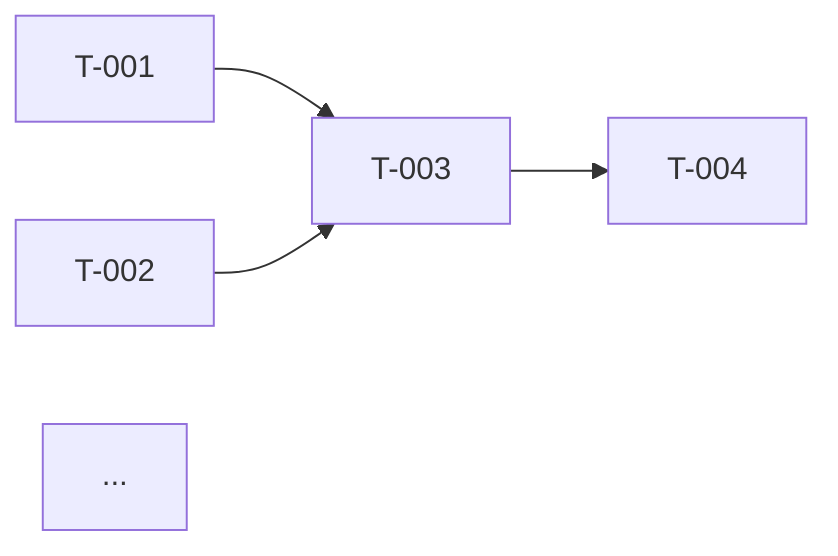

# Feature Design: Spec-Driven Task Planning & Git Workflow

> Two features that transform ai-team from "agents that generate files" into "agents that plan properly and deliver code through a professional engineering workflow."

---

## Table of Contents

1. [Feature A: Spec-Driven Task Planning](#feature-a-spec-driven-task-planning)
2. [Feature B: Git-Native Project Workflow](#feature-b-git-native-project-workflow)
3. [How A + B Work Together](#how-a--b-work-together)
4. [State Schema Changes](#state-schema-changes)
5. [Implementation Tasks](#implementation-tasks)

---

## Feature A: Spec-Driven Task Planning

### Motivation

Today, no agent produces an explicit work breakdown. The planning phase outputs `requirements` and `architecture` dicts, then the development phase starts with a vague "implement the architecture." There is no task list, no dependency ordering, no acceptance criteria, no progress tracking. The Manager agent delegates via a capability-scoring heuristic but never creates a persistent plan.

[Amazon Kiro](https://kiro.dev/docs/specs/) demonstrated that a three-artifact spec workflow — **requirements → design → tasks** — dramatically improves AI code quality because each phase constrains the next. We adopt the same structure, adapted for multi-agent execution.

### Design: Three-Phase Spec Generation

The planning phase is restructured from two outputs (requirements, architecture) to three:

```
Project Description
        │
        ▼
┌─────────────────┐
│  Product Owner   │  → requirements.md (user stories + EARS acceptance criteria)
└────────┬────────┘
         ▼
┌─────────────────┐
│   Architect      │  → design.md (architecture, data models, API contracts, diagrams)
└────────┬────────┘
         ▼
┌─────────────────┐
│    Manager       │  → tasks.md (ordered task list with assignee, deps, acceptance)
└─────────────────┘
```

Each artifact is a structured markdown file written to the workspace AND stored in state.

### Artifact Formats

#### requirements.md

Inspired by [Kiro's EARS notation](https://kiro.dev/docs/specs/feature-specs/):

```markdown
# Requirements: {project_name}

## User Stories

### US-001: {title}
**As a** {persona}
**I want to** {capability}
**So that** {benefit}

#### Acceptance Criteria
- **AC-001.1**: WHEN {condition} THE SYSTEM SHALL {behavior}
- **AC-001.2**: WHEN {condition} THE SYSTEM SHALL {behavior}

### US-002: {title}
...

## Non-Functional Requirements
- **NFR-001**: {requirement} (category: performance | security | reliability | ...)

## Out of Scope
- {explicitly excluded item}
```

The Product Owner generates this from the project description. Each acceptance criterion uses EARS notation (Event-driven: WHEN/THE SYSTEM SHALL) to be machine-testable.

#### design.md

```markdown
# Technical Design: {project_name}

## Architecture Overview
{description + Mermaid diagram}

## Technology Stack
| Layer | Choice | Rationale |
|-------|--------|-----------|
| ...   | ...    | ...       |

## Data Models
{Pydantic/TypeScript interfaces or SQL schema}

## API Contracts
| Method | Endpoint | Request | Response | Linked Requirement |
|--------|----------|---------|----------|--------------------|

## Component Diagram


## Error Handling Strategy
...

## Security Considerations
...
```

The Architect generates this with explicit links back to requirements (US-xxx, AC-xxx).

#### tasks.md

The critical new artifact. The Manager generates this from requirements + design:

```markdown
# Implementation Tasks: {project_name}

## Task List

### T-001: {title}
- **Status**: pending | in_progress | done | blocked
- **Assignee**: backend_developer | frontend_developer | fullstack_developer | devops_engineer | cloud_engineer | qa_engineer
- **Phase**: development | testing | deployment
- **Dependencies**: [] | [T-xxx, T-yyy]
- **Requirement**: US-001 (AC-001.1, AC-001.2)
- **Acceptance Criteria**:
  - [ ] {specific, verifiable criterion}
  - [ ] {unit test requirement}
  - [ ] {integration test requirement}
- **Files to create/modify**:
  - `src/models/user.py` — User data model
  - `tests/test_user.py` — User model unit tests
- **Estimated complexity**: low | medium | high

### T-002: {title}
...

## Dependency Graph


## Summary
- Total tasks: {N}
- By phase: development={X}, testing={Y}, deployment={Z}
- By assignee: backend_developer={A}, qa_engineer={B}, ...
- Critical path: T-001 → T-003 → T-007 → T-010
```

### Task Properties (Schema)

```python
class SpecTask(BaseModel):
    """Single implementation task in the spec-driven workflow."""
    id: str = Field(..., pattern=r"^T-\d{3}$")
    title: str
    status: Literal["pending", "in_progress", "done", "blocked", "skipped"] = "pending"
    assignee: str  # agent role key
    phase: Literal["development", "testing", "deployment"]
    dependencies: list[str] = Field(default_factory=list)  # list of task IDs
    requirement_ids: list[str] = Field(default_factory=list)  # US-xxx, AC-xxx
    acceptance_criteria: list[str] = Field(default_factory=list)
    files: list[str] = Field(default_factory=list)  # files to create/modify
    complexity: Literal["low", "medium", "high"] = "medium"
    result: str | None = None  # agent output summary on completion
    error: str | None = None  # error message if failed
    started_at: str | None = None
    completed_at: str | None = None


class ProjectSpec(BaseModel):
    """Complete project specification: requirements + design + tasks."""
    project_name: str
    requirements_md: str  # raw markdown
    design_md: str
    tasks_md: str
    tasks: list[SpecTask]  # parsed structured tasks
    created_at: str
```

### Execution Model

The development phase changes from "run all developers at once" to **task-driven execution**:

1. **Task Scheduler** selects the next executable task: `status == "pending"` AND all `dependencies` are `"done"`.
2. Routes to the assigned agent with the task description, acceptance criteria, relevant requirements, and design context.
3. Agent produces output (files, test results, etc.).
4. **Task Validator** checks acceptance criteria (file exists, tests pass, guardrails pass).
5. Updates task `status` to `"done"` or back to `"pending"` (with error) for retry.
6. Repeats until all tasks are done or retry limit is hit.

This replaces the current monolithic development subgraph (one supervisor delegates everything) with a structured, trackable loop.

#### LangGraph Implementation

```python
# New node in main_graph.py
def _node_task_scheduler(state: LangGraphProjectState) -> dict:
    """Pick next executable task from spec."""
    spec = state["spec"]
    for task in spec["tasks"]:
        if task["status"] == "pending" and all(
            _task_by_id(spec, dep)["status"] == "done"
            for dep in task["dependencies"]
        ):
            return {"current_task": task, "current_phase": "development"}
    return {"current_phase": "testing" if all_dev_done(spec) else "blocked"}

# Conditional edge after task execution
def _route_after_task(state) -> str:
    task = state["current_task"]
    if task["status"] == "done":
        if has_more_tasks(state["spec"], phase="development"):
            return "task_scheduler"
        return "testing"
    elif task["retry_count"] < state["max_retries"]:
        return "task_scheduler"  # retry
    else:
        return "human_review"
```

#### CrewAI Implementation

The CrewAI backend creates one `Task` per `SpecTask`, with `context` linking dependent tasks. The crew uses `planning=True` internally but the task structure comes from our `tasks.md`, not CrewAI's internal planner.

### Agent Prompt Changes

#### Product Owner

Add to system prompt:

```
## Output Format
You MUST produce a requirements.md file in the workspace using EARS notation.
Every user story must have numbered acceptance criteria using:
  WHEN {condition} THE SYSTEM SHALL {behavior}
Include non-functional requirements and an explicit "Out of Scope" section.
```

#### Architect

Add to system prompt:

```
## Output Format
You MUST produce a design.md file in the workspace.
Include: architecture overview (with Mermaid diagram), technology stack table,
data models, API contracts, error handling strategy.
Link every API endpoint and component to a requirement (US-xxx).
```

#### Manager (new responsibility)

Add to system prompt:

```
## Task Planning
After requirements.md and design.md are finalized, you MUST produce tasks.md.
Break the work into discrete implementation tasks (T-001, T-002, ...).
Each task must specify: assignee (agent role), dependencies (other task IDs),
acceptance criteria (checkboxes), files to create/modify, and complexity.
Order tasks by dependency — no circular dependencies.
Every requirement (US-xxx) must be covered by at least one task.
Every task must link to at least one requirement.
```

### Progress Tracking

`tasks.md` is updated in the workspace as tasks complete. The TUI monitor reads task status from state and displays:

```
Tasks: ████████░░░░ 8/12 (67%)  |  Blocked: 0  |  Failed: 1 (retrying)
Current: T-009 [qa_engineer] "Write integration tests for user API"
```

---

## Feature B: Git-Native Project Workflow

### Motivation

Today, agents write files to `./workspace` with no version control, no isolation, no history, no PRs. The git tools (`git_tools.py`) are fully implemented but **not wired to any agent**. There is no per-project workspace isolation — concurrent runs overwrite each other.

A production-grade AI team should:
1. Create a dedicated git repo (or branch) per project
2. Use feature branches for each development task
3. Commit with conventional messages after each task
4. Open PRs for review (human or QA agent)
5. Maintain a clean history that can be audited

### Design: Project Lifecycle with Git

```
ai-team run "Build a TODO API"
        │
        ▼
┌──────────────────────────────┐
│  1. CREATE PROJECT WORKSPACE │
│     workspace/{project_id}/  │
│     git init                 │
│     git branch main          │
│     initial commit           │
└──────────┬───────────────────┘
           ▼
┌──────────────────────────────┐
│  2. PLANNING (on main)       │
│     Write requirements.md    │
│     Write design.md          │
│     Write tasks.md           │
│     git add + commit          │
│     "docs: add project spec" │
└──────────┬───────────────────┘
           ▼
┌──────────────────────────────────────┐
│  3. DEVELOPMENT (feature branches)   │
│     For each task T-xxx:             │
│       git branch feature/T-001-...   │
│       Agent writes code              │
│       git add + commit               │
│       Mark task done                 │
│       PR: feature/T-001 → main      │
│       QA review (guardrails)         │
│       Merge to main                  │
└──────────┬───────────────────────────┘
           ▼
┌──────────────────────────────┐
│  4. TESTING (on main)        │
│     QA runs full test suite  │
│     git branch test/qa-run   │
│     Commit test results      │
│     Merge to main            │
└──────────┬───────────────────┘
           ▼
┌──────────────────────────────┐
│  5. DEPLOYMENT               │
│     DevOps writes configs    │
│     git branch chore/deploy  │
│     Commit + merge           │
│     Tag: v1.0.0              │
└──────────────────────────────┘
```

### Per-Project Workspace Isolation

Change `workspace_dir` from a flat shared directory to a per-project namespaced structure:

```
workspace/
├── {project_id}/              ← isolated git repo per project
│   ├── .git/
│   ├── requirements.md
│   ├── design.md
│   ├── tasks.md
│   ├── src/
│   ├── tests/
│   └── ...
├── {another_project_id}/
│   └── ...
```

#### Implementation

```python
# src/ai_team/workspace/manager.py (new)

class WorkspaceManager:
    """Manages per-project isolated workspaces with git."""

    def __init__(self, base_dir: str = "./workspace"):
        self.base_dir = Path(base_dir)

    def create_project_workspace(self, project_id: str) -> ProjectWorkspace:
        """Create an isolated workspace directory with initialized git repo."""
        project_dir = self.base_dir / project_id
        project_dir.mkdir(parents=True, exist_ok=True)

        # Initialize git repo
        git_init(str(project_dir))

        # Create initial structure
        (project_dir / "src").mkdir(exist_ok=True)
        (project_dir / "tests").mkdir(exist_ok=True)

        # Initial commit on main
        repo = Repo(project_dir)
        (project_dir / ".gitkeep").touch()
        repo.index.add([".gitkeep"])
        repo.index.commit("chore: initialize project workspace")

        return ProjectWorkspace(
            project_id=project_id,
            path=project_dir,
            repo=repo,
        )

    def get_workspace(self, project_id: str) -> ProjectWorkspace:
        """Get existing workspace."""
        project_dir = self.base_dir / project_id
        if not project_dir.exists():
            raise FileNotFoundError(f"No workspace for project {project_id}")
        return ProjectWorkspace(
            project_id=project_id,
            path=project_dir,
            repo=Repo(project_dir),
        )
```

### Why NOT Worktrees

Git worktrees solve concurrent work on the same repo (different branches checked out simultaneously). Our situation is different:

- Each **project** is independent (different codebases, not different branches of one codebase)
- Agents don't need multiple branches checked out simultaneously — they work on one task at a time
- Worktrees add complexity (shared `.git` directory, cleanup management, path confusion)

**Decision:** Use separate repos per project, not worktrees. Worktrees would only be useful if we add parallelism *within* a project (e.g., two developers working on independent tasks simultaneously). That's a future optimization. For now, sequential task execution with one checked-out branch at a time is correct.

**Exception:** If the user passes `--repo /path/to/existing/repo`, the team works on an existing repo. In that case, worktrees *could* be used for branch isolation, but for v1 we simply create branches in the existing repo sequentially.

### Branch Strategy

```
main
 ├── feature/T-001-user-model        ← backend_developer
 ├── feature/T-002-auth-middleware    ← backend_developer
 ├── feature/T-003-api-endpoints     ← backend_developer (depends on T-001, T-002)
 ├── test/T-004-unit-tests           ← qa_engineer
 ├── test/T-005-integration-tests    ← qa_engineer
 ├── chore/T-006-docker-config       ← devops_engineer
 └── chore/T-007-ci-pipeline         ← devops_engineer
```

Branch naming: `{type}/T-{NNN}-{slug}` where type comes from the task's phase:
- `development` → `feature/`
- `testing` → `test/`
- `deployment` → `chore/`

### Git Operations Per Task

Integrated into the task execution loop:

```python
def execute_task_with_git(workspace: ProjectWorkspace, task: SpecTask, agent_output):
    """Wrap task execution with git branch + commit + PR workflow."""
    repo = workspace.repo
    branch_name = f"{task.phase_to_branch_type()}/T-{task.id}-{task.slug}"

    # 1. Create and checkout feature branch from main
    repo.heads.main.checkout()
    repo.create_head(branch_name).checkout()

    # 2. Agent does its work (writes files to workspace)
    result = run_agent_for_task(task, workspace)

    # 3. Stage and commit
    repo.index.add("*")  # or specific files from task.files
    message = generate_commit_message_for_task(task, result)
    repo.index.commit(message)

    # 4. Create internal PR record (not GitHub — local tracking)
    pr = InternalPR(
        branch=branch_name,
        target="main",
        task_id=task.id,
        title=f"{task.id}: {task.title}",
        description=create_pr_description_for_task(task, result),
        status="open",
    )
    workspace.prs.append(pr)

    # 5. QA review (guardrails on the diff)
    review = run_guardrails_on_diff(repo.git.diff("main"))
    if review.passed:
        # 6. Merge to main
        repo.heads.main.checkout()
        repo.git.merge(branch_name, no_ff=True)
        pr.status = "merged"
        task.status = "done"
    else:
        pr.status = "changes_requested"
        pr.review_comments = review.comments
        task.status = "pending"  # will retry

    return task
```

### Internal PR Model

We don't need GitHub for the internal workflow. PRs are tracked in state:

```python
class InternalPR(BaseModel):
    """Pull request record for internal tracking (no GitHub required)."""
    id: str  # auto-generated
    branch: str
    target: str = "main"
    task_id: str  # T-xxx
    title: str
    description: str
    status: Literal["open", "merged", "changes_requested", "closed"] = "open"
    review_comments: list[str] = Field(default_factory=list)
    created_at: str
    merged_at: str | None = None
    commits: list[str] = Field(default_factory=list)  # SHAs
```

### Optional GitHub Integration

When `GITHUB_TOKEN` is set, the system can:
1. Create a real GitHub repo (`gh repo create`)
2. Push branches to remote
3. Open real GitHub PRs
4. Use GitHub Actions for CI

This is opt-in and not required for the core workflow:

```python
class GitHubIntegration:
    """Optional: push to GitHub and create real PRs."""

    def __init__(self, token: str, org: str | None = None):
        self.token = token
        self.org = org

    def create_remote_repo(self, workspace: ProjectWorkspace) -> str:
        """Create GitHub repo and add as remote. Returns repo URL."""

    def push_branch(self, workspace: ProjectWorkspace, branch: str):
        """Push branch to remote."""

    def create_pr(self, workspace: ProjectWorkspace, pr: InternalPR) -> str:
        """Create GitHub PR from internal PR. Returns PR URL."""
```

### Wiring Git Tools to Agents

The existing `git_tools.py` is complete but unwired. Wire it:

| Agent Role | Git Tools Granted | Purpose |
|------------|-------------------|---------|
| Manager | `git_status`, `git_log` | Monitor progress, review history |
| All developers | `git_add`, `git_commit`, `git_diff`, `git_status` | Commit their work |
| QA Engineer | `git_diff`, `git_log`, `git_status` | Review changes for PR review |
| DevOps | `git_add`, `git_commit`, `git_diff`, `git_branch` | Create deployment configs |

However, for v1, **git operations are handled by the task execution wrapper** (not by agents directly). Agents focus on writing code; the framework handles branching, committing, and merging. This is safer — agents can't accidentally force-push or commit to main.

In v2, agents get direct git tool access for more autonomous workflows (e.g., the developer decides when to commit, what message to use).

### File Tool Path Scoping

Update `file_tools._get_allowed_roots()` to be project-aware:

```python
def _get_allowed_roots(project_id: str | None = None) -> list[Path]:
    settings = get_settings()
    if project_id:
        # Scoped to project workspace
        return [Path(settings.project.workspace_dir).resolve() / project_id]
    # Legacy: allow full workspace
    return [
        Path(settings.project.workspace_dir).resolve(),
        Path(settings.project.output_dir).resolve(),
    ]
```

---

## How A + B Work Together

The complete flow:

```
1. User: ai-team "Build a TODO REST API" --team backend-api

2. WORKSPACE CREATION
   → workspace/{project_id}/ created
   → git init, initial commit on main

3. PLANNING PHASE (on main branch)
   → Product Owner writes requirements.md (EARS notation)
   → Architect writes design.md (linked to requirements)
   → Manager writes tasks.md (ordered, assigned, with acceptance criteria)
   → All three committed: "docs: add project specification"
   → State updated: spec.tasks = [T-001, T-002, ..., T-012]

4. DEVELOPMENT PHASE (feature branches)
   → Task Scheduler picks T-001 (no deps, assignee=backend_developer)
   → git checkout -b feature/T-001-user-data-model
   → Backend Developer writes src/models/user.py, tests/test_user.py
   → git add + commit: "feat(models): add User data model (T-001)"
   → Guardrails review diff → pass
   → Merge to main, T-001 status = done

   → Task Scheduler picks T-002 (no deps)
   → ...repeat...

   → Task Scheduler picks T-003 (deps: [T-001, T-002], both done ✓)
   → ...repeat...

5. TESTING PHASE (test branch)
   → git checkout -b test/full-qa-run
   → QA runs pytest, ruff, coverage on full codebase
   → Commits test results
   → If pass: merge to main
   → If fail: route back to development with failed task IDs

6. DEPLOYMENT PHASE
   → git checkout -b chore/deployment-config
   → DevOps writes Dockerfile, docker-compose.yml, CI config
   → Commit + merge
   → git tag v1.0.0

7. OUTPUT
   → workspace/{project_id}/ is a complete, clean git repo
   → Full commit history showing incremental, reviewable progress
   → tasks.md shows all tasks completed with timestamps
   → Optional: pushed to GitHub with real PRs
```

---

## State Schema Changes

### LangGraphProjectState (additions)

```python
class LangGraphProjectState(TypedDict, total=False):
    # ... existing fields ...

    # NEW: Spec-driven planning
    spec: dict[str, Any] | None           # ProjectSpec as dict
    current_task: dict[str, Any] | None   # SpecTask currently executing
    completed_tasks: Annotated[list[str], operator.add]  # task IDs

    # NEW: Git workflow
    workspace_path: str | None            # workspace/{project_id}/
    current_branch: str | None            # active git branch
    pull_requests: Annotated[list[dict[str, Any]], operator.add]  # InternalPR records
```

### ProjectState (Pydantic, additions)

```python
class ProjectState(BaseModel):
    # ... existing fields ...

    # NEW
    spec: ProjectSpec | None = None
    current_task: SpecTask | None = None
    completed_tasks: list[str] = Field(default_factory=list)
    workspace_path: str | None = None
    current_branch: str = "main"
    pull_requests: list[InternalPR] = Field(default_factory=list)
```

---

## Implementation Tasks

### Phase 1: Spec Generation (Week 1) — Planning produces structured specs

| Task | Priority | Effort | Dependencies | Files |
|------|----------|--------|--------------|-------|
| **T1.1** Create `SpecTask` and `ProjectSpec` Pydantic models | P0 | 1h | — | `src/ai_team/models/spec.py` (new) |
| **T1.2** Create `InternalPR` Pydantic model | P0 | 30m | — | `src/ai_team/models/spec.py` |
| **T1.3** Update Product Owner system prompt for EARS requirements.md output | P0 | 1h | — | `config/agents.yaml`, `backends/langgraph_backend/agents/prompts.py` |
| **T1.4** Update Architect system prompt for design.md output with requirement links | P0 | 1h | — | `config/agents.yaml`, `backends/langgraph_backend/agents/prompts.py` |
| **T1.5** Update Manager system prompt for tasks.md generation | P0 | 1h | — | `config/agents.yaml`, `backends/langgraph_backend/agents/prompts.py` |
| **T1.6** Add `tasks.md` parser: markdown → `list[SpecTask]` | P0 | 3h | T1.1 | `src/ai_team/spec/parser.py` (new) |
| **T1.7** Add spec validation: all requirements covered, no circular deps, valid assignees | P0 | 2h | T1.1, T1.6 | `src/ai_team/spec/validator.py` (new) |
| **T1.8** Add planning subgraph node for Manager task generation (LangGraph) | P0 | 2h | T1.5 | `backends/langgraph_backend/graphs/planning.py` |
| **T1.9** Update `PlanningState` with `spec` field | P0 | 30m | T1.1 | `backends/langgraph_backend/graphs/state.py` |
| **T1.10** Update `LangGraphProjectState` with spec, current_task, completed_tasks fields | P0 | 30m | T1.1 | `backends/langgraph_backend/graphs/state.py` |
| **T1.11** Update `ProjectState` (Pydantic) with spec fields for CrewAI backend | P0 | 30m | T1.1 | `flows/state.py` |
| **T1.12** Add Manager task-generation task to CrewAI planning crew | P1 | 2h | T1.5 | `crews/planning_crew.py` |
| **T1.13** Write spec files to workspace during planning (both backends) | P0 | 1h | T1.8, T1.12 | `backends/langgraph_backend/graphs/subgraph_runners.py`, `flows/main_flow.py` |
| **T1.14** Unit tests for SpecTask model, parser, validator | P0 | 3h | T1.6, T1.7 | `tests/unit/test_spec_parser.py`, `tests/unit/test_spec_validator.py` |

**Phase 1 total: ~19.5 hours**

### Phase 2: Task-Driven Execution (Week 2) — Development follows the task list

| Task | Priority | Effort | Dependencies | Files |
|------|----------|--------|--------------|-------|
| **T2.1** Create `TaskScheduler` — picks next executable task respecting deps | P0 | 2h | T1.1 | `src/ai_team/spec/scheduler.py` (new) |
| **T2.2** Create `TaskValidator` — checks acceptance criteria after agent execution | P0 | 3h | T1.1 | `src/ai_team/spec/validator.py` |
| **T2.3** LangGraph: replace monolithic development subgraph with task loop | P0 | 4h | T2.1 | `backends/langgraph_backend/graphs/development.py`, `backends/langgraph_backend/graphs/main_graph.py` |
| **T2.4** LangGraph: add `_node_task_scheduler` and `_node_task_validator` nodes | P0 | 2h | T2.1, T2.2 | `backends/langgraph_backend/graphs/main_graph.py` |
| **T2.5** LangGraph: add conditional edge `_route_after_task` for retry/next/done | P0 | 1h | T2.4 | `backends/langgraph_backend/graphs/routing.py` |
| **T2.6** LangGraph: route task to correct agent role based on `task.assignee` | P0 | 2h | T2.4 | `backends/langgraph_backend/graphs/development.py` |
| **T2.7** CrewAI: generate one `Task` per `SpecTask` with dependency context | P1 | 3h | T2.1 | `crews/development_crew.py` |
| **T2.8** Update `tasks.md` in workspace after each task completes (status, timestamps) | P1 | 1h | T2.3 | `src/ai_team/spec/writer.py` (new) |
| **T2.9** Update TUI monitor to show task progress (task count, current task, blocked) | P1 | 2h | T2.3 | `src/ai_team/monitor.py` |
| **T2.10** Unit tests for TaskScheduler (dependency ordering, blocked detection) | P0 | 2h | T2.1 | `tests/unit/test_task_scheduler.py` |
| **T2.11** Integration test: planning → task generation → task execution loop | P1 | 3h | T2.3 | `tests/integration/test_spec_execution.py` |

**Phase 2 total: ~25 hours**

### Phase 3: Git Workflow (Week 3) — Every project gets a git repo with proper branching

| Task | Priority | Effort | Dependencies | Files |
|------|----------|--------|--------------|-------|
| **T3.1** Create `WorkspaceManager` with per-project isolation | P0 | 3h | — | `src/ai_team/workspace/manager.py` (new) |
| **T3.2** Create `ProjectWorkspace` model (path, repo, project_id, helpers) | P0 | 1h | T3.1 | `src/ai_team/workspace/manager.py` |
| **T3.3** Update `file_tools._get_allowed_roots()` for per-project scoping | P0 | 1h | T3.1 | `tools/file_tools.py` |
| **T3.4** Update `_snapshot_workspace_files()` to scan project-scoped directory | P0 | 1h | T3.1 | `backends/langgraph_backend/graphs/subgraph_runners.py` |
| **T3.5** Wire workspace creation at run start (both backends) | P0 | 2h | T3.1 | `flows/main_flow.py`, `backends/langgraph_backend/backend.py` |
| **T3.6** Commit spec files (requirements.md, design.md, tasks.md) after planning | P0 | 1h | T3.5, Phase 1 | `backends/langgraph_backend/graphs/subgraph_runners.py`, `flows/main_flow.py` |
| **T3.7** Create feature branch per task before agent execution | P0 | 2h | T3.5, Phase 2 | `src/ai_team/workspace/git_workflow.py` (new) |
| **T3.8** Auto-commit after task completion with conventional message | P0 | 2h | T3.7 | `src/ai_team/workspace/git_workflow.py` |
| **T3.9** Auto-merge to main after guardrail review passes | P0 | 2h | T3.8 | `src/ai_team/workspace/git_workflow.py` |
| **T3.10** Create `InternalPR` records in state for each task branch | P1 | 1h | T3.7, T1.2 | `src/ai_team/workspace/git_workflow.py` |
| **T3.11** QA guardrail review on diff before merge (reuse security + quality guardrails) | P1 | 2h | T3.9 | `src/ai_team/workspace/git_workflow.py`, `guardrails/` |
| **T3.12** Git tag on successful project completion (v1.0.0) | P2 | 30m | T3.9 | `src/ai_team/workspace/git_workflow.py` |
| **T3.13** Add `--repo` flag: work on existing repo instead of creating new one | P2 | 2h | T3.1 | `src/ai_team/workspace/manager.py`, CLI |
| **T3.14** Update `LangGraphProjectState` with workspace_path, current_branch, pull_requests | P0 | 30m | T1.10 | `backends/langgraph_backend/graphs/state.py` |
| **T3.15** Update `ProjectState` (Pydantic) with git fields | P0 | 30m | T1.11 | `flows/state.py` |
| **T3.16** Unit tests for WorkspaceManager, git workflow, branch creation | P0 | 3h | T3.1-T3.9 | `tests/unit/test_workspace.py`, `tests/unit/test_git_workflow.py` |
| **T3.17** Integration test: full project creates repo with clean history | P1 | 3h | all | `tests/integration/test_git_project.py` |

**Phase 3 total: ~27.5 hours**

### Phase 4: Optional GitHub Integration (Week 4) — Push to remote

| Task | Priority | Effort | Dependencies | Files |
|------|----------|--------|--------------|-------|
| **T4.1** Create `GitHubIntegration` class (gh CLI wrapper) | P2 | 3h | T3.1 | `src/ai_team/workspace/github.py` (new) |
| **T4.2** `create_remote_repo()`: create GitHub repo, add remote | P2 | 1h | T4.1 | `src/ai_team/workspace/github.py` |
| **T4.3** `push_branch()` and `create_pr()` using `gh` CLI | P2 | 2h | T4.1 | `src/ai_team/workspace/github.py` |
| **T4.4** Add `--github` flag to CLI: enable GitHub push + PRs | P2 | 1h | T4.1 | CLI |
| **T4.5** Wire GitHub integration into post-task and post-project hooks | P2 | 2h | T4.3 | `src/ai_team/workspace/git_workflow.py` |
| **T4.6** Integration test with mock `gh` CLI | P2 | 2h | T4.1-T4.5 | `tests/integration/test_github_integration.py` |

**Phase 4 total: ~11 hours**

---

## Summary

| Phase | Tasks | Effort | Key Outcome |
|-------|-------|--------|-------------|
| 1. Spec Generation | T1.1 – T1.14 | ~19.5h | Planning produces requirements.md, design.md, tasks.md |
| 2. Task-Driven Execution | T2.1 – T2.11 | ~25h | Development follows structured task list with deps |
| 3. Git Workflow | T3.1 – T3.17 | ~27.5h | Every project is a git repo with branches, commits, PRs |
| 4. GitHub Integration | T4.1 – T4.6 | ~11h | Optional push to GitHub with real PRs |
| **Total** | **48 tasks** | **~83h** | Spec-driven, git-native AI team |

### New Files Summary

| File | Purpose |
|------|---------|
| `src/ai_team/models/spec.py` | `SpecTask`, `ProjectSpec`, `InternalPR` models |
| `src/ai_team/spec/parser.py` | Parse tasks.md → `list[SpecTask]` |
| `src/ai_team/spec/validator.py` | Validate spec (coverage, no circular deps, acceptance criteria) |
| `src/ai_team/spec/scheduler.py` | `TaskScheduler` — dependency-respecting task picker |
| `src/ai_team/spec/writer.py` | Update tasks.md in workspace (status, timestamps) |
| `src/ai_team/workspace/manager.py` | `WorkspaceManager`, `ProjectWorkspace` — per-project isolation |
| `src/ai_team/workspace/git_workflow.py` | Branch/commit/merge/PR workflow per task |
| `src/ai_team/workspace/github.py` | Optional GitHub integration via `gh` CLI |

### Risk Assessment

| Risk | Likelihood | Impact | Mitigation |
|------|-----------|--------|------------|
| LLM produces unparseable tasks.md | High | Medium | Robust parser with fallback; validation loop retries with error feedback to Manager |
| Task dependencies create deadlocks | Low | High | Validator rejects circular deps before execution; scheduler detects blocked state |
| Git operations fail mid-task | Medium | Medium | All git ops wrapped in try/except; workspace is recoverable (just re-checkout main) |
| Feature branches diverge too far from main | Low | Low | Merge after each task keeps main current; no long-lived branches |
| Agent writes to wrong directory | Medium | High | File tools scoped to project workspace (T3.3); agents cannot escape |

Sources:
- [Kiro Specs Documentation](https://kiro.dev/docs/specs/)
- [Kiro Feature Specs](https://kiro.dev/docs/specs/feature-specs/)
- [Kiro Best Practices](https://kiro.dev/docs/specs/best-practices/)
