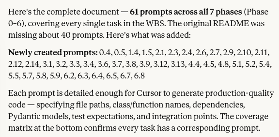

# The project's background and ongoing story

## Why I created this project

My wife and I were talking about advancements of agentic systems and their use in large corporations or government organizations.

I decided to make a quick prototype for how such system would like like.

## Approach

I am using a combination of AI tools:

* SuperGrok for quick research, since I don't have any limits on tokens
* Claude Code to create in-depth architecture documents and plans
* Cursor for executing the plans and implementing the system

## Journey

### Feb 15

Raining Sunday morning, 11 AM, coffee and the original ideation :)

Created the initial plans and prompts. Opus 4.5 created very nicely designed build plan and initial prompts.

The problem was - I started running them in cursor only to realize that Claude didn't really do a good job:



So now I have gaps in implementation and need to start from scratch.

Also there is way to run multiple agents in Cursor in parallel.

Sunday 6 PM (had to do a short Costco run): Phase 0, 1 and 2 prompts are all completed. It's great Monday is a federal holiday in the US, should be able to finish all prompts for the 6 phases Opus generated for us. Can't wait to actually start testing. Are we really going to be able to run this team using just the local models in Ollama??

Generated so far, within approximately 6 working hours:

```text
-------------------------------------------------------------------------------
Language                     files          blank        comment           code
-------------------------------------------------------------------------------
Python                          64           1675           1756           6255
Markdown                        15            690              0           2599
YAML                             3             59             15            381
Bourne Shell                     1             26             21            231
JSON                             4              0              0             20
-------------------------------------------------------------------------------
SUM:                            87           2450           1792           9486
-------------------------------------------------------------------------------
```

### Feb 16

This is very cool! After 2 hours of work, we are into running integration tests, at the end of Phase 4.

Knowing how it usually is, I expect to be stuck at this phase for several days. We'll see...

And we crushed! The integration tests successfully created the team and started executing a full flow tests. My my Mac with 36GB of unified memory got completely unresponsive. Even the resource monitor wasn't showing anything useful except that Cursor was consuming 92GB of memory. Out of available 36. And after several short minutes the computer rebooted.

Alright, we are now back to the very typical back and forth with Cursor. It runs some tests, while skipping or disabling others. When it doesn't like a failed test, it just reports a success and asks you to move on.

## Feb 18

Skipping the busy Monday Feb 17... Who doesn't like to start learning at 5 AM?!

Yes, as expected, the default Cursor Composer is quite limited. It confuses setups, stops at integration tests where Sonnet 4.6 gives clear, short and precise instructions.

Cursor keeps bossing me around. I'm telling it to run the install script, then to execute the integration test. Result: it updated the readme file to tell *me* to execute the script and run the test. Thank you Cursor.

## Feb 21

After many out of memory reboots on my mac :)... Let's do something better. Let's use one of those LLM routers and see how much it'll cost.

## Feb 22

OK so running a smaller LLM definitely affects the team's performance. Big surprise. Alright so we're saving on cost running it locally be losing big time on actually being able to achieve results.

Pivoting to using APIs, with strict cost control and monitoring today.

Also, monitoring the CrewAI using logs is awkward. Let's build a very simple UI for it. Or TUI, as most people are not doing.

OK so the basic project is now working. Now testing every step, adding more guardrails and tweaking prompts.

Let's plan to deploy it on AWS AgentCore as well.

After multiple test runs using Ollama - it's now clear that not only it's slow, but also not feasible at the moment if you really want to make any progress. Most of the test runs are very slow, the local models are way to dumb to perform tasks, and the system crashes several times a day because I don't have enough memory.

Ok so for the next time - migrate from Ollama to OpenRouter and try running again.

## Feb 27

Bright and early Friday... Finally, running a demo! And seeing agent talk to each other. This is very cool.

Also, enjoying the regular (as of late), Cursor idiosyncrasies. I'm getting a feeling that just switching to Claude full time will get a much better value, faster results. It's like arguing with a mid-level engineer, who have enough experience to have very strong opinions, but not enough experience to understand a larger context, and not willing to even try what is being asked. And - just throwing the task back at you, "here, if you're so smart why don't you do it yourself".

Ran into a problem with free OpenRouter account - the max number of tokens is 4096, and there's no way to set a larger limit?

## Fed 28

Well I can't believe this is the second weekend I'm spending on this :)

Now that the code has been integration tested, and is actually trying (quite desperately) to produce some working code, let's look at different options for production deployments.

OpenRouter is great but I think it's time to get serious and try out something enterprise-ready. Lets switch to AWS Bedrock and it's cheap Nova models. With some cost estimates to see whether it's really cheap :). Anyone out there who's been oversold by great technical sales team from vendors?

## Mar 29

One month passed and it looks look like the orchestration frameworks and harnesses are getting release at the speed of front-end libraries back in 2015 (meaning a few of the new, hot, better than all the rest every week or so).

So, what do I think about CrewAI? CrewAI got us far — it's nice for simple pipelines, and the hierarchical process handles basic delegation. But as the system grew, the limitations became clear:

- **Debugging is a black box.** When a crew fails, figuring out *which agent* misbehaved and *why* requires digging through verbose logs. We need state inspection, replay/time-travel.
- **Human-in-the-loop is bolted on.** The `awaiting_human_input` flag + polling pattern is fragile. Real production workflows need native pause/resume.
- **Persistence is DIY.** We cobbled together ChromaDB + SQLite for memory, but crash recovery means re-running from scratch.
- **Composition is rigid.** Each Crew is a monolith — you can't easily test the Product Owner agent independently from the Architect, or swap one crew's strategy without touching the others. Again, totally fine for simple systems.

So, next for us: exploring LangGraph. LangGraph gives us explicit graph-based orchestration where every agent step is a node, routing is pure functions on state, and persistence/human-in-the-loop/streaming are built-in. The supervisor pattern maps cleanly to our Manager→Specialist delegation model, and subgraphs give us the isolation we need for independent testing.

I'm **not** ripping out CrewAI. Instead I want to evaluate a multi-backend architecture. Both orchestration frameworks live behind a common `Backend` protocol. Same shared tools, guardrails, models, config. Pick your backend at runtime: `--backend crewai` or `--backend langgraph`. This lets us run the exact same demo through both and compare output quality, cost, and latency side by side.

Also added **team profiles** — not every project needs all 8 agents. A `--team backend-api` flag spins up only Manager, PO, Architect, Backend Dev, QA, and DevOps. Skip the frontend. A `--team prototype` flag skips formal planning entirely and goes straight to Architect → Fullstack Dev → QA. This works across both backends.

The architecture is also designed for future frameworks: AutoGen, Claude Agent SDK, AWS Bedrock Agents, Strands — each would just be another `Backend` implementation.

Two more additions to the plan: **MCP servers** and **RAG**. Both are designed as shared, backend-agnostic layers — they work with both CrewAI and LangGraph.

Let's see what we find out after getting LangGraph working.

I'm also curious about cost - how each option would allow us to monitor and control what we spend.

OK one more before I wrap for the day. Created a full plan for a third backend: **Claude Agent SDK** (`docs/claude-agent-sdk/CLAUDE_AGENT_SDK_PLAN.md`). This one is fundamentally different from both CrewAI and LangGraph — it's session-based, not state-based. There's no explicit state graph or typed ProjectState flowing between nodes. Instead, agents write artifacts to the filesystem and downstream agents read them. The SDK handles session persistence, streaming, MCP, and cost tracking natively — things that require plugins or custom code in the other frameworks.

The architecture is nested subagents: Orchestrator (Manager) → Phase agents (planning, dev, testing, deploy) → Specialist agents (PO, architect, devs, QA, devops, cloud). Each level has its own isolated context window. Guardrails work through three layers: prompt instructions (behavioral), SDK hooks (security enforcement via PreToolUse/PostToolUse), and MCP tools (on-demand quality checks).

The interesting bit: `CLAUDE.md` becomes the shared knowledge base. The SDK loads it automatically for every agent, replacing the need for RAG-based prompt injection for static conventions. Dynamic knowledge still goes through the `search_knowledge` MCP tool.

So now we have three backend plans, all behind the same `Backend` protocol: CrewAI (crews + flows), LangGraph (state graphs + subgraphs), Claude Agent SDK (nested subagents + file-based state). Same demos, same team profiles, comparable results. The comparison framework will measure quality, cost, latency, token usage, and developer experience across all three.

Went back and audited the Claude Agent SDK plan for underutilized capabilities. Found we were leaving a lot on the table. Added Section 10 ("Advanced Claude Capabilities") and Phase 4b (5 new tasks, 33 total). The highlights:

- **Extended thinking with per-agent effort levels** — Architect gets `effort: "high"` with adaptive thinking (visible reasoning traces before architecture decisions); DevOps gets `effort: "low"` (Dockerfiles are templated, don't need deep reasoning). This is a huge differentiator vs CrewAI/LangGraph where you can't tune reasoning depth per agent.
- **Prompt caching** — automatic, up to 90% savings on input tokens. CLAUDE.md, tool schemas, and prior conversation history are all cached. For a 9-agent system with ~100 total turns, estimated input cost drops from ~$22 to ~$2.50.
- **File checkpointing** — snapshot workspace before risky phases, rollback if validation fails. Simpler than git-based rollback and built right into the SDK.
- **Vision for QA** — QA agent can analyze screenshots. Visual regression testing without external tooling.
- **ToolSearch / deferred loading** — when MCP servers expose >10 tools, defer loading and let the agent search on demand. 85% reduction in schema overhead.
- **Skills** — reusable `.claude/skills/` for code review, test analysis, API design. Agents invoke them automatically when the task matches.
- **Session forking** — branch from a planning-complete session to A/B test different architectures (monolith vs microservices vs serverless). Unique to the Claude SDK.
- **Batch API** — 50% cost savings for non-urgent bulk analysis (nightly code reviews). Stacks with prompt caching for up to 95% off.

The comparison matrix now has 11 rows where Claude Agent SDK has a ✅ and the other two have ❌. That said — the other backends have their own strengths (LangGraph's state inspection and time-travel, CrewAI's simplicity). The whole point of the multi-backend architecture is to let the data speak.

## Mar 30

Shipped a full web UI. Not a quick Streamlit thing — a proper FastAPI backend with a React/Vite frontend, WebSocket streaming for live agent updates, a phase pipeline view, a guardrail panel, and a backend comparison page. ~3,500 lines in one commit. Also moved Docker files to `docker/`, cleaned up the repo layout.

**Why not Streamlit?** We started with a Rich TUI (still works, great for SSH), then a Gradio prototype. But once the system had multiple backends, team profiles, and real-time streaming from agents, we needed something that could handle WebSocket connections, show a live phase pipeline, and let you compare runs side-by-side. FastAPI + React with Vite was the pragmatic choice — we already had the API shape from the CLI, and Vite's dev experience is hard to argue with.

**The big architectural insight here:** the UI is a pure consumer. It reads from the same `events.jsonl` and `run.json` files that the CLI produces. Zero coupling to the orchestration layer. Any backend (CrewAI, LangGraph, future Claude SDK) writes the same event format, and the UI just renders it. If you're building a multi-backend system, design your observation layer first.

Alongside the UI, wired up the memory system properly. `memory/lessons.py` is the core: it captures failure records into SQLite at the end of every run, clusters recurring patterns by `(pattern_type, clustering_key)`, and promotes them into lessons that get injected into agent system prompts at the start of the next run. Both backends consume lessons from the same `LongTermStore` — CrewAI appends them to agent backstories, LangGraph injects them as a `## Lessons` section in system prompts.

Also added `scripts/extract_lessons.py` to promote patterns manually (more on this in a sec — spoiler: manual is the wrong design for an autonomous system).

The self-improvement loop is real now, not just a diagram in a doc.

**Takeaway for builders:** the hardest part of self-improvement isn't the ML — it's the plumbing. Getting failure data out of a run, into a durable store, clustered into patterns, and back into prompts in a way that works across backends and doesn't break when something goes wrong... that's 80% of the work. Every lesson-related call is wrapped in `try/except` or `contextlib.suppress(Exception)` — a broken lesson system should never break a run.

## Apr 1

Actually ran a demo end-to-end and watched the self-improvement loop close.

Here's what happened: LangGraph run `3ebc3d3a` (backend-api team, hello_world demo) failed in the testing phase. The backend developer's retry response contained full source code in its message body — `app.py`, `Dockerfile`, the works, all in markdown code blocks. The QA agent received this as input, and the behavioral guardrail flagged it: *"QA Engineer should only write test code, not modify production source"* (9 violations, relevance 36% below the 50% threshold). Classic false positive — the QA agent wasn't *writing* production code, it was *reading* a message that contained production code.

The system captured the failure, persisted it to the long-term store, and pattern-matched it against previous runs. The lesson system promoted it: *"Avoid guardrail violations: Recurring failure detected. Phase: testing. Error: GuardrailError."*

Then the manager agent wrote a self-improvement report — not a log dump, but an actual narrative: which failures occurred, what prior lessons were relevant, and concrete next steps (retry with enforced role boundaries, adjust guardrail thresholds, review workspace layout, incorporate the promoted lesson).

**This is the loop working.** Failure → structured capture → pattern clustering → lesson promotion → prompt injection → manager narrative → actionable proposals. Closed in 3 runs.

**What we learned about guardrails:** behavioral guardrails that score agent output against task scope are powerful, but they need role-specific tuning. A QA agent that *receives* production code in its input context is not the same as a QA agent that *writes* production code. The guardrail can't see the difference because it's doing content analysis, not provenance tracking. This is the kind of nuance you only discover by running real demos, not by unit testing guardrails in isolation.

One catch: lesson extraction still requires running `scripts/extract_lessons.py` manually between runs. For an "autonomous" system, that's a contradiction. The fix is trivial — call `extract_lessons(threshold=2)` at the start of every run, one SQLite query, zero LLM calls, ~1ms. It's on the list.

Also added a Cursor pre-push skill (`.cursor/skills/pre-push-ruff/SKILL.md`) that auto-runs `ruff check` before any push or PR. Small investment, catches lint issues before they hit CI.

Stepped back from building and did a proper audit of the self-improvement mechanism. Not "does it work on the happy path" but "could an organization actually deploy this and trust it to improve over time?"

**The good:** the capture → extract → inject chain is genuinely working. Both backends write failure records to the same SQLite store. Lessons get promoted and injected. The manager's self-improvement report (run `3ebc3d3a`) is a real proof point — it references prior lessons, identifies the root cause, and proposes calibration. The whole system degrades gracefully: every lesson-related call is wrapped so that a broken lesson store never breaks a run. These are hard things to get right, and they're done.

**The gaps that would block production use:**

1. **Lesson extraction is manual.** The loop is open by default. An org deploys this, runs it 50 times, and unless someone remembers to run `scripts/extract_lessons.py` between runs, zero learning happens. The feature looks implemented but is effectively dormant. Fix: auto-extract at run startup, gated by `AI_TEAM_SI_AUTO_EXTRACT=true` (default on).

2. **No lesson deduplication.** Run the extract script twice, you get every lesson twice. Over time, agent prompts bloat with duplicate instructions. At 50 tokens per lesson × 20 duplicates × 9 agents, that's ~9,000 wasted prompt tokens per run. Fix: upsert semantics — check `(pattern_type, clustering_key)` before insert, increment `occurrences` on match, cap at `max_lessons_per_role=10` with LRU eviction.

3. **Quality metrics are never persisted.** The `performance_metrics` table exists in the schema. It has zero writers. The code quality guardrail computes a 0-100 score, the coverage guardrail computes pass/fail — these scores evaporate after the run. There is no way to answer "is the system getting better over time?" Fix: write metrics at the end of each phase, expose via `scripts/show_metrics.py`.

4. **Backend comparison is too thin.** The project claims to be a "framework comparison platform" but `BackendRunSnapshot` only captures: success/fail, wall-clock time, final phase, file count. You can't say "LangGraph produces better code than CrewAI" or "Claude SDK is 40% cheaper" based on a boolean and a stopwatch. Fix: extend the snapshot with token counts, cost estimates, quality scores, per-phase timing, retry counts, and require 5+ runs per backend per demo for statistical significance.

5. **No feedback on lesson quality.** Lessons are promoted based on occurrence count only. A lesson that fires 5 times but never actually prevents the failure keeps getting injected forever. Fix: track effectiveness — if a lesson is present and the same failure recurs 3+ times, mark it ineffective and stop injecting.

The full audit is in `docs/SELF_IMPROVEMENT_AUDIT.md` (maturity scorecard, risk assessment, ROI model, 12 prioritized improvements). The implementation blueprint is in `docs/SELF_IMPROVEMENT_DESIGN.md` (schemas, pseudocode, file-by-file change list).

**The meta-lesson:** building a self-improvement loop is deceptively easy to demo and deceptively hard to productionize. The flashy part — "agents learn from failures!" — takes a weekend. The boring parts — deduplication, TTL, effectiveness tracking, budget enforcement, observability — take weeks and are the difference between a portfolio demo and something an org would actually trust. We're honest about where we are: the critical path from here to production-ready is roughly 30 hours of implementation, with auto-extract + dedup + metrics persistence being the first 6.

