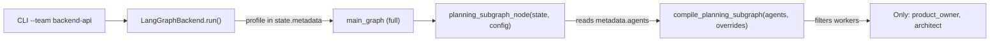

# Profile-Aware LangGraph Agent Composition

## Problem

Today the four LangGraph subgraphs (`planning`, `development`, `testing`, `deployment`) are compiled as **process-global singletons** with hardcoded agent rosters. The `TeamProfile` (from `--team backend-api`) is stored in state metadata but never shapes which workers are wired or which models are used. A `backend-api` run still compiles and pays for `frontend_developer`, `fullstack_developer`, and `cloud_engineer`.

## Current flow

```mermaid
flowchart LR
  CLI["CLI --team backend-api"] --> Backend["LangGraphBackend.run()"]
  Backend -->|"profile in metadata only"| MainGraph["main_graph (full)"]
  MainGraph --> Planning["planning_subgraph_node()"]
  Planning --> GetPlanning["_get_planning() singleton"]
  GetPlanning --> Compile["compile_planning_subgraph()"]
  Compile -->|"hardcoded PO + Architect"| Workers["Always: product_owner, architect"]
```




## Target flow




## Design decisions

- **No more singletons.** The cached `_planning`, `_development`, etc. globals prevent profile-specific compilation. Replace with a simple `functools.lru_cache` keyed on `(frozenset(agents), frozenset(model_overrides.items()))` so identical profiles still share a compiled graph.
- **Subgraph runners read profile from state.** `planning_subgraph_node` etc. already receive `state` which has `metadata.agents` and `metadata.model_overrides` (the latter needs adding to `_build_initial_state`).
- **Each `compile_*_subgraph` accepts agent list + model overrides.** Workers not in the list are simply not created or added to the supervisor. If a subgraph has zero applicable workers (e.g. `infra-only` has no developers), the phase node returns a no-op result (skip).
- `**model_overrides` flow through to `create_chat_model_for_role`.** When the override dict maps a role to a model ID, that ID is used instead of the settings default.

## Files to change

### 1. `[src/ai_team/backends/langgraph_backend/backend.py](src/ai_team/backends/langgraph_backend/backend.py)`

Add `model_overrides` to `_build_initial_state` so it flows into `state.metadata`:

```python
"metadata": {
    "team_profile": profile.name,
    "agents": profile.agents,
    "phases": profile.phases,
    "model_overrides": profile.model_overrides,  # NEW
    "profile_rag": profile.metadata.get("rag"),
},
```

### 2. `[src/ai_team/backends/langgraph_backend/graphs/subgraph_runners.py](src/ai_team/backends/langgraph_backend/graphs/subgraph_runners.py)`

- Remove the four `_planning` / `_development` / `_testing` / `_deployment` globals and their `_get_*` helpers.
- Add a `_compile_cached` wrapper using `functools.lru_cache` (keyed on phase name + frozen agent set + frozen overrides).
- Each `*_subgraph_node` reads `state["metadata"]["agents"]` and `state["metadata"].get("model_overrides", {})`, then calls the corresponding compile function with those parameters.
- `reset_subgraph_cache()` clears the LRU cache (for tests).

### 3. `[src/ai_team/backends/langgraph_backend/graphs/planning.py](src/ai_team/backends/langgraph_backend/graphs/planning.py)`

`compile_planning_subgraph` gains an `agents: frozenset[str]` parameter:

- Planning workers are `{"product_owner", "architect"}`. Filter to `agents & {"product_owner", "architect"}`.
- If only one worker remains, use a single ReAct agent instead of a supervisor.
- If zero workers remain, return a trivial pass-through graph.

### 4. `[src/ai_team/backends/langgraph_backend/graphs/development.py](src/ai_team/backends/langgraph_backend/graphs/development.py)`

`compile_development_subgraph` gains an `agents: frozenset[str]` parameter:

- Development workers are `{"backend_developer", "frontend_developer", "fullstack_developer"}`. Filter to intersection.
- Supervisor is only created when 2+ workers remain; single worker uses bare ReAct.
- Zero workers: pass-through.

### 5. `[src/ai_team/backends/langgraph_backend/graphs/testing.py](src/ai_team/backends/langgraph_backend/graphs/testing.py)`

`compile_testing_subgraph` gains `agents` parameter. QA is always `qa_engineer`; if absent from profile, pass-through.

### 6. `[src/ai_team/backends/langgraph_backend/graphs/deployment.py](src/ai_team/backends/langgraph_backend/graphs/deployment.py)`

`compile_deployment_subgraph` gains `agents` parameter:

- Deployment workers are `{"devops_engineer", "cloud_engineer"}`. Wire only those present.
- Single worker: single ReAct. Zero: pass-through.

### 7. `[src/ai_team/backends/langgraph_backend/graphs/langgraph_chat.py](src/ai_team/backends/langgraph_backend/graphs/langgraph_chat.py)`

`create_chat_model_for_role` gains an optional `model_id_override: str | None` parameter. When set, it overrides the model ID from settings. The compile functions pass overrides through.

### 8. Tests

- Update `[tests/unit/backends/langgraph_backend/test_langgraph_guardrails_adversarial.py](tests/unit/backends/langgraph_backend/test_langgraph_guardrails_adversarial.py)` if compile signatures change.
- Add new tests in `tests/unit/backends/langgraph_backend/`:
  - `test_profile_aware_subgraphs.py` -- verify each compile function filters agents correctly (full set, subset, empty).
  - `test_subgraph_cache.py` -- verify LRU cache returns same graph for same profile, different for different.
- Update any existing tests that call `reset_subgraph_cache()`.

## Out of scope (deferred)

- **Phase skipping based on `profile.phases`**: e.g. `infra-only` has no `development` or `testing` phase. This would require changes to `routing.py` and `build_main_graph`, which is a separate concern.
- **CrewAI backend**: currently also ignores `profile.agents`; parity change deferred.

