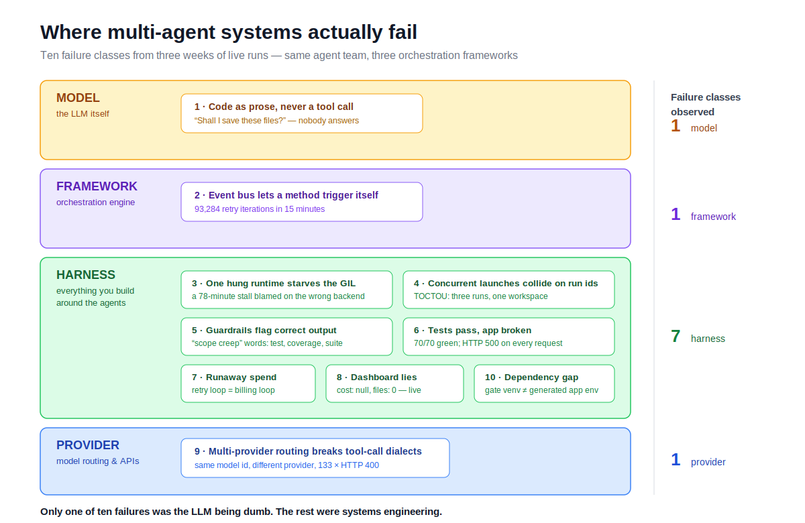

# Ten Ways Multi-Agent Systems Actually Fail

*A failure taxonomy from running the same AI engineering team on three orchestration
frameworks — CrewAI, LangGraph, and the Claude Agent SDK — with receipts for every entry.*

Most multi-agent content shows the demo that worked. This is the opposite: a catalog of
every distinct way my system *broke* over three weeks of running a nine-agent software
team against real briefs, side by side on three orchestrators. Every entry below has a
reproducible trace, a root cause, and a shipped fix in
[the repo](https://github.com/RickZee/ai-team). None of them were in the demo script.

The punchline up front: **only one of the ten was caused by an LLM being dumb.** The
rest were systems engineering — event semantics, GIL contention, race conditions,
guardrail calibration, verification gaps. If you're building agentic systems, the model
is not where most of your reliability budget goes.

---

## 1. The model writes code as prose and asks permission

**Symptom:** development "completes", workspace is empty, tests fail with ImportError,
pipeline retries forever.

**Root cause:** open-weights models (deepseek-v3 in my case) given a `file_writer` tool
and told *"call file_writer, do not output code as text"* will emit perfectly correct
code — as markdown, framed as a proposal: *"Would you like me to proceed with saving
these files?"* There is no human to say yes. Agent frameworks coordinate through files
on disk; prose writes nothing.

**Fix:** salvage. If output contains fenced code with a filename, extract it and write
it to disk yourself. Also: a bounded re-prompt lever — detect "no tool call happened,"
re-prompt once with a blunt corrective, then let the normal retry path own it. Both
shipped; the re-prompt lever fired three times in a live run and fell back cleanly.

**Lesson:** treat tool-calling compliance as probabilistic, and build the recovery path
before you need it.

## 2. The framework's event bus lets a method trigger itself forever

**Symptom:** a retry handler logged 93,284 iterations in 15 minutes. Three weeks of
"CrewAI deadlocks in retry" verdicts.

**Root cause:** in CrewAI Flows, a completed method emits *its own method name* as the
next trigger, and the engine deliberately clears completed methods to allow cycles. So
`@listen("retry_development") def retry_development(...)` re-triggers itself,
unconditionally, forever. Ten of my flow methods had this shape. Worse: a plain
listener's return value is silently discarded — only `@router` returns route — so the
retry cap I'd "implemented" (`return "escalate_to_human"`) had never routed once.

**Fix:** rename every listener away from its trigger string (`on_<trigger>` convention),
attach real routers to anything whose return value must route, and add a meta-test that
introspects the class and fails if any method ever listens to its own name again.

**Lesson:** learn your framework's event semantics from its source, not its docs. The
bug convicted the framework for three weeks when the wiring was mine.

## 3. One hung backend starves everyone else's GIL

**Symptom:** LangGraph fired a human-review interrupt; the web API reported it 78
minutes later. Looked exactly like a checkpointer bug. Wasn't.

**Root cause:** CrewAI (hung in its retry path, pinned at ~95% CPU in a busy loop) ran
as a *thread* in the same process. Python threads can't be killed, and a spinning
thread starves the GIL for every other backend co-hosted in that server — including
LangGraph's post-interrupt bookkeeping, which is pure Python.

**Fix:** subprocess isolation. The unreliable backend runs in its own OS process with a
hard wall-clock kill (`terminate()`, then `kill()`). Three consecutive on-deadline
clean kills since; the same interrupt now surfaces in under a minute.

**Lesson:** co-hosting agent runtimes in one interpreter couples their failure modes.
Anything that can hang gets a process boundary and a kill switch.

## 4. Concurrent launches collide on the same run id

**Symptom:** "Run all three backends" produced one run id — three orchestrators
overwriting each other's state and writing into one shared workspace.

**Root cause:** classic TOCTOU. Run ids were `{timestamp}_{slug}_{nn}` where `nn` came
from scanning existing directories. Three requests in the same second all scanned an
empty listing and all picked `01`.

**Fix:** the `mkdir` *is* the reservation — create the directory atomically inside the
allocation loop, bump the index on `FileExistsError`.

**Lesson:** agent platforms are distributed systems at tiny scale. The boring races
still apply.

## 5. Lexical guardrails flag correct output for using domain vocabulary

**Symptom:** the QA agent wrote correct pytest tests; a "scope control" guardrail
rejected them for being off-topic — three retries burned per occurrence, then human
escalation. The flagged "scope creep" words were literally: *test, coverage, suite,
validation*.

**Root cause:** scope relevance was keyword overlap between output and the product
brief. Test code shares almost no vocabulary with a brief in either direction. A second
class hit the same week: a role guardrail limited QA to `test_*.py` files and flagged
`tests/conftest.py` — a *standard pytest file* — as forbidden production source.

**Fix:** strip code blocks before scoring (lexical checks are only meaningful on
prose; security and quality gates own the code), calibrate thresholds from observed
distributions of correct vs off-topic output, and allowlist the ecosystem's standard
files.

**Lesson:** guardrails are classifiers. They have precision and recall, and nobody
measures them. Every guardrail needs the same calibration discipline as a model.

## 6. Tests pass, app broken

**Symptom:** a run reported full success — 70/70 pytest green — and the generated app
returned HTTP 500 on every single request (a logging misconfiguration only triggered
under a real server).

**Root cause:** unit tests used an in-process test client that never exercised the real
boot path. No agent, on any backend, ever *ran* the app it built.

**Fix:** a runtime smoke gate — boot the generated app for real (docker compose or the
actual entrypoint), probe real HTTP including a create→read→update→delete chain, and
feed failures back into a bounded fix-retry loop. It caught the broken app on its first
outing; every "success" since has meant a booted, probed application.

**Lesson:** "tests pass" is a claim about the test harness. Verify behavior, not
artifacts.

## 7. Runaway spend has no natural ceiling

**Symptom:** a crash-retry loop is also a *billing* loop. A model emitting malformed
tool calls can burn money in tight cycles bounded only by retry caps you hope work
(see #2 for how well that went).

**Root cause:** nothing in any framework meters cumulative per-run spend by default.

**Fix:** a spend guard fed real per-call cost (OpenRouter's `usage.cost`, LiteLLM's
`response_cost`), raising a *non-retryable* abort past a per-run ceiling. One subtlety
that bit later: as a process-global singleton it cross-contaminated concurrent runs —
it had to become per-run context state before the numbers meant anything.

**Lesson:** budget enforcement is a first-class guardrail, and its state model matters
as soon as you run two things at once.

## 8. The dashboard lies by omission

**Symptom:** live runs showed `cost: null, files: 0, tests: 0` while real files and
real dollars flowed. Diagnosis of everything above was log-archaeology instead of
glancing at a screen.

**Root cause:** metrics wired to in-memory event plumbing that most backends never fed,
in a process that restarts.

**Fix:** derive metrics from the artifacts every backend already writes (workspace
files, test results, smoke reports, spend registry) and persist run history to SQLite
so it survives restarts. Ground truth over event plumbing.

**Lesson:** observability *is* the harness. Every failure above was found and verified
through logs, persisted state, and artifacts — the dashboards that showed zeros helped
nobody.

---

## 9. The same model id speaks different dialects depending on who serves it

**Symptom:** a controlled experiment (same framework, same brief, model swapped to
claude-sonnet-4 via OpenRouter) drowned in HTTP 400s — 133 provider-error retries in a
single run, burning the entire spend budget mid-pipeline.

**Root cause:** OpenRouter served the model from Google Vertex, whose
Anthropic-translation layer rejects the tool-call ids the client sends. Same model id,
different upstream provider, incompatible tool-calling dialect. Bonus discovery: a hard
pin to provider "Anthropic" 404s — endpoint pools are *account-specific* (this key's
pool was Vertex + Bedrock only).

**Fix:** steer away from the broken provider (`ignore: ["Google"]`), verified with a
live tool round-trip and then a full run with zero provider errors (from 133).

**Lesson:** for tool-calling agents, the provider routing layer is part of your
correctness surface, not just your latency/cost surface.

## 10. The verification gate runs in a different universe than the app

**Symptom:** a model wrote correct code and correct tests; every test module died on
`ModuleNotFoundError` — four times, retries exhausted, human escalation.

**Root cause:** the quality gate runs pytest in the *harness* venv and never installs
the generated `requirements.txt`. The model had (reasonably) chosen `flask_sqlalchemy`;
our venv only had plain `flask`. Weaker models had been dodging this failure for weeks
purely by picking whatever happened to be installed — the gate was silently biasing the
comparison toward stdlib-ish stacks.

**Fix (queued):** install the generated requirements into an isolated per-workspace
environment before the gate runs.

**Lesson:** every gap between the gate environment and the app's real environment is a
place where correct work gets marked wrong — the mirror image of failure #6.

## What this adds up to

Across three frameworks and dozens of runs, the ranking of what actually determined
reliability:

1. **The harness** — salvage, smoke gates, spend guards, process isolation, atomic ids,
   calibrated guardrails, gate-environment fidelity. Framework-agnostic, and where
   nearly all the fixes landed (seven of ten classes).
2. **The model** — one failure class (#1), but it dominates outcomes once the platform
   is sound: the same pipeline succeeds in ~13 minutes with a strong tool-calling model
   and escalates to a human with a weak one.
3. **The framework** — real differences in semantics and ergonomics (#2 was framework
   specific), but smaller than either of the above.
4. **The provider** — a layer most write-ups ignore entirely (#9): routing, dialects,
   account-specific endpoint pools.

The same-model matrix made the ranking falsifiable: swap only the model and the
"framework failure" disappears; what's left fails in the harness and provider layers.

The comparison table gets the attention. The taxonomy is the useful part.
