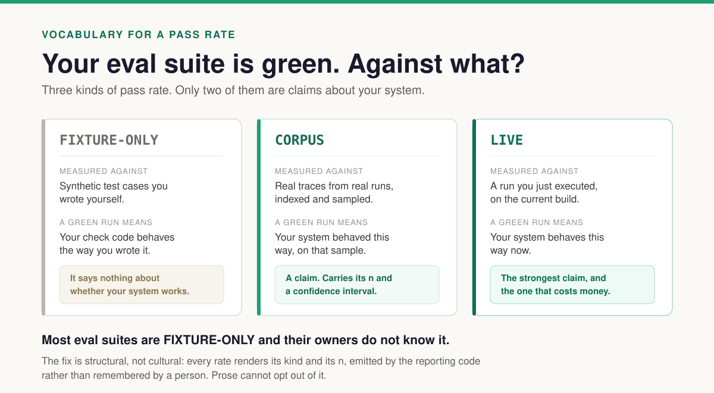

# FIXTURE-ONLY

*What a green eval run actually asserts, and the three words I now put on every rate
I publish.*

---

Some time in August I described my eval setup to someone. I said it had a gate that
runs on every pull request, that it costs nothing, that it scores against a
seventeen-mode failure taxonomy, and that it was green.

Every one of those statements was true. Together they implied something false.

What the listener heard — what I intended them to hear, if I am honest about it — was
*the system works, and I have the evidence*. What the green run actually asserted was
that **my check code behaves the way I wrote it**. Those are not the same claim. They
are not even adjacent. One is a statement about a multi-agent system; the other is a
statement about a hundred lines of assertion logic.

I did not lie. The repo said so plainly, in two places. It says it in
`evals/golden/README.md` under a heading about honesty constraints, and it said it in
`EVAL_METHODOLOGY.md` under a heading I had titled *Open-coding status (honest)*. I
wrote the disclosure myself, months before, and then let the number travel without it.

That is the failure I want to describe, because I do not think it is mine alone. The
suite was honest. The label stayed home and the figure went out.

## Three words

I went looking for standard vocabulary for this and could not find any. So I started
using three words, and every rate I publish now carries exactly one of them.

**FIXTURE-ONLY** — measured against synthetic test cases you wrote yourself. Mine
scores 94 committed fixtures across 21 checks: a passing case, a failing case, and
usually a not-applicable case per check. A green run proves the check code behaves as
written. That is a real and useful thing to know. It is the reason the suite catches
regressions in the suite. It says nothing whatsoever about whether the system under
test works, because the system under test was never involved.

**CORPUS** — measured against real traces from real runs, indexed and sampled. This is
a claim about your system: it behaved this way, on that sample, with that `n`. It is
the first kind that earns a confidence interval, and the first kind a reader is
entitled to reason from.

**LIVE** — measured against a run you just executed on the current build. The strongest
claim, a statement about now rather than about a sample from the past, and the only one
that costs money every time you make it.

The distinction is not subtle once you have the words. Before I had them, all three
were "the evals pass."

## Why the badge is the most over-read signal in AI engineering

A CI badge is an honest instrument that is read dishonestly, and both halves of that
matter.

The badge reports a boolean about a job. The job is scoped by whoever wrote it. In a
conventional codebase, the inference from *tests pass* to *the code does what it should*
is loose but roughly serviceable, because the tests exercise the actual code paths users
hit. In an LLM system that inference quietly stops working, for a specific reason:
**the expensive, flaky, interesting part is the part your fixtures replace.**

A fixture is a recorded trace or a synthetic one. Replaying it exercises your scoring
logic at full fidelity and your agents not at all. The more carefully you build the
offline tier — and you should build it, mine runs at $0.00 on every PR and I would not
give it up — the more completely it isolates the scoring from the thing being scored.
The quality of the engineering is what produces the illusion. A sloppy eval suite that
occasionally calls a real model is, in this one narrow respect, more honest than a
beautifully deterministic one.

So the badge stays green while the agents rot, and nothing in the machinery is
malfunctioning. There is no bug to find. That is why this survives code review, survives
a rigorous author, and survives a repo that documented the problem in its own README.

## Make the label structural, not cultural

Here is the part I got wrong and would do differently.

My disclosure lived in prose. Prose written by a person who intended to be careful, in a
file that person expected to reread. Which means the label was a matter of discipline —
and discipline is exactly what fails under the conditions where you need it: a month
later, mid-conversation, when someone asks how it's going and the honest answer is
long.

The fix is to move the label out of prose and into the reporting code. In my harness the
renderer now emits the corpus kind beside every rate, along with `n`. Prose cannot opt
out of it, because prose is not where it comes from. If the corpus behind a number fails
its diversity floors — I use at least 100 indexable traces, three backends, four
scenario ids, two statuses, and a fourteen-day span — the renderer stamps the whole
report `NON-REPRESENTATIVE` and names the specific floors that were missed.

This is the general principle and it took me embarrassingly long to reach: **a claim
that has to declare its own provenance is worth more than a claim that relies on its
author to remember.** Anything you could forget to say, the tooling should say for you.
My taxonomy now carries the same treatment — every failure mode records an `origin`
field, one of `essay`, `reference`, `hypothesis`, or `open_coding`, and `open_coding`
requires annotation ids behind it. Promotion takes evidence rather than argument. It
renders the current state in a single line: **zero of seventeen failure modes have been
observed.**

That line is uncomfortable to look at. It is supposed to be.

## What it costs

Publishing `FIXTURE-ONLY` next to your own numbers is worse than not publishing it, in
the short run, in exactly the way you expect.

My current state, stamped honestly: the Tier A gate is `FIXTURE-ONLY`. It runs
`--warn-only`, which is to say it does not block anything. No judge has a validated
true-positive or true-negative rate; the alignment report reads `n: 0` and
`eligible_to_gate: false`. There is no `CORPUS` rate in existence because the corpus
does not yet clear its floors. Every one of those sentences is less impressive than "we
have a $0 eval gate in CI," which is also true and which I could have kept saying.

I think the trade is obviously correct, and not because honesty is its own reward.

It is correct because **the alternative is a number you cannot act on.** A green
`FIXTURE-ONLY` run told me nothing, for two months, about a system I was actively
changing. I could not have used it to decide anything, and I did not, which is the
tell: if a metric never changes a decision, it is decoration. Labelling it is what makes
the gap visible, and the gap is the thing worth fixing.

It is also correct because the label is falsifiable and the vibe is not. "We have strong
evals" invites nothing. `FIXTURE-ONLY, 94 fixtures, 21 checks` invites a reader to ask
the next question, which is the only kind of credibility that survives contact.

## Turning it outward

The reason to have the vocabulary is not confession. It is that most published claims
about agent quality do not say which kind they are, and once you have the three words
you cannot stop noticing.

When you next read that a framework, a harness, or an agent product "passes its evals,"
the questions are short:

- **Against what?** Synthetic fixtures, recorded traces, or live runs?
- **How many, and how diverse?** A pass rate over fifty traces from one configuration on
  one afternoon is `n=1` wearing `n=50`'s clothes. Mine was — fifty traces, one backend,
  one scenario id, one status, all created inside a 1.97-second window.
- **Where did the failure categories come from?** If nobody can point from a category to
  the traces that produced it, the suite is testing an imagination.
- **What does the green run assert, in one sentence?** Ask the author to say it out loud.
  The sentence is usually shorter and narrower than the badge implies, and most authors
  will tell you honestly if asked directly, because most of them are not lying either.

I would guess most eval suites in this space are `FIXTURE-ONLY` and their owners do not
know it. I want to be careful here, because that is the most quotable sentence in this
essay and it is currently a guess rather than a finding — I have surveyed exactly one
suite, and it was mine. Someone should go and count. It might be me.

## The rule

Every rate carries its corpus kind and its `n`, emitted by the reporting code rather
than remembered by a person.

That is the whole thing. It is not a methodology, it is a field on a report, and it
would have caught the episode that produced it about three months earlier than I did.

---

*I write up one measurement from a real multi-agent system every week, with the query
that produced it. No benchmarks, no leaderboards — just what the instrument actually
said, and what kind of corpus it said it about.*
