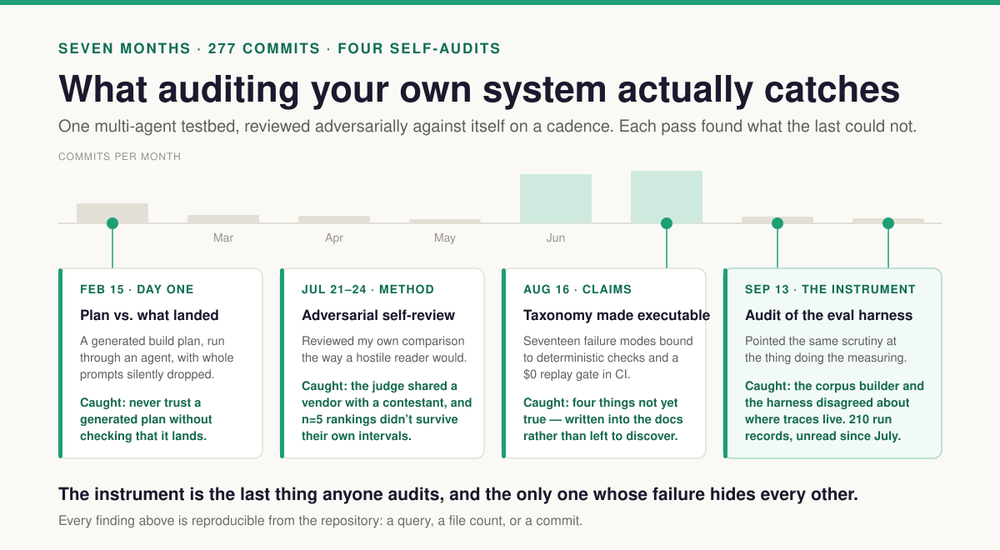
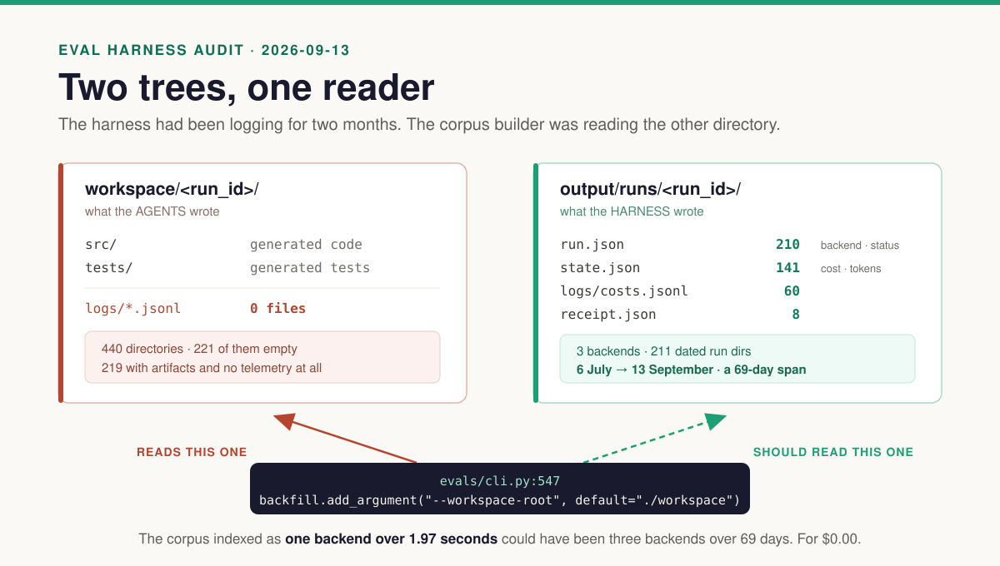
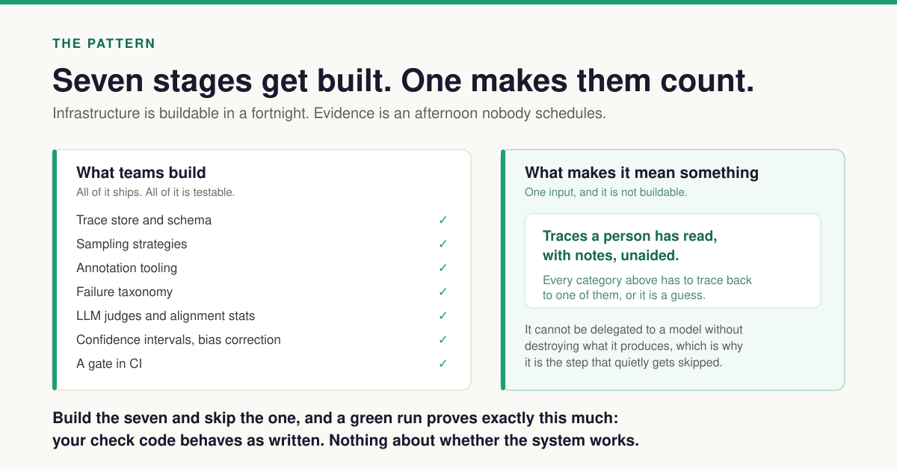

# The Starved Harness

*The instrument is the last thing anyone audits, and the only one whose failure hides
every other.*

---

The first entry in this project's journal is dated 15 February. A rainy Sunday, a
generated build plan that looked excellent, and an afternoon of running it through
Cursor before I noticed that whole prompts had been silently dropped. I reset, restarted
from a known-good state, and wrote the lesson down that night:

> Never trust a generated plan end-to-end without checking it lands.

Seven months and 277 commits later, I have applied that lesson to almost everything.
Three orchestration frameworks behind one backend protocol, compared on the same task so
I can tell whose failure a failure actually is. A runtime smoke gate that boots the app
and probes real HTTP, because agents will tell you the tests pass. A spend guard. An
adversarial review I ran on my own comparison in July, which found that my judge shared a
vendor with one of the contestants and that my n=5 rankings did not survive their own
confidence intervals.



Somewhere in August I decided the most valuable thing I could add was not another feature
but a way to know whether any of it works. So I built an eval harness. About thirteen
thousand lines. A trace store with a SQLite index. Five sampling strategies. An
annotation TUI for open coding. An axial clusterer. Golden label sets with deterministic
dev/test splits assigned by hash. Judge alignment with Cohen's κ, bootstrap confidence
intervals, and prevalence bias correction. Wilson intervals on every rate. A budget
ledger. A `$0` gate that runs on every pull request.

The methodology came from the people who teach it: Hamel Husain and Shreya Shankar.
Traces before scores. Binary verdicts, never Likert. TPR *and* TNR, never accuracy on its
own. One domain expert as the annotator rather than a committee. Open coding that shows
the annotator no model output at all, because anchoring a human on a model's guess
corrupts the ground truth the whole thing rests on. There is a docstring in my annotation
module instructing future agents not to "helpfully" add AI assistance to it, and I still
think it is the best paragraph in the codebase.

Last week they did [an episode of Lenny's Podcast][ep]. I sat down to do an alignment
pass — read the source, compare it to my methodology doc, note the deltas.

There were no deltas. The methodology was right.

Then I opened the corpus, and found the one place I had never applied the lesson from
February: I had never checked that the thing doing the checking had landed.

## Fifty traces, zero spans

```
select count(*)                 ->  50
select sum(span_count)          ->  0
select backend, count(*)        ->  [('crewai', 50)]
select scenario_id, count(*)    ->  [('unknown', 50)]
select status, count(*)         ->  [('failed', 50)]
select min(started_at), max(started_at)
    ->  2026-08-16T19:29:23.668979Z
        2026-08-16T19:29:25.639385Z
```

Fifty traces. **Zero spans between all fifty.** One backend. One status. One
scenario id, and that id is `unknown`. Every one of them created inside a
**1.97-second window** on a single afternoon in August.

Then the annotations directory:

```
$ ls -A evals/annotations/
$
```

Empty. Not one trace has ever been open-coded by a human. Which means the
seventeen-mode failure taxonomy — every deterministic check bound to it, the
coverage table, the essay it cites — came from a post I wrote in July from
memory, and **not one entry traces to a trace**.

Then the runs on disk. Four hundred and forty run workspaces. Two hundred and
twenty-one of them are empty directories. The other two hundred and nineteen
contain generated `src/` and `tests/` and nothing else. Workspaces containing a
log file of any kind: **zero**.

## The harness had been logging the whole time



Every one of those fifty traces carries the same warning block:

```
"missing: .../logs/phases.jsonl",
"missing: .../logs/costs.jsonl",
"missing: .../logs/audit.jsonl",
"missing: .../logs/session.json",
"no audit log for backend=crewai; tool-level checks skipped"
```

The trace builder is not broken. It went looking in `workspace/` and the files
were not there. They were never going to be there. `workspace/<run_id>/` is where
the **agents' generated code** lands — `src/`, `tests/`, and nothing else.

The **harness's own records** go somewhere else:

```
$ ls output/runs | grep -c '^20'
211
$ find output/runs -maxdepth 2 -name 'run.json' | wc -l
210
$ find output/runs -maxdepth 2 -name 'state.json' | wc -l
141
$ find output/runs -maxdepth 2 -name 'receipt.json' | wc -l
8
```

Two hundred and ten run records. Each one carrying the backend that ran, the
workspace it wrote to, when it completed, and its final status. A hundred and
forty-one carrying real cost and token counts. Sixty cost logs. Eight signed
receipts. Backends: langgraph 148, crewai 1, claude-agent-sdk 1, unset 60. Date
range 6 July to 13 September — **a sixty-nine-day span.**

And the default:

```
evals/cli.py:547
  backfill.add_argument("--workspace-root", default="./workspace")
```

The corpus that indexed as one backend over 1.97 seconds could have been three
backends over sixty-nine days, for **$0.00**, on the day the backfill was
written. Four of my five diversity floors were reachable from disk the entire
time. My eval harness has been reading the directory where the generated code
lands instead of the directory where the run records live.

## The one thing that really is a bullet in a prompt

There is a second half, and it is the one I had actually feared.

`phases.jsonl` is the file that yields the phase and retry spans — the trajectory.
Almost every interesting check I wrote reasons over it. Its only writer in code is
`harness/context_pressure.py`, added last week, which appends a single `phase_end`
row when it records context pressure. Otherwise:

```
src/ai_team/backends/claude_agent_sdk_backend/agents/prompts.py:23

  7. Write phase transition entries to workspace/logs/phases.jsonl
     (JSON lines: phase, status, timestamp).
```

Zero of those files exist. Not under `workspace/`, not under `output/runs/`, not
in 440 runs.

I want to be precise about this, because the general version of the claim would be
wrong and the specific version is more useful. Most of my telemetry *is* written
by code. `audit.jsonl` has a writer in the tool bus. `costs.jsonl` has two, and
sixty of them exist on disk. Phase telemetry is the one signal I left to an
instruction — and it happens to be the one every trajectory check depends on.

Two failures, then. One where I pointed the reader at the wrong shelf. One where
the book was never written because I asked the model to write it.

## The sentence I did not want to write

The comfortable version is "we haven't done error analysis yet." I had written
that version, more or less, in the methodology doc, under a heading titled
*Open-coding status (honest)*.

The true version is worse:

> **I pointed the measurement at the wrong directory, and then wrote two more
> specs on top of the empty result without noticing.**



Thirteen thousand lines of sampling, annotation, clustering, split discipline,
alignment statistics, bias correction — all real, all typed, all unit-tested, and
all fed by 94 synthetic fixtures across 21 checks. A green eval run in my CI
proves that my check code behaves the way I wrote it. It has never once said
anything about whether the agents work.

I want to be precise about the failure here, because it is not dishonesty and
that makes it more interesting. The repo *says all of this*. It says it in
`evals/golden/README.md`. It says it in the methodology doc under that honest
heading. I wrote the disclosure myself and then let the numbers travel without
it — into a README, into a comparison table, into how I described the project to
other people. The label stayed home and the figures went out.

That is a failure mode I did not have in my taxonomy, and it is not one a check
can catch.

## What I actually got wrong

Three things, in increasing order of how long it took me to admit them.

**One: I never verified that the thing producing data and the thing reading data
agreed on where data lives.** Two trees, one writer, one reader, no test. And the
part I did leave to the model — asking the agent to log its own phases — is the
same category of error as asking it to grade its own work. I have a failure mode for the second one — FM-016,
`self_graded_verification`, added two weeks ago from an Anthropic reference. I
did not have one for the first, and the first is worse. A self-graded verdict is
visibly wrong and you can argue with it. Self-reported telemetry produces a
*clean-looking dataset*, and nothing downstream has any way to know.

**Two: I confused diversity with volume.** "Roughly 100 diverse traces" is the
guardrail in the source material, and the word doing all the work is *diverse*.
Fifty traces from one backend, one scenario, one status, one two-second batch is
n=1 wearing n=50's clothes. I caught exactly this mistake in my defense layer in
July, wrote a journal entry about it, and then repeated it one layer up in the
thing that was supposed to catch mistakes.

**Three, and this is the real one: building the measurement infrastructure is a
very comfortable way to avoid doing the measurement.** The people I learned this
from say they spend 60–80% of development time on error analysis and evaluation.
I have spent close to 100% of my eval time on *evaluation infrastructure* and 0%
on *error analysis*. Those are different activities. The first is engineering,
which I am good at and enjoy. The second is sitting down and reading traces for
four hours, which is boring, and cannot be delegated to a model without
destroying the thing it produces.

I built the tool that makes the boring thing efficient, and then did not do the
boring thing, and the tool was good enough that its existence felt like progress.

## What changed

Nothing in `src/` yet. One spec: sixteen requirements, nine phases, thirty-eight
tasks. The shape of it:

**The corpus reads `output/runs/`.** One argument, no money, and the highest-value
task in the spec: roughly 210 traces, three backends, sixty-nine days, with
backend and status read from run records instead of guessed from directory names.
`--workspace-root` survives as a secondary source for runs with no record.

**Phase telemetry moves into the harness.** A single writer on the execution path,
constructed by the backend wrapper so a new backend inherits it for free, writing
beside `run.json` rather than into a tree nobody reads. Every record stamped
`writer: harness` by the module itself, so no call site can forge it. The prompt
line is *deleted*, not supplemented — keeping it would give one file two writers
and make provenance unresolvable at exactly the moment it matters.

**FM-018, `self_reported_telemetry`.** A run whose records were written by the
model rather than the harness. Deterministic, free, scoreable retroactively. It
will mark all fifty existing traces, and that is recorded as a *baseline*, not a
regression — the cleanest before-and-after this project will ever get for a
harness change.

**`unindexable` becomes a trace state.** A run the builder could not read is not
a failed run. Right now all fifty are recorded as `failed` and are poisoning
every denominator they touch. Absence of evidence stops being recorded as
evidence of failure.

**A diversity floor with a stamp the renderer enforces.** ≥100 indexable traces,
≥3 backends, ≥4 scenario ids, ≥2 statuses, ≥14-day span. Below any floor,
everything derived from the corpus renders `NON-REPRESENTATIVE`. Prose cannot opt
out of it, which is the specific mechanism that would have caught the failure I
just described.

**Every failure mode records where it came from.** `essay`, `reference`,
`hypothesis`, or `open_coding` — and `open_coding` requires annotation ids behind
it. Promotion takes evidence, not argument. Today's state then reads in one line:
zero of seventeen failure modes have been observed.

**Three refusals with no override flag.** Axial clustering refuses under 30
unaided annotations. Judge validation refuses under 100 human labels. The re-run
resolver refuses above its ceiling. The loop was skippable because nothing
refused, and a flag is how a refusal becomes a formality.

And Phase 4 — annotate 100 traces — is marked human-only, with an explicit
instruction that an agent reading the task list must stop there and say so. That
is not ceremony. I now own thirteen thousand lines that would cheerfully generate
me a golden set, and that is the one thing that must never happen.

## The part that transfers

If you are building on LLMs and you have an eval setup, the audit is four
commands and takes ten minutes:

0. **Is the thing that writes your traces pointed at the same place as the thing
   that reads them?** I would not have put this on the list a week ago. Put it
   first now.
1. **How many real traces are in it, and how diverse are they?** Group by every
   dimension you have. If one value dominates a column, your `n` is a fiction.
2. **How many have a human actually read?** Not scored — read, with notes.
3. **Where did your failure categories come from?** If you cannot point from a
   category to the specific traces that produced it, you are testing your
   imagination.
4. **What does a green run actually assert?** Say it out loud in one sentence. If
   the sentence is "my check code behaves as written," that is a real and useful
   thing, and it is not a quality claim, and you should stop letting it travel as
   one. I now label every rate I publish with its corpus kind — **FIXTURE-ONLY**,
   **CORPUS**, or **LIVE** — rendered by the reporting code rather than remembered
   by me. Most eval suites I have looked at are FIXTURE-ONLY and their owners do
   not know it.

The smallest useful version of the fix, for me, is one free command and one
unavoidable afternoon: re-index the right directory, then read thirty traces
myself. Thirty traces read by hand will change what I build next more than the
remaining eight phases of the spec combined.

Which is, stripped of the thirteen thousand lines, the entire content of the
podcast that started this.

---

*A standalone HTML version of this audit, with the tables rendered, is at
[`docs/showcase/starved-harness.html`](../showcase/starved-harness.html).
The full audit, with the queries and the file counts, is in the engineering
journal: [`2026-09-13-eval-methodology-audit.md`](../journal/2026-09-13-eval-methodology-audit.md).
The remediation spec is [`.kiro/specs/eval-methodology-alignment/`](../../.kiro/specs/eval-methodology-alignment/).
Current gate status and what may be claimed from it:
[`campaign/EVAL_GATE_STATUS.md`](../campaign/EVAL_GATE_STATUS.md).*

[ep]: https://www.lennysnewsletter.com/p/why-ai-evals-are-the-hottest-new-skill

---

*I write up one measurement from a real multi-agent system every week, with the query that
produced it. No benchmarks, no leaderboards — just what the instrument actually said, and
what kind of corpus it said it about.*
