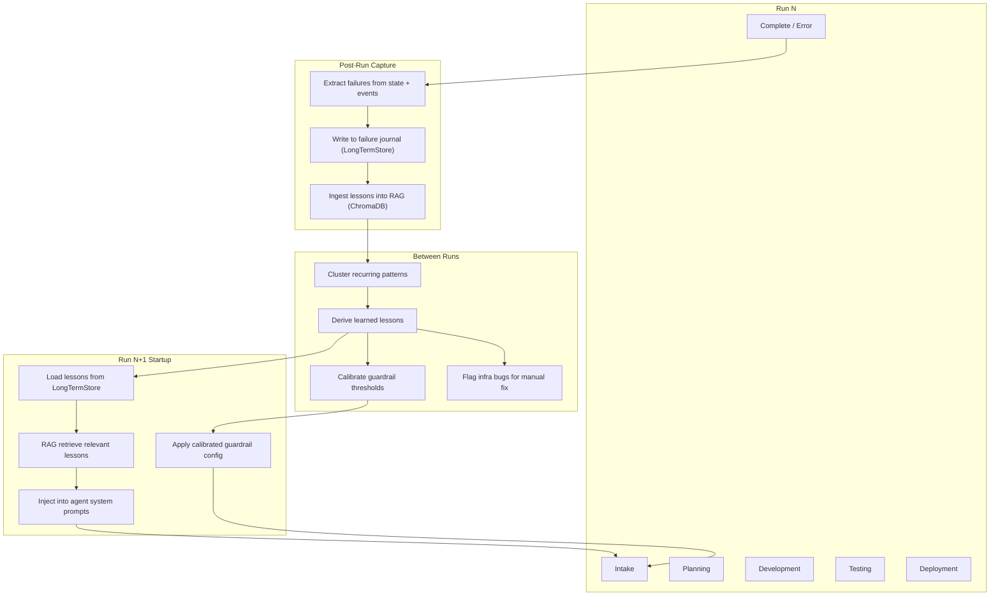

# Self-Improvement Mechanism

How the AI team learns from failures and evolves across runs.

---

## Problem

The system can plan, develop, test, and deploy -- but it cannot *learn*. Every run starts from the same prompts with the same guardrail thresholds, repeating the same mistakes. When a run fails, the failure is logged to `events.jsonl` and a state dump, then forgotten.

### Worked example: demo-01 LangGraph failure

Running demo `01_hello_world` with `--backend langgraph --langgraph-mode full` produced these cascading failures:

1. **Pytest import error** -- the generated `tests/test_app.py` used `from app import app, items`, but pytest ran from the repo root (not the per-run workspace), so `app` was not on `sys.path`. This is a workspace isolation bug, not an agent error.
2. **Dev retry included production code** -- the backend developer's retry response contained full `app.py`, `Dockerfile`, and `tests/test_app.py` in its message body (markdown code blocks).
3. **Behavioral guardrail false positive** -- the QA engineer's testing subgraph evaluated that retry output and flagged it as "QA Engineer should only write test code, not modify production source" (9 violations). The guardrail retried 3 times, then terminated the run.

Each of these is a *learnable* pattern. The system has infrastructure to persist and retrieve such patterns, but it is not wired up.

---

## Architecture



---

## 1. Failure Journal (post-run capture)

### What exists today

- `ResultsBundle.append_event()` in [`core/results/writer.py`](../src/ai_team/core/results/writer.py) writes JSONL events to `output/<project_id>/events.jsonl`.
- `LongTermStore` in [`memory/memory_config.py`](../src/ai_team/memory/memory_config.py) has a `learned_patterns` SQLite table with `add_pattern(pattern_type, content)` and `get_patterns(pattern_type, limit)`.
- `ProjectState.errors` in [`flows/state.py`](../src/ai_team/flows/state.py) accumulates `ProjectError` objects during a run.
- `error_handling.py` classifies errors (`RETRYABLE`, `RECOVERABLE`, `FATAL`) and records structured error logs.

### What is missing

None of these write to `learned_patterns`. The failure journal needs a **post-run hook** that extracts structured failure records from the completed state and persists them.

### Failure record schema

Each failure record stored via `LongTermStore.add_pattern()` uses `pattern_type` for categorization and a JSON `content` blob:

```json
{
  "run_id": "b9d82bb3-8332-4ffb-b2d7-9fec831d2901",
  "timestamp": "2026-03-31T15:54:23Z",
  "backend": "langgraph",
  "team_profile": "backend-api",
  "phase": "testing",
  "agent_role": "qa_engineer",
  "error_type": "GuardrailError",
  "category": "behavioral",
  "message": "QA Engineer should only write test code, not modify production source.",
  "details": {
    "violations": ["Production code (non-test function) (x9)"],
    "guardrail_retry_count": 3,
    "guardrail_terminal": true
  },
  "test_output": {
    "pytest_returncode": 2,
    "pytest_error": "ModuleNotFoundError: No module named 'app'",
    "ruff_violations": 3
  },
  "resolution": null
}
```

Pattern types: `guardrail_failure`, `test_failure`, `environment_error`, `timeout`, `model_error`.

### Wiring point

Add a `record_lessons()` call at the end of `AITeamFlow.finalize_project()` in [`flows/main_flow.py`](../src/ai_team/flows/main_flow.py) and in `LangGraphBackend.run()` in [`backends/langgraph_backend/backend.py`](../src/ai_team/backends/langgraph_backend/backend.py), after the final state is known. This function iterates `state.errors` and `state.test_results`, builds failure records, and calls `LongTermStore.add_pattern()` for each.

---

## 2. Pattern Extraction (between runs)

### Goal

Transform raw failure records into actionable **learned lessons** that can be injected into prompts or used to tune guardrails.

### Extraction rules

Pattern extraction is deterministic (no LLM required):

| Raw pattern type | Clustering key | Lesson template |
|------------------|---------------|-----------------|
| `guardrail_failure` | `(category, agent_role, message)` | "When acting as {role}, avoid {violation}. The {category} guardrail will reject output that {description}." |
| `test_failure` | `(pytest_error_class, phase)` | "Tests failed with {error}. Ensure {mitigation} before running pytest." |
| `environment_error` | `(error_message_prefix)` | Infrastructure issue: {description}. Flagged for manual fix. |
| `timeout` | `(phase, agent_role)` | "{role} timed out during {phase}. Simplify the task or increase iteration limits." |
| `model_error` | `(model_name, error_class)` | "Model {model} returned {error}. Consider fallback or retry." |

A lesson is promoted when it appears in **2+ distinct runs** (configurable threshold). One-off failures stay in the journal but are not injected into prompts.

### Worked example

The demo-01 failure produces two raw records:

1. `test_failure`: pytest `ModuleNotFoundError: No module named 'app'`
2. `guardrail_failure`: behavioral, qa_engineer, "should only write test code"

After a second run with the same failures, extraction promotes them to lessons:

- **Lesson A**: "When running pytest in an isolated workspace, ensure `sys.path` includes the workspace root or use `PYTHONPATH`. Tests that import `from app import ...` will fail with `ModuleNotFoundError` if pytest runs from the repo root."
- **Lesson B**: "When acting as QA Engineer, respond ONLY with test analysis and test code. Do NOT include production source code (app.py, Dockerfile, requirements.txt) in your response -- the behavioral guardrail will reject it."

### Implementation

A new function `extract_lessons()` in a `src/ai_team/memory/lessons.py` module reads `LongTermStore.get_patterns()`, groups by clustering key, counts occurrences, and writes promoted lessons back as `pattern_type="lesson"`. This can be called from a CLI command (`scripts/extract_lessons.py`) or automatically at the start of each run.

---

## 3. Prompt Augmentation (pre-run injection)

### What exists today

- `AgentPromptBundle.system_message()` in [`prompts.py`](../src/ai_team/backends/langgraph_backend/agents/prompts.py) builds: `"You are {role}.\n\n## Goal\n{goal}\n\n## Background\n{backstory}"`.
- CrewAI agents receive `role`, `goal`, `backstory` from [`config/agents.yaml`](../src/ai_team/config/agents.yaml) via [`agents/base.py`](../src/ai_team/agents/base.py).
- The RAG pipeline in [`rag/pipeline.py`](../src/ai_team/rag/pipeline.py) supports `ingest_chunks()`, `retrieve()`, and `format_context()`.
- The LangGraph `_node_rag_context` in [`main_graph.py`](../src/ai_team/backends/langgraph_backend/graphs/main_graph.py) already injects RAG context into `metadata.rag_context` when `RAG_ENABLED=true`.

### Injection strategy

Lessons are injected at two levels:

**Level 1 -- Role-specific prompt suffix (always active)**

`AgentPromptBundle.system_message()` is extended to accept an optional `lessons: list[str]` parameter. When present, it appends:

```
## Lessons from previous runs
- {lesson_1}
- {lesson_2}
```

Lessons are filtered by `agent_role` so each agent only sees lessons relevant to its role. The QA engineer would see Lesson B above; the backend developer would see Lesson A.

**Level 2 -- Semantic RAG retrieval (when RAG is enabled)**

Promoted lessons are ingested into the RAG ChromaDB collection via `RAGPipeline.ingest_chunks()` with metadata `{"source_id": "lesson", "lesson_id": "...", "agent_role": "..."}`. At run time, the existing `_node_rag_context` retrieves semantically relevant lessons based on the project description and injects them into `metadata.rag_context`.

Level 1 provides deterministic, guaranteed injection. Level 2 adds semantic relevance when the project context matches a past failure scenario.

### Wiring point

At startup in `AITeamFlow._kickoff()` and `LangGraphBackend.run()`, before compiling crews/graphs:

1. Call `LongTermStore.get_patterns(pattern_type="lesson")` to load all promoted lessons.
2. Group by `agent_role`.
3. Pass role-specific lessons to `AgentPromptBundle.system_message(lessons=...)` (LangGraph) or append to the agent's `backstory` (CrewAI).

---

## 4. Guardrail Calibration

### Problem

The behavioral guardrail's `role_adherence_guardrail()` in [`guardrails/behavioral.py`](../src/ai_team/guardrails/behavioral.py) uses regex heuristics to detect role violations. In the demo-01 case, it correctly identified that the QA agent's output contained production code -- but the *root cause* was the developer's retry response bleeding into the QA evaluation, not the QA agent actually writing production code.

### Calibration approach

The failure journal tracks guardrail outcomes with enough detail to compute:

- **False positive rate**: guardrail fired but the output was legitimate (diagnosed by subsequent human override or successful re-run).
- **Repeat offender patterns**: the same `(guardrail, agent_role, violation_type)` tuple appearing across multiple runs.

When the false positive rate for a specific pattern exceeds a threshold (default: 3 occurrences with no resolution), the system flags it for review and can:

1. **Refine the prompt** -- add a lesson to the offending agent's prompt (handled by Section 3).
2. **Adjust the guardrail scope** -- e.g., `behavioral_only_message_names` already exists to limit behavioral checks to specific agent names. The calibration step can recommend widening/narrowing this filter.
3. **Downgrade from fail to warn** -- for known false-positive patterns, change the guardrail status from `fail` to `warn` so the run continues. This is a configuration change in `GuardrailConfig`.

### Wiring point

A new `calibrate_guardrails()` function reads the failure journal, computes rates, and writes a `guardrail_overrides.yaml` file. The guardrail functions check for overrides at invocation time. This keeps the core guardrail logic unchanged while allowing data-driven tuning.

---

## 5. Tool and Environment Fixes

Some failures are not prompt-level or guardrail-level -- they are bugs in the infrastructure. The demo-01 pytest import failure is a clear example: no amount of prompt tuning will fix a missing `PYTHONPATH`.

### Classification

The failure journal uses `category: "environment_error"` for these. The extraction step writes them to a separate **infra backlog** file at `data/infra_backlog.jsonl`, each entry containing:

```json
{
  "id": "...",
  "created_at": "2026-03-31T15:54:23Z",
  "description": "pytest runs from repo root, not workspace/<project_id>/; 'from app import' fails with ModuleNotFoundError",
  "affected_phase": "testing",
  "affected_tool": "qa_tools.run_pytest_in_workspace",
  "suggested_fix": "Set cwd to workspace root or prepend workspace to PYTHONPATH before subprocess.run",
  "status": "open",
  "occurrences": 1
}
```

These are surfaced in:
- The run summary (`RESULTS.md` or `output/<project_id>/reports/summary.md`)
- The CLI (`scripts/extract_lessons.py --show-infra`)
- The Streamlit/Gradio UI (future)

They require human (or Cursor-assisted) code changes and cannot be auto-fixed by the agents.

---

## 6. Feedback Loop Summary

The complete self-improvement loop has five stages:

| Stage | When | What | Where |
|-------|------|------|-------|
| **Capture** | End of every run | Extract errors, guardrail results, test output from final state | `LongTermStore.add_pattern()`, `ResultsBundle.append_event()` |
| **Extract** | Between runs (CLI or auto) | Cluster raw failures into lessons and infra issues | `memory/lessons.py` → `LongTermStore` |
| **Augment** | Start of next run | Inject role-specific lessons into agent prompts | `AgentPromptBundle.system_message()`, `backstory` append |
| **Calibrate** | Between runs (CLI or auto) | Tune guardrail thresholds from false-positive data | `guardrail_overrides.yaml` |
| **Fix** | Manual / Cursor-assisted | Resolve infra bugs flagged by the journal | `data/infra_backlog.jsonl` → code changes |

---

## Wiring Checklist

Concrete code changes needed to activate the loop, in priority order:

### Phase 1: Capture (minimum viable loop)

- [ ] **`src/ai_team/memory/lessons.py`** (new) -- `record_run_failures(state, backend, team_profile)` function that iterates `state.errors` and `state.test_results`, builds failure records, calls `LongTermStore.add_pattern()`.
- [ ] **`src/ai_team/flows/main_flow.py`** -- call `record_run_failures()` in `finalize_project()` (both success and error paths).
- [ ] **`src/ai_team/backends/langgraph_backend/backend.py`** -- call `record_run_failures()` after `graph.invoke()` completes in `run()`.
- [ ] **`src/ai_team/memory/memory_config.py`** -- ensure `MemoryManager.initialize()` is called at flow startup (currently only called in tests).

### Phase 2: Extract + Augment

- [ ] **`src/ai_team/memory/lessons.py`** -- `extract_lessons(threshold=2)` function that reads raw patterns, clusters, promotes to `pattern_type="lesson"`.
- [ ] **`scripts/extract_lessons.py`** (new) -- CLI wrapper for `extract_lessons()` with `--show-infra` flag.
- [ ] **`src/ai_team/backends/langgraph_backend/agents/prompts.py`** -- extend `system_message()` to accept `lessons: list[str]` and append a `## Lessons from previous runs` section.
- [ ] **`src/ai_team/agents/base.py`** -- extend `BaseAgent.__init__()` to accept `lessons: list[str]` and append them to `backstory`.
- [ ] **`src/ai_team/backends/langgraph_backend/backend.py`** -- at run startup, load lessons from `LongTermStore`, group by role, pass to subgraph compilation.
- [ ] **`src/ai_team/flows/main_flow.py`** -- at flow startup, load lessons and pass to crew constructors.

### Phase 3: Calibrate + RAG

- [ ] **`src/ai_team/memory/lessons.py`** -- `calibrate_guardrails()` function that computes false-positive rates and writes `guardrail_overrides.yaml`.
- [ ] **`src/ai_team/guardrails/behavioral.py`** -- check `guardrail_overrides.yaml` for downgrade rules before returning `fail`.
- [ ] **`src/ai_team/rag/pipeline.py`** -- `ingest_lessons()` convenience method that converts lesson records to `TextChunk` objects and calls `ingest_chunks()`.
- [ ] **`scripts/extract_lessons.py`** -- add `--ingest-rag` flag to also ingest lessons into the RAG collection.

### Phase 4: Infra backlog

- [ ] **`src/ai_team/memory/lessons.py`** -- `flag_infra_issues()` function that writes environment errors to `data/infra_backlog.jsonl`.
- [ ] **`scripts/extract_lessons.py`** -- add `--show-infra` flag to print open infra issues.

---

## Worked Example: Demo-01 Evolution

### Run 1 (current state)

The run fails. No lessons exist. The failure journal captures two records.

### Between runs

`extract_lessons()` sees only 1 occurrence of each pattern -- below the promotion threshold. No lessons are promoted yet. The pytest import error is flagged in the infra backlog.

A developer fixes the pytest `cwd` / `PYTHONPATH` issue in `qa_tools.run_pytest_in_workspace()`.

### Run 2

The pytest issue is fixed by the code change. The behavioral guardrail fires again (the QA agent still receives production code in the retry message). The failure journal now has 2 occurrences of the behavioral pattern.

`extract_lessons()` promotes Lesson B: "When acting as QA Engineer, respond ONLY with test analysis and test code. Do NOT include production source code in your response."

### Run 3

At startup, Lesson B is loaded and injected into the QA engineer's system prompt. The QA agent's response now focuses on test analysis only. The behavioral guardrail passes. The run completes successfully.

The system has evolved.
